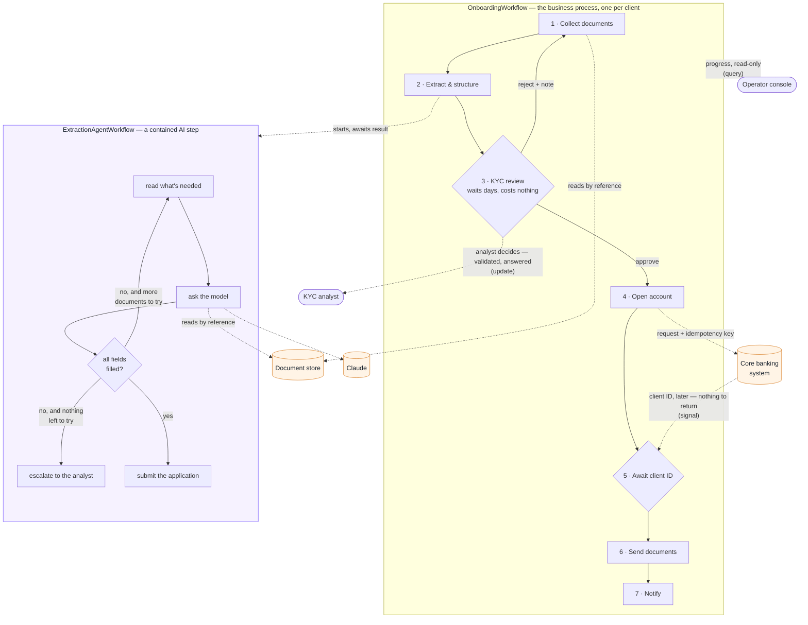
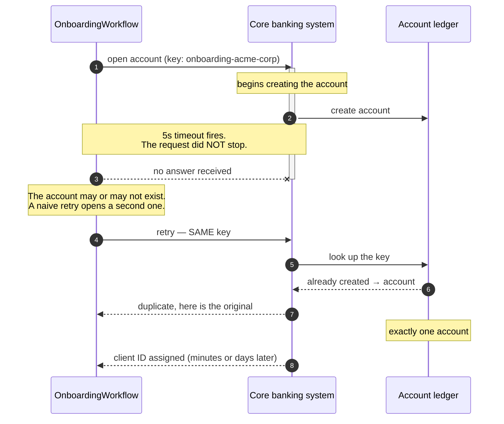
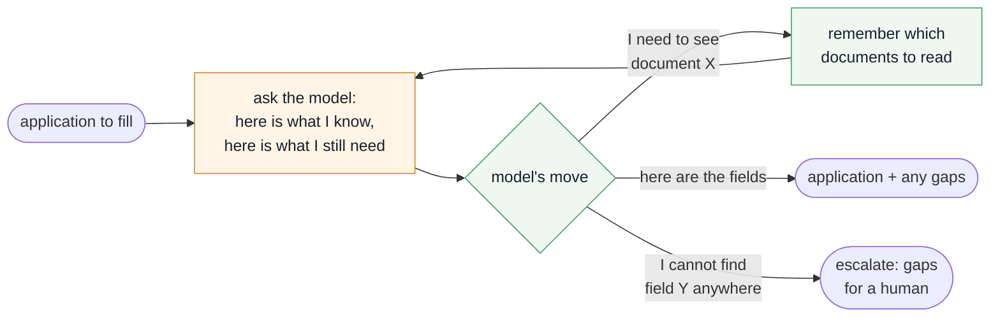

# Onboarding a business client: the design

Three pictures and the reasoning behind them. Each diagram carries numbered
callouts that answer *why this shape* rather than *what this is*, so the design
can be read after the conversation, or without anyone to narrate it.

The subject is commercial account opening — a business, not a consumer. That
distinction drives everything below: several documents rather than one ID,
several people to verify rather than one, and a review that takes days rather
than minutes.

---

## 1. How the process is put together

1. **The outer process is deterministic and readable top to bottom.** Anyone in
   compliance can read the seven steps and recognise their own process. The AI
   is one step inside it, not the thing driving it.
2. **The AI step is contained.** It is a separate unit with a typed input and a
   typed result. If it misbehaves, the damage is bounded to step 2 — and you can
   point at exactly which part of the diagram is non-deterministic.
3. **Rejection loops back to step 1, not step 2.** The analyst asks for a
   missing document, the specialist adds it, and collection runs again. The
   retry gets a clean slate rather than resuming a confused conversation.
4. **Steps 3 and 5 are waits, and they are free.** The process is asleep, not
   polling. It survives restarts, deploys, and machine failures, and resumes
   exactly where it was — whether that is two minutes or two weeks later.
5. **Documents never travel through the process itself.** Every arrow to the
   document store is a reference. The scans stay in the store; the orchestrator
   never holds the paperwork.
6. **The three orange boxes are the things that fail.** Everything the design
   does about reliability is about those three boundaries. The dotted arrows
   crossing out of the box are the only places this process touches the outside
   world — each one is a separately retried, separately recorded unit of work.
7. **The three ways in are deliberately different.** The analyst's decision has
   to be checked and answered, so it is a call that returns a verdict. The core
   banking system's client ID needs no answer, so it is fire-and-forget. The
   console only reads, so it never touches the process's recorded history at
   all. Three needs, three mechanisms — rather than one general-purpose
   message that has to mean all three.

---

## 2. The failure that matters: opening the account twice

1. **A timeout is not a cancellation.** When the call gives up, the bank's
   system keeps working. This is the part most systems get wrong — they treat
   "no answer" as "did not happen."
2. **So the retry is the dangerous moment,** not the timeout. Retrying blindly
   is how a customer ends up with two accounts, which is a regulatory problem
   rather than a bug to patch later.
3. **The key is derived from the application itself,** so it is identical on
   every attempt. That is what lets the bank's system recognise the second
   request as the same request.
4. **The bank's system answers "duplicate" and returns the original account.**
   The process carries on with the right account number and no human ever finds
   out anything went wrong.
5. **The client ID arrives separately, whenever it arrives.** The process waits
   without holding anything open — which is why a system that answers in
   minutes and a system that answers in days need no different handling.

---

## 3. Inside the AI step

1. **Only the orange box leaves the process.** Asking the model is the one
   external call here; it is retried, timed, and recorded. Everything green is
   bookkeeping inside the process — nothing that can fail halfway.
2. **The loop exists because documents disagree.** A tax ID appears in two
   different filings. If one is illegible, the right move is to go look at the
   other — and that is a decision the model makes, not a branch we scripted.
3. **"Remember which documents to read" stores names, not contents.** The
   paperwork is fetched fresh each time by the part that is allowed to touch
   storage.
4. **Escalation is a normal outcome, not an error.** If a date of birth is
   genuinely absent from every document, the correct behaviour is to hand the
   analyst a specific question — "this field, these documents searched" — not to
   guess, and not to fail.
5. **The loop is bounded.** It cannot spin indefinitely; after a fixed number
   of attempts it escalates with whatever it has.
