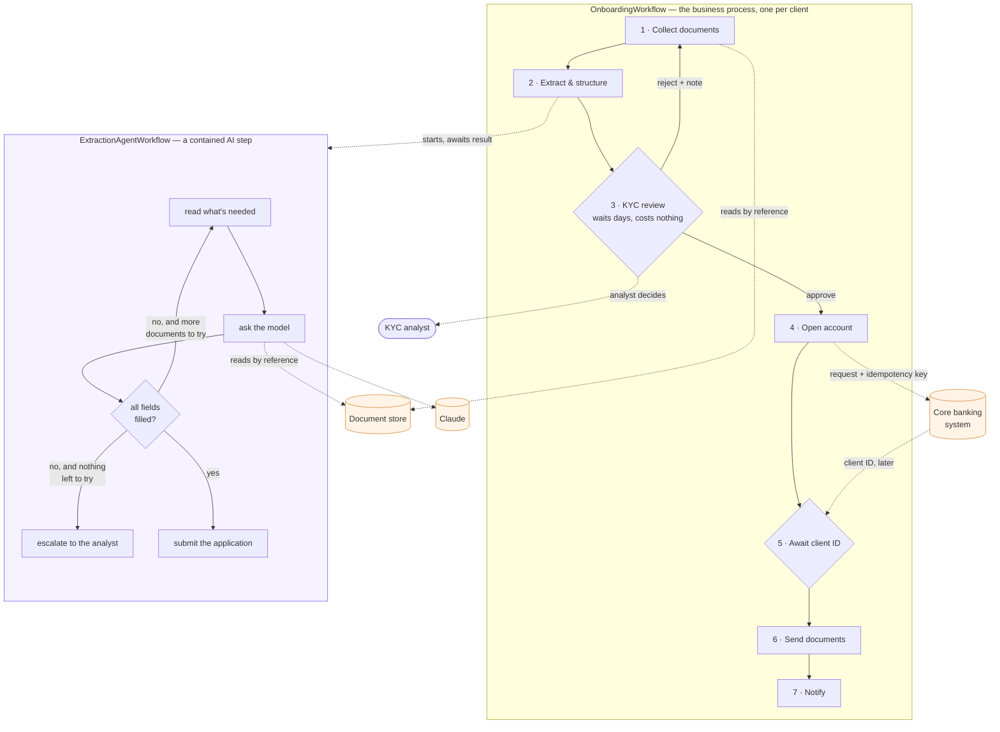
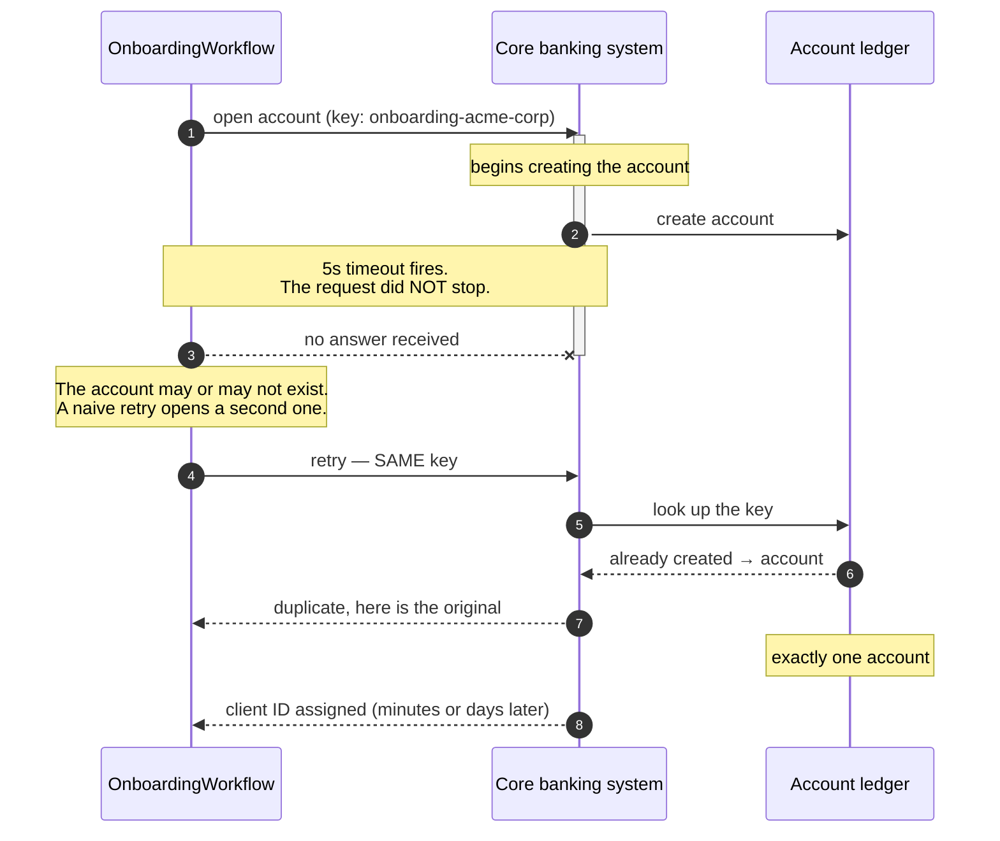
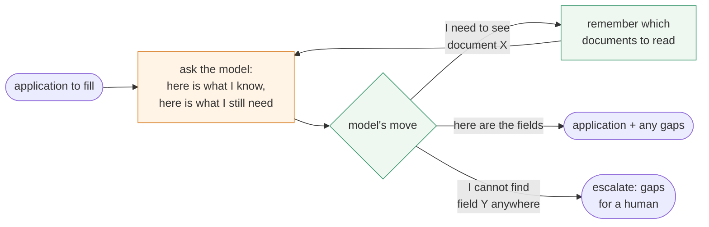

# Customer Onboarding Demo Implementation Plan

> **For agentic workers:** REQUIRED SUB-SKILL: Use superpowers:subagent-driven-development (recommended) or superpowers:executing-plans to implement this plan task-by-task. Steps use checkbox (`- [ ]`) syntax for tracking.

**Goal:** Build a Temporal demo in which a commercial bank onboards a business client through a seven-step deterministic workflow containing a bounded AI extraction child workflow, headlining the ambiguous-timeout / idempotency failure.

**Architecture:** A deterministic `OnboardingWorkflow` parent runs the business process 1→7 and spawns an `ExtractionAgentWorkflow` child for document extraction. The child is a hand-rolled ReAct loop whose only activity is `call_llm`; all its tools are inline workflow state mutations. A FastAPI gateway drives Temporal by string name and serves a single-page operator console. A separate FastAPI service impersonates the core banking system and holds an idempotency ledger.

**Tech Stack:** Python 3.12, `uv`, `temporalio`, `pydantic` + `pydantic_data_converter`, `anthropic`, `fastapi`, `uvicorn`, `pypdf`, `reportlab`, `pytest`, `pytest-asyncio`, `httpx`, Temporal CLI dev server.

**Spec:** [`docs/superpowers/specs/2026-09-04-customer-onboarding-design.md`](../specs/2026-09-04-customer-onboarding-design.md) — read it alongside this plan. The plan argues from the spec; section references like §8.1 point there.

## Global Constraints

Every task's requirements implicitly include this section. Values are copied verbatim from the spec.

- **Task queue:** `customer-onboarding`
- **Parent workflow type/ID:** `OnboardingWorkflow` / `onboarding-<client-key>`
- **Child workflow type/ID:** `ExtractionAgentWorkflow` / `onboarding-<client-key>-extract-<attempt>`
- **One Pydantic model per handler, argument and return.** No positional argument lists anywhere, including single-field payloads (§5).
- **`pydantic_data_converter` on the worker and every client** — worker, gateway, core banking callback, tests. Constructed only in `config.build_data_converter()` (§17).
- **Determinism:** no `requests`, `httpx`, `datetime.now()`, `time.time()`, or `random` under `python/workflows/`. Use `workflow.now()` and `workflow.uuid4()` (§16.6).
- **Document content never enters workflow history.** Workflows carry `DocumentRef`s and doc *ids*; activities resolve them to text internally (§8.1, §8.2).
- **The idempotency key for `open_account` is the parent workflow ID**, stable across every retry. Never derive it from `activity.info().attempt` (§10.1).
- **The workflow must never auto-approve on timeout** (§9.2). Enforced by `T-TIME-02`.
- **Escalation is a return value, never an exception.** `ExtractionResult.escalated=True` (§8.2).
- **Every failure path ends in a business status**, not a failed workflow (§10.3).
- **Error classification lives inside activities**, via `ApplicationError(..., non_retryable=True)` — never `non_retryable_error_types` at the call site (§10.2).
- **LLM client retries disabled** (`max_retries=0`); Temporal owns retry (§8.3).
- **`call_llm` returns validated models.** Workflows never parse raw model output (§8.3).
- **Default model:** `claude-sonnet-5`, via `MODEL` env.
- **Temporal UI floor:** v2.34.6 (activity summaries on the Timeline, §12).
- **`make test` runs with `FIXTURE_MODE=1` and no API key.** `make verify` additionally asserts `skipped == 0` (§16, §16.8).
- **Timeouts:** `ingest_documents` 30s · `call_llm` 120s · `open_account` **5s** · `send_documents` 60s · `notify` 30s (§10.2).
- **Caps:** `MAX_ATTEMPTS=3`, `MAX_ITERATIONS=8` — these are the history bound, not arbitrary limits (§4.3).
- **Exactly three optional application fields:** `dba`, `phone`, `website`. Everything else is required (§5.1).
- **Log every deviation as a ruling in `docs/RULINGS.md`** — a gap the spec and plan both leave, or a place the plan's own code is wrong. Say what was decided, against which authority, and what it cost.
- **At the Commit step, before writing the message, promote what you learned.** Re-read the rulings you added: does any of them meet the rule of two in `RULINGS.md`'s header — a second occurrence, or a fault that will bite a task you can name? If so, copy the short form into the matching file under `.claude/rules/` in the same commit. A ruling nobody reads before repeating the mistake bought nothing.

---

## File Structure

Which files exist and what each is responsible for. Locked in here so tasks don't renegotiate boundaries.

| Path | Responsibility |
|------|----------------|
| `pyproject.toml` | deps, pytest config, `uv` project root |
| `Makefile` | forwards every target to `python/Makefile` |
| `make/common.mk` | process management: pgrep guards, nohup, pkill, URL printing |
| `python/Makefile` | the SDK's targets |
| `CLAUDE.md` | run/test commands, task queue, IDs, determinism rule, layout |
| `CONTRACT.md` | the §6 wire surface, SDK-agnostic, string names only |
| `TALK_TRACK.md` | narration for a live or design-only walkthrough |
| `docs/DESIGN-DIAGRAMS.md` | three annotated mermaid diagrams (§21) |
| `python/config.py` | env reading, `build_data_converter()`, `REQUIRED_FIELD_PATHS` |
| `python/models/application.py` | `Address`, `BeneficialOwner`, `ControlPerson`, `ApplicationFields` |
| `python/models/documents.py` | `DocumentRef`, `DocumentManifest`, `IngestRequest` |
| `python/models/extraction.py` | `FieldGap`, `ExtractionRequest/Result`, `AgentTurn`, `LLMRequest/Response`, the action union |
| `python/models/review.py` | `FieldEdit`, `ReviewSubmission`, `ReviewAck` |
| `python/models/core_banking.py` | `OpenAccountRequest/Ack`, `ClientIdAssignment` |
| `python/models/delivery.py` | `SendDocumentsRequest/Result`, `NotifyRequest/Result` |
| `python/models/onboarding.py` | `ApplicationRequest`, `OnboardingStatus`, `OnboardingResult` |
| `python/gaps.py` | gap computation and edit merging — pure functions, importable by workflows |
| `python/prompts.py` | the extraction system prompt and tool schemas |
| `python/activities/ingest.py` | `ingest_documents` |
| `python/activities/llm.py` | `call_llm` — live and fixture implementations |
| `python/activities/core_banking.py` | `open_account` |
| `python/activities/delivery.py` | `send_documents`, `notify` |
| `python/workflows/extraction.py` | `ExtractionAgentWorkflow` — the ReAct loop |
| `python/workflows/onboarding.py` | `OnboardingWorkflow` — the seven-step spine |
| `python/workflows/tracker.py` | progress-tracker string building (pure, deterministic) |
| `python/worker.py` | worker entrypoint; selects the `call_llm` implementation |
| `web/gateway.py` | the §6.1 HTTP surface; imports zero worker code |
| `web/static/index.html` | the operator console |
| `core_banking/app.py` | the fake external system; never imports `temporalio` |
| `core_banking/ledger.py` | SQLite idempotency ledger |
| `tools/make_documents.py` | generates the `acme-corp` text-layer PDFs |
| `tools/record_fixtures.py` | records `call_llm` fixtures from a live run |
| `tools/capture_histories.py` | captures workflow histories for replay tests |
| `documents/acme-corp/` | five committed sample PDFs |
| `fixtures/` | recorded `LLMResponse` sequences |
| `histories/` | committed workflow histories |
| `tests/` | the 22-scenario manifest and its implementations |

**Files written once in Task 1–2 and treated as append-only thereafter** (§20.3): `python/models/`, `Makefile`, `make/common.mk`, `python/Makefile`, `python/config.py`, `CONTRACT.md`, `pyproject.toml`.

---

## Task Order and Parallelism

Derived from §20.2. Tasks 1–3 are sequential and gate everything. Tasks 4–8 are the parallel tracks; **Task 4 (the design artifact) is scheduled first among them** because §2 requires it to survive the demo not being completed. Tasks 19–21 are a sequential tail with genuine data dependencies.

| Tasks | Track | Parallel with |
|-------|-------|---------------|
| 1, 2, 3 | foundation | nothing — sequential |
| 4 | E — design artifact | 5, 6, 7, 8, and 9–18 |
| 5 | D — sample documents | 4, 6, 7, 8 |
| 6 | C — core banking | 4, 5, 7, 8 |
| 7, 8 | B — gateway + console | 4, 5, 6, 9–18 |
| 9–18 | A — worker | 4, 5, 6, 7, 8 |
| 19, 20, 21 | tail | nothing — sequential |

Within track A, tasks 9–12 (activities) are parallel with each other; 13 needs 10; 14–18 need 13.

---

### Task 1: Project skeleton, config, and Makefile

**Files:**
- Create: `pyproject.toml`, `.gitignore`, `CLAUDE.md`
- Create: `Makefile`, `make/common.mk`, `python/Makefile`
- Create: `python/config.py`, `python/__init__.py`, `python/models/__init__.py`
- Test: `tests/test_config.py`

**Interfaces:**
- Consumes: nothing
- Produces: `config.settings()` returning a `Settings` pydantic model with fields `temporal_address: str`, `task_queue: str`, `model: str`, `fixture_mode: bool`, `max_attempts: int`, `max_iterations: int`, `sla_remind: timedelta`, `sla_escalate: timedelta`, `client_id_sla: timedelta`, `core_slow_ms: int`, `document_store: Path`, `core_banking_url: str`, `gateway_url: str`, `outbox_dir: Path`, `payload_codec: str`; and `config.build_data_converter() -> DataConverter`.

- [ ] **Step 1: Write the failing test**

```python
# tests/test_config.py
from datetime import timedelta
import pytest
from python import config


def test_defaults_match_spec_section_17(monkeypatch):
    for var in ("TASK_QUEUE", "MODEL", "MAX_ATTEMPTS", "MAX_ITERATIONS",
                "SLA_REMIND", "SLA_ESCALATE", "CLIENT_ID_SLA", "CORE_SLOW_MS",
                "FIXTURE_MODE", "PAYLOAD_CODEC"):
        monkeypatch.delenv(var, raising=False)
    s = config.settings()
    assert s.task_queue == "customer-onboarding"
    assert s.model == "claude-sonnet-5"
    assert s.max_attempts == 3
    assert s.max_iterations == 8
    assert s.sla_remind == timedelta(days=3)
    assert s.sla_escalate == timedelta(days=7)
    assert s.client_id_sla == timedelta(days=1)
    assert s.core_slow_ms == 10000
    assert s.fixture_mode is False
    assert s.payload_codec == "off"


def test_duration_env_accepts_short_form(monkeypatch):
    monkeypatch.setenv("SLA_REMIND", "30s")
    monkeypatch.setenv("SLA_ESCALATE", "60s")
    assert config.settings().sla_remind == timedelta(seconds=30)
    assert config.settings().sla_escalate == timedelta(seconds=60)


def test_data_converter_is_pydantic_aware():
    from temporalio.contrib.pydantic import pydantic_data_converter
    assert config.build_data_converter() is pydantic_data_converter


def test_payload_codec_on_is_rejected_until_implemented(monkeypatch):
    monkeypatch.setenv("PAYLOAD_CODEC", "on")
    with pytest.raises(NotImplementedError, match="§18"):
        config.build_data_converter()
```

- [ ] **Step 2: Run test to verify it fails**

Run: `uv run pytest tests/test_config.py -v`
Expected: FAIL — `ModuleNotFoundError: No module named 'python.config'`

- [ ] **Step 3: Write `pyproject.toml`**

```toml
[project]
name = "customer-onboarding-demo"
version = "0.1.0"
requires-python = ">=3.12"
dependencies = [
    "temporalio>=1.9",
    "pydantic>=2.7",
    "anthropic>=0.40",
    "fastapi>=0.115",
    "uvicorn[standard]>=0.30",
    "httpx>=0.27",
    "pypdf>=4.2",
    "reportlab>=4.2",
]

[dependency-groups]
dev = ["pytest>=8", "pytest-asyncio>=0.23"]

[tool.pytest.ini_options]
asyncio_mode = "auto"
testpaths = ["tests"]
pythonpath = ["."]

[tool.uv]
package = false
```

- [ ] **Step 4: Write `python/config.py`**

```python
"""Single source of configuration. §17 of the spec.

The data converter is constructed ONLY here (§17) so that enabling a
PayloadCodec later is configuration rather than surgery (§18).
"""
from __future__ import annotations

import os
import re
from datetime import timedelta
from pathlib import Path

from pydantic import BaseModel
from temporalio.converter import DataConverter

_DURATION = re.compile(r"^(\d+)([smhd])$")
_UNITS = {"s": "seconds", "m": "minutes", "h": "hours", "d": "days"}


def _duration(raw: str) -> timedelta:
    m = _DURATION.match(raw.strip())
    if not m:
        raise ValueError(f"bad duration {raw!r}; use forms like 30s, 5m, 3d")
    return timedelta(**{_UNITS[m.group(2)]: int(m.group(1))})


class Settings(BaseModel):
    temporal_address: str
    task_queue: str
    model: str
    fixture_mode: bool
    max_attempts: int
    max_iterations: int
    sla_remind: timedelta
    sla_escalate: timedelta
    client_id_sla: timedelta
    core_slow_ms: int
    document_store: Path
    core_banking_url: str
    gateway_url: str
    outbox_dir: Path
    payload_codec: str


def settings() -> Settings:
    env = os.environ.get
    return Settings(
        temporal_address=env("TEMPORAL_ADDRESS", "localhost:7233"),
        task_queue=env("TASK_QUEUE", "customer-onboarding"),
        model=env("MODEL", "claude-sonnet-5"),
        fixture_mode=env("FIXTURE_MODE", "0") == "1",
        max_attempts=int(env("MAX_ATTEMPTS", "3")),
        max_iterations=int(env("MAX_ITERATIONS", "8")),
        sla_remind=_duration(env("SLA_REMIND", "3d")),
        sla_escalate=_duration(env("SLA_ESCALATE", "7d")),
        client_id_sla=_duration(env("CLIENT_ID_SLA", "1d")),
        core_slow_ms=int(env("CORE_SLOW_MS", "10000")),
        document_store=Path(env("DOCUMENT_STORE", "./.store")),
        core_banking_url=env("CORE_BANKING_URL", "http://localhost:8001"),
        gateway_url=env("GATEWAY_URL", "http://localhost:8000"),
        outbox_dir=Path(env("OUTBOX_DIR", "./outbox")),
        payload_codec=env("PAYLOAD_CODEC", "off"),
    )


def build_data_converter() -> DataConverter:
    """Every process that talks to Temporal must use this. A mismatch produces
    deserialization errors that look like corruption rather than config."""
    from temporalio.contrib.pydantic import pydantic_data_converter

    if settings().payload_codec != "off":
        raise NotImplementedError(
            "PayloadCodec encryption is a stated scope cut (§18). Enabling it "
            "requires a codec server plus --codec-endpoint on the UI and CLI."
        )
    return pydantic_data_converter
```

- [ ] **Step 5: Run test to verify it passes**

Run: `uv run pytest tests/test_config.py -v`
Expected: PASS — 4 passed

- [ ] **Step 6: Write the Makefiles with every target stubbed**

§20.3: write these completely now, including targets for components that do not exist yet, so three tracks never edit the same Makefile.

```makefile
# Makefile (repo root)
.DEFAULT_GOAL := up
up down status logs demo demo-reset worker kill-worker restart-worker \
gateway core-banking temporal test verify fixtures histories documents clean deps:
	@$(MAKE) --no-print-directory -C python $@
.PHONY: up down status logs demo demo-reset worker kill-worker restart-worker \
        gateway core-banking temporal test verify fixtures histories documents clean deps
```

```makefile
# make/common.mk
ROOT := $(shell cd $(dir $(lastword $(MAKEFILE_LIST)))/.. && pwd)
.PHONY: up down status logs demo demo-reset temporal gateway core-banking \
        worker kill-worker restart-worker test verify fixtures histories documents clean deps

deps:
	cd $(ROOT) && uv sync

up: temporal core-banking gateway worker
	@echo ""
	@echo "  console      → http://localhost:8000"
	@echo "  temporal UI  → http://localhost:8233"
	@echo "  core banking → http://localhost:8001/ledger"

demo: demo-reset up
	@echo "  ready — click Submit on the console"

temporal:
	@command -v temporal >/dev/null 2>&1 || \
		{ echo "Temporal CLI not on PATH — install it with: brew install temporal"; \
		  echo "(see README Setup; make demo cannot start a dev server without it)"; \
		  exit 1; }
	@pgrep -f "temporal server start-dev" >/dev/null 2>&1 || \
		(nohup temporal server start-dev --ui-port 8233 > /tmp/onboarding-temporal.log 2>&1 & \
		 sleep 3 && echo "temporal dev server started (UI :8233)")

core-banking:
	@pgrep -f "core_banking.app:app" >/dev/null 2>&1 || \
		(cd $(ROOT) && nohup uv run uvicorn core_banking.app:app --port 8001 \
		 > /tmp/onboarding-core.log 2>&1 & echo "core banking started (:8001)")

gateway:
	@pgrep -f "web.gateway:app" >/dev/null 2>&1 || \
		(cd $(ROOT) && nohup uv run uvicorn web.gateway:app --port 8000 \
		 > /tmp/onboarding-gateway.log 2>&1 & echo "gateway started (:8000)")

worker:
	@pgrep -f "python.worker" >/dev/null 2>&1 || \
		(cd $(ROOT) && nohup uv run python -m python.worker \
		 > /tmp/onboarding-worker.log 2>&1 & echo "worker started")

kill-worker:
	-pkill -f "python.worker"
	@echo "worker killed — the workflow survives this. restart with: make worker"

restart-worker: kill-worker worker

down: kill-worker
	-pkill -f "web.gateway:app"
	-pkill -f "core_banking.app:app"
	-pkill -f "temporal server start-dev"

status:
	@printf "temporal     : "; pgrep -f "temporal server start-dev" >/dev/null 2>&1 && echo "running (:7233, UI :8233)" || echo "stopped"
	@printf "core banking : "; pgrep -f "core_banking.app:app" >/dev/null 2>&1 && echo "running (:8001)" || echo "stopped"
	@printf "gateway      : "; pgrep -f "web.gateway:app" >/dev/null 2>&1 && echo "running (:8000)" || echo "stopped"
	@printf "worker       : "; pgrep -f "python.worker" >/dev/null 2>&1 && echo "running" || echo "stopped"

logs:
	tail -f /tmp/onboarding-*.log

test:
	cd $(ROOT) && FIXTURE_MODE=1 uv run pytest -v

verify:
	cd $(ROOT) && FIXTURE_MODE=1 uv run pytest -v -p no:randomly \
		--override-ini=addopts= -rs 2>&1 | tee /tmp/onboarding-verify.log; \
	  if grep -qE "^SKIPPED|skipped" /tmp/onboarding-verify.log; then \
	    echo "VERIFY FAILED: skipped tests remain (§16.8)"; exit 1; \
	  else echo "VERIFY OK: 22/22 scenarios implemented and passing"; fi

documents:
	cd $(ROOT) && uv run python tools/make_documents.py

fixtures:
	cd $(ROOT) && uv run python tools/record_fixtures.py

histories:
	cd $(ROOT) && uv run python tools/capture_histories.py

demo-reset:
	rm -rf $(ROOT)/.store $(ROOT)/outbox $(ROOT)/core_banking/ledger.db
	@echo "application state cleared"

clean: down demo-reset
```

```makefile
# python/Makefile
include ../make/common.mk
```

**Keep the `command -v temporal` preflight.** It is not defensive clutter. The
CLI is a setup prerequisite the README states but nothing enforces (§14 runs the
dev server as a host process), and without the guard a missing CLI fails
invisibly: `nohup` swallows the error into `/tmp/onboarding-temporal.log`, `make
demo` still prints its three URLs, and the operator meets a console that loads
and then does nothing. The guard is diagnosis only — it prints the `brew`
command and exits non-zero. **It must never install anything.** Installing
software as a side effect of `make` is a decision this repo has already declined:
it would surprise an evaluator running `make deps`, and it would fight the
Homebrew install it cannot see, upgrade, or remove.

- [ ] **Step 7: Write `.gitignore` and `CLAUDE.md`**

```gitignore
.superpowers/
.store/
outbox/
core_banking/ledger.db
__pycache__/
.venv/
.pytest_cache/
```

```markdown
<!-- CLAUDE.md -->
# Customer Onboarding Demo

Temporal demo: a commercial bank onboards a business client. Seven-step
deterministic workflow with a bounded AI extraction child workflow.

**Spec:** `docs/superpowers/specs/2026-09-04-customer-onboarding-design.md` —
the binding authority. **Plan:** `docs/superpowers/plans/2026-09-04-customer-onboarding-demo.md`.

## Commands

    make deps          # uv sync
    make demo          # reset state, start everything, print URLs
    make up / down / status / logs
    make test          # FIXTURE_MODE=1, no API key needed
    make verify        # test + assert zero skipped (the definition of done)
    make restart-worker
    make demo-reset    # clear ledger, outbox, document store

## Identity

- Task queue: `customer-onboarding`
- Parent: `OnboardingWorkflow`, id `onboarding-<client-key>`
- Child: `ExtractionAgentWorkflow`, id `onboarding-<client-key>-extract-<attempt>`

## The determinism rule

No I/O, no clocks, no randomness in `python/workflows/`. No `requests`,
`httpx`, `datetime.now()`, `time.time()`, or `random`. Use `workflow.now()`
and `workflow.uuid4()`. Everything non-deterministic goes in an activity.

Document content never enters workflow history — workflows carry refs and doc
ids; activities resolve them to text.

## Layout

- `python/workflows/` — the parent spine and the agent child
- `python/activities/` — ingest, llm, core_banking, delivery
- `python/models/` — every Pydantic payload; one model per handler
- `web/` — gateway + console; imports zero worker code
- `core_banking/` — the fake external system; never imports temporalio
- `tests/` — the 22-scenario manifest (§16.8)
```

- [ ] **Step 8: Verify the skeleton runs**

Run: `uv sync && uv run pytest tests/test_config.py -v && make status`
Expected: deps install, 4 tests pass, `make status` prints four "stopped" lines

- [ ] **Step 9: Commit**

```bash
git add pyproject.toml uv.lock .gitignore CLAUDE.md Makefile make/ python/ tests/
git commit -m "feat: project skeleton, config, and complete Makefile

All Makefile targets are written now, including ones for components that
do not exist yet, so parallel tracks never edit the same file (§20.3).
The data converter is constructed in exactly one place (§17)."
```

---

### Task 2: Models, gap computation, and CONTRACT.md

Every payload in §5. Written once; append-only thereafter (§20.3). `CONTRACT.md` is written here because it documents the same surface and must not be edited by parallel tracks.

**Files:**
- Create: `python/models/application.py`, `documents.py`, `extraction.py`, `review.py`, `core_banking.py`, `delivery.py`, `onboarding.py`
- Create: `python/gaps.py`
- Create: `CONTRACT.md`
- Modify: `python/config.py` — append `REQUIRED_FIELD_PATHS`
- Test: `tests/test_models.py`, `tests/test_gaps.py`

**Interfaces:**
- Consumes: `config.settings()` from Task 1
- Produces: all models listed in §5 and §6; `config.REQUIRED_FIELD_PATHS: tuple[str, ...]`; `gaps.compute_gaps(app: ApplicationFields) -> list[FieldGap]`; `gaps.apply_edits(app: ApplicationFields, edits: list[FieldEdit]) -> ApplicationFields`; `gaps.missing_required(app: ApplicationFields) -> list[str]`

- [ ] **Step 1: Write the failing tests**

```python
# tests/test_gaps.py
from datetime import date
from decimal import Decimal

from python import gaps
from python.models.application import Address, ApplicationFields, BeneficialOwner, ControlPerson
from python.models.review import FieldEdit


def _addr() -> Address:
    return Address(line1="410 Harbor St", line2=None, city="Boston",
                   state="MA", postal_code="02210", country="US")


def _owner(name: str, dob: date | None, pct: str) -> BeneficialOwner:
    return BeneficialOwner(full_name=name, dob=dob, ownership_pct=Decimal(pct),
                           residential_address=_addr(), id_type="passport",
                           id_number="X4419223")


def _complete_except_second_dob() -> ApplicationFields:
    return ApplicationFields(
        legal_name="Acme Holdings LLC", dba=None, entity_type="LLC",
        formation_date=date(2019, 3, 11), formation_state="DE", tax_id="88-1234567",
        registered_address=_addr(), business_address=_addr(), industry_code="541611",
        phone=None, website=None,
        beneficial_owners=[_owner("Dana Whitfield", date(1978, 6, 2), "55"),
                           _owner("Marcus Vela", None, "30")],
        control_person=ControlPerson(full_name="Dana Whitfield", title="Managing Member",
                                     dob=date(1978, 6, 2), residential_address=_addr(),
                                     id_type="passport", id_number="X4419223"),
    )


def test_the_deliberate_gap_is_the_only_gap():
    """§8.4 — the acme-corp set is complete except one owner's dob."""
    found = gaps.compute_gaps(_complete_except_second_dob())
    assert [g.field_path for g in found] == ["beneficial_owners[1].dob"]


def test_optional_fields_are_never_gaps():
    """§5.1 — exactly three fields are optional."""
    app = _complete_except_second_dob()
    app.beneficial_owners[1].dob = date(1985, 1, 1)
    assert gaps.compute_gaps(app) == []


def test_empty_owner_list_is_a_gap():
    app = _complete_except_second_dob()
    app.beneficial_owners = []
    assert "beneficial_owners" in [g.field_path for g in gaps.compute_gaps(app)]


def test_gap_records_documents_searched():
    g = gaps.compute_gaps(_complete_except_second_dob())[0]
    assert "ownership_declaration" in g.documents_searched
    assert g.reason


def test_apply_edits_fills_the_gap_without_mutating_the_original():
    """§9.1 audit rule — never overwrite the AI's output in place."""
    original = _complete_except_second_dob()
    merged = gaps.apply_edits(original, [FieldEdit(field_path="beneficial_owners[1].dob",
                                                   value="1985-01-01")])
    assert merged.beneficial_owners[1].dob == date(1985, 1, 1)
    assert original.beneficial_owners[1].dob is None
    assert gaps.compute_gaps(merged) == []


def test_apply_edits_coerces_to_the_schema_type():
    merged = gaps.apply_edits(_complete_except_second_dob(),
                              [FieldEdit(field_path="beneficial_owners[0].ownership_pct",
                                         value="45.5")])
    assert merged.beneficial_owners[0].ownership_pct == Decimal("45.5")
```

```python
# tests/test_models.py
from python.models.extraction import (DocumentRequest, Escalation, ExtractionSubmission,
                                      LLMResponse, AgentTurn)
from python.models.onboarding import OnboardingStatus


def test_llm_response_action_discriminates_on_kind():
    """§5.3.1 — the workflow dispatches on action.kind and never parses."""
    raw = {"action": {"kind": "request_documents", "doc_ids": ["w9"],
                      "rationale": "tax_id not in ein_letter"},
           "turn": {"role": "assistant", "content": "checking the W-9"},
           "usage": {"input_tokens": 10, "output_tokens": 5}}
    parsed = LLMResponse.model_validate(raw)
    assert isinstance(parsed.action, DocumentRequest)
    assert parsed.action.doc_ids == ["w9"]


def test_escalation_and_submission_also_discriminate():
    esc = LLMResponse.model_validate(
        {"action": {"kind": "escalate", "gaps": []},
         "turn": {"role": "assistant", "content": "cannot find it"}, "usage": {}})
    assert isinstance(esc.action, Escalation)


def test_status_stage_is_constrained_to_the_spec_list():
    import pytest
    from pydantic import ValidationError
    with pytest.raises(ValidationError):
        OnboardingStatus(stage="inventing_a_stage", attempt=1, application=None,
                         gaps=[], pending_since=None, core_attempt=0,
                         last_error=None, core_request_id=None, client_id=None,
                         extraction_iterations=0)
```

- [ ] **Step 2: Run tests to verify they fail**

Run: `uv run pytest tests/test_gaps.py tests/test_models.py -v`
Expected: FAIL — `ModuleNotFoundError: No module named 'python.models.application'`

- [ ] **Step 3: Write the models**

Transcribe §5.1–§5.6 exactly. `python/models/application.py`:

```python
from __future__ import annotations
from datetime import date
from decimal import Decimal
from typing import Literal
from pydantic import BaseModel

IdType = Literal["passport", "drivers_license", "state_id"]


class Address(BaseModel):
    line1: str
    line2: str | None = None
    city: str
    state: str
    postal_code: str
    country: str


class BeneficialOwner(BaseModel):
    full_name: str | None = None
    dob: date | None = None
    ownership_pct: Decimal | None = None
    residential_address: Address | None = None
    id_type: IdType | None = None
    id_number: str | None = None


class ControlPerson(BaseModel):
    full_name: str | None = None
    title: str | None = None
    dob: date | None = None
    residential_address: Address | None = None
    id_type: IdType | None = None
    id_number: str | None = None
    is_authorized_signatory: bool = True


class ApplicationFields(BaseModel):
    legal_name: str | None = None
    dba: str | None = None                 # optional (§5.1)
    entity_type: Literal["LLC", "C_CORP", "S_CORP", "LP", "LLP"] | None = None
    formation_date: date | None = None
    formation_state: str | None = None
    tax_id: str | None = None
    registered_address: Address | None = None
    business_address: Address | None = None
    industry_code: str | None = None
    phone: str | None = None               # optional (§5.1)
    website: str | None = None             # optional (§5.1)
    beneficial_owners: list[BeneficialOwner] = []
    control_person: ControlPerson | None = None
```

`python/models/documents.py`:

```python
from __future__ import annotations
from typing import Literal
from pydantic import BaseModel

DocumentKind = Literal["articles_of_incorporation", "business_license",
                       "ein_letter", "w9", "ownership_declaration"]


class DocumentRef(BaseModel):
    doc_id: str
    kind: DocumentKind
    uri: str
    sha256: str
    page_count: int


class DocumentManifest(BaseModel):
    refs: list[DocumentRef] = []


class IngestRequest(BaseModel):
    client_key: str
    attempt: int
```

`python/models/extraction.py`:

```python
from __future__ import annotations
from typing import Annotated, Literal
from pydantic import BaseModel, Field

from python.models.application import ApplicationFields
from python.models.documents import DocumentManifest


class FieldGap(BaseModel):
    field_path: str
    reason: str
    documents_searched: list[str] = []


class ExtractionRequest(BaseModel):
    client_key: str
    legal_name: str
    manifest: DocumentManifest
    attempt: int
    prior_gaps: list[FieldGap] = []
    analyst_note: str | None = None


class ExtractionResult(BaseModel):
    application: ApplicationFields
    gaps: list[FieldGap] = []
    iterations: int = 0
    escalated: bool = False


class AgentTurn(BaseModel):
    role: Literal["assistant", "tool"]
    content: str


class LLMRequest(BaseModel):
    model: str
    manifest: DocumentManifest
    requested_doc_ids: list[str] = []
    turns: list[AgentTurn] = []
    required_field_paths: list[str] = []
    prior_gaps: list[FieldGap] = []
    analyst_note: str | None = None


class DocumentRequest(BaseModel):
    kind: Literal["request_documents"] = "request_documents"
    doc_ids: list[str]
    rationale: str


class ExtractionSubmission(BaseModel):
    kind: Literal["submit_extraction"] = "submit_extraction"
    application: ApplicationFields
    gaps: list[FieldGap] = []


class Escalation(BaseModel):
    kind: Literal["escalate"] = "escalate"
    gaps: list[FieldGap] = []


AgentAction = Annotated[DocumentRequest | ExtractionSubmission | Escalation,
                        Field(discriminator="kind")]


class LLMResponse(BaseModel):
    action: AgentAction
    turn: AgentTurn
    usage: dict[str, int] = {}
```

`python/models/review.py`, `core_banking.py`, `delivery.py`, `onboarding.py`: transcribe §5.4, §5.5, §5.5.1, §5.6 verbatim, importing `ApplicationFields` and `FieldGap` as needed.

- [ ] **Step 4: Write `REQUIRED_FIELD_PATHS` into `config.py`**

```python
# appended to python/config.py — §5.1: declared in exactly one place, so the
# console, the gaps list, and the approve rule can never disagree.
REQUIRED_FIELD_PATHS: tuple[str, ...] = (
    "legal_name", "entity_type", "formation_date", "formation_state", "tax_id",
    "registered_address", "business_address", "industry_code",
    "beneficial_owners",
    "beneficial_owners[].full_name", "beneficial_owners[].dob",
    "beneficial_owners[].ownership_pct", "beneficial_owners[].residential_address",
    "beneficial_owners[].id_type", "beneficial_owners[].id_number",
    "control_person",
    "control_person.full_name", "control_person.title", "control_person.dob",
    "control_person.residential_address", "control_person.id_type",
    "control_person.id_number",
)

# §5.2 — which document each field lives in; used for FieldGap.documents_searched
FIELD_SOURCES: dict[str, tuple[str, ...]] = {
    "legal_name": ("articles_of_incorporation", "w9"),
    "entity_type": ("articles_of_incorporation",),
    "formation_date": ("articles_of_incorporation",),
    "formation_state": ("articles_of_incorporation",),
    "registered_address": ("articles_of_incorporation",),
    "tax_id": ("ein_letter", "w9"),
    "dba": ("business_license",),
    "business_address": ("business_license",),
    "industry_code": ("business_license",),
}
_OWNERSHIP_SOURCES = ("ownership_declaration",)
```

- [ ] **Step 5: Write `python/gaps.py`**

Pure functions only — imported by workflow code, so no I/O, no clocks (§16.6).

```python
"""Gap computation and edit merging. Pure and deterministic: safe to import
from workflow code (determinism-protection.md lists models as pass-through)."""
from __future__ import annotations

from python import config
from python.models.application import ApplicationFields
from python.models.extraction import FieldGap
from python.models.review import FieldEdit


def _sources_for(path: str) -> list[str]:
    base = path.split("[")[0].split(".")[0]
    if base in ("beneficial_owners", "control_person"):
        return list(config._OWNERSHIP_SOURCES)
    return list(config.FIELD_SOURCES.get(path, ()))


def _get(app: ApplicationFields, path: str):
    """Resolve a dotted/indexed path against the model. Deterministic."""
    node = app
    for part in path.replace("]", "").split("."):
        if "[" in part:
            name, idx = part.split("[")
            node = getattr(node, name)[int(idx)]
        else:
            node = getattr(node, part)
    return node


def _expand(app: ApplicationFields, path: str) -> list[str]:
    """`beneficial_owners[].dob` -> one path per owner index."""
    if "[]" not in path:
        return [path]
    prefix, suffix = path.split("[]")
    return [f"{prefix}[{i}]{suffix}" for i in range(len(getattr(app, prefix)))]


def missing_required(app: ApplicationFields) -> list[str]:
    out: list[str] = []
    for template in config.REQUIRED_FIELD_PATHS:
        for path in _expand(app, template):
            value = _get(app, path)
            if value is None or value == [] or value == "":
                out.append(path)
    return out


def compute_gaps(app: ApplicationFields) -> list[FieldGap]:
    return [
        FieldGap(field_path=path,
                 reason=f"{path} not found in any supplied document",
                 documents_searched=_sources_for(path))
        for path in missing_required(app)
    ]


def apply_edits(app: ApplicationFields, edits: list[FieldEdit]) -> ApplicationFields:
    """Returns a NEW application. §9.1: never overwrite the AI's output in place."""
    merged = app.model_copy(deep=True)
    for edit in edits:
        parts = edit.field_path.replace("]", "").split(".")
        node = merged
        for part in parts[:-1]:
            if "[" in part:
                name, idx = part.split("[")
                node = getattr(node, name)[int(idx)]
            else:
                node = getattr(node, part)
        setattr(node, parts[-1], edit.value)
    # Re-validate so strings are coerced to dates/Decimals by the schema.
    return ApplicationFields.model_validate(merged.model_dump())
```

- [ ] **Step 6: Run tests to verify they pass**

Run: `uv run pytest tests/test_gaps.py tests/test_models.py -v`
Expected: PASS — 9 passed

- [ ] **Step 7: Write `CONTRACT.md`**

Transcribe §6 and §6.1 as an SDK-agnostic document: the identity table from §4.1, the handler table with literal string names, every model's JSON shape, and the gateway endpoints. State at the top that a worker in any SDK is "done" when it implements this file, and that only one SDK's worker may poll `customer-onboarding` at a time.

- [ ] **Step 8: Commit**

```bash
git add python/models/ python/gaps.py python/config.py CONTRACT.md tests/
git commit -m "feat: payload models, gap computation, and CONTRACT.md

REQUIRED_FIELD_PATHS is declared once so the console, the gaps list, and
the approve rule cannot disagree (§5.1). apply_edits returns a new model
rather than mutating, per the audit rule in §9.1."
```

---

### Task 3: The 22-scenario manifest

§16.8. This is the definition of done and it exists before any feature, so completeness is a command rather than a judgement.

**Files:**
- Create: `tests/test_manifest.py`
- Test: itself — plus `make verify` must now fail with 22 skips

**Interfaces:**
- Consumes: nothing
- Produces: 22 test function names that later tasks convert into real tests. Later tasks MUST reuse these exact names.

- [ ] **Step 1: Write all 22 stubs**

```python
"""The scenario manifest — §16.8 of the spec.

THE DEFINITION OF DONE: all 22 pass and none are skipped.

Each task below converts its own stubs into real failing tests, then makes
them pass. Do NOT delete a stub. Adding a scenario is allowed and must be
logged as a ruling (§19); silently dropping one is not.
"""
import pytest

SKIP = "not implemented — see the owning task in the plan"


# --- §16.1 activity unit tests (Tasks 9, 10, 11) ---

@pytest.mark.skip(reason=SKIP)
def test_T_ACT_01_ingest_copies_and_hashes_documents():
    """ingest_documents copies files and returns refs; missing file raises non-retryable."""


@pytest.mark.skip(reason=SKIP)
def test_T_ACT_02_call_llm_classifies_errors():
    """401 non-retryable, 429 sets next_retry_delay, 5xx retryable."""


@pytest.mark.skip(reason=SKIP)
def test_T_ACT_03_open_account_is_idempotent():
    """Two calls with the same idempotency key: the second returns duplicate."""


# --- §16.2 workflow tests (Tasks 14, 15, 16) ---

@pytest.mark.skip(reason=SKIP)
def test_T_WF_01_happy_path_completes_with_client_id():
    """Happy path completes with status="completed" and a client ID."""


@pytest.mark.skip(reason=SKIP)
def test_T_WF_02_reject_increments_attempt_and_reingests():
    """Reject increments attempt and re-runs ingest_documents."""


@pytest.mark.skip(reason=SKIP)
def test_T_WF_03_max_attempts_exhausted_is_manual_intervention():
    """MAX_ATTEMPTS exhausted -> manual_intervention, not a failed workflow."""


@pytest.mark.skip(reason=SKIP)
def test_T_WF_04_approve_with_empty_required_field_is_rejected():
    """The validator refuses an approve while a required field is empty."""


@pytest.mark.skip(reason=SKIP)
def test_T_WF_05_approve_without_attestation_is_rejected():
    """The validator refuses an approve without attested=True."""


@pytest.mark.skip(reason=SKIP)
def test_T_WF_06_ownership_over_100_is_rejected():
    """sum(ownership_pct) > 100 -> validator rejects. Note <=, not ==."""


@pytest.mark.skip(reason=SKIP)
def test_T_WF_07_timeout_then_duplicate_opens_exactly_one_account():
    """THE HEADLINE. Workflow proceeds and the ledger holds exactly one account."""


@pytest.mark.skip(reason=SKIP)
def test_T_WF_08_core_rejection_completes_as_rejected_by_core():
    """A non-retryable core rejection completes the workflow, not crashes it."""


@pytest.mark.skip(reason=SKIP)
def test_T_WF_09_child_workflow_error_counts_as_a_spent_attempt():
    """ChildWorkflowError is caught and counted, not propagated."""


# --- §16.3 time-skipping tests (Task 17) ---

@pytest.mark.skip(reason=SKIP)
def test_T_TIME_01_remind_then_escalate_fire_in_order():
    """Remind at SLA_REMIND, escalate at SLA_ESCALATE, still waiting after both."""


@pytest.mark.skip(reason=SKIP)
def test_T_TIME_02_never_auto_approves():
    """Far past both SLAs, stage is still awaiting_review. §9.2's rule is
    worthless without this test."""


@pytest.mark.skip(reason=SKIP)
def test_T_TIME_03_client_id_sla_does_not_abandon_the_workflow():
    """CLIENT_ID_SLA fires, reminds, and keeps waiting."""


# --- §16.4 child workflow tests (Task 13) ---

@pytest.mark.skip(reason=SKIP)
def test_T_CHILD_01_illegible_ein_letter_falls_back_to_w9():
    """The cross-document behaviour. If this regresses, the demo's most
    interesting moment dies silently."""


@pytest.mark.skip(reason=SKIP)
def test_T_CHILD_02_missing_dob_escalates_with_documents_searched():
    """dob absent everywhere -> escalated=True, documents_searched populated."""


@pytest.mark.skip(reason=SKIP)
def test_T_CHILD_03_iteration_cap_escalates_without_raising():
    """MAX_ITERATIONS reached -> escalated=True, no exception."""


# --- §16.5 replay tests (Task 20) ---

@pytest.mark.skip(reason=SKIP)
def test_T_REPLAY_01_happy_path_history_replays():
    """histories/happy-path.json replays against current workflow code."""


@pytest.mark.skip(reason=SKIP)
def test_T_REPLAY_02_reject_loop_history_replays():
    """histories/reject-loop.json replays."""


@pytest.mark.skip(reason=SKIP)
def test_T_REPLAY_03_timeout_retry_history_replays():
    """histories/timeout-retry.json replays."""


@pytest.mark.skip(reason=SKIP)
def test_T_REPLAY_04_escalation_history_replays():
    """histories/escalation.json replays."""
```

- [ ] **Step 2: Run the suite and confirm 22 skips**

Run: `uv run pytest tests/test_manifest.py -v -rs`
Expected: `22 skipped` — every scenario named, none implemented

- [ ] **Step 3: Confirm `make verify` fails for the right reason**

Run: `make verify`
Expected: exits non-zero with `VERIFY FAILED: skipped tests remain (§16.8)`

This is the gate working. From here, every turn can run `make test` and read remaining skips as remaining work.

- [ ] **Step 4: Add the determinism guard check**

```python
# tests/test_determinism_guard.py — §16.6
import re
from pathlib import Path

BANNED = re.compile(r"\b(requests|httpx)\b|datetime\.now\(|time\.time\(|\brandom\b")


def test_no_io_clocks_or_randomness_in_workflows():
    offenders = []
    for path in Path("python/workflows").rglob("*.py"):
        for lineno, line in enumerate(path.read_text().splitlines(), 1):
            if line.strip().startswith("#"):
                continue
            if BANNED.search(line):
                offenders.append(f"{path}:{lineno}: {line.strip()}")
    assert not offenders, (
        "workflow code must not do I/O, read clocks, or use randomness "
        "(§16.6). Use workflow.now() and workflow.uuid4().\n" + "\n".join(offenders))
```

- [ ] **Step 5: Run it**

Run: `uv run pytest tests/test_determinism_guard.py -v`
Expected: PASS — `python/workflows/` does not exist yet, so zero offenders. It will keep passing as workflows are added, and fail the moment someone reaches for `httpx`.

- [ ] **Step 6: Commit**

```bash
git add tests/test_manifest.py tests/test_determinism_guard.py
git commit -m "test: the 22-scenario manifest and the determinism guard

The manifest is the definition of done (§16.8). All 22 scenarios are
named up front as skip-marked stubs so remaining skips read as remaining
work on every turn, and make verify asserts zero skips. Later tasks must
reuse these exact test names rather than inventing their own."
```

---

### Task 4: The customer-shareable design artifact — TRACK E, SCHEDULE FIRST

§21. **Do this before the feature tracks.** Its purpose is to survive the demo not being completed, so building it last guarantees it is absent in exactly the scenario it exists for (§2). It depends on nothing but the spec.

**Files:**
- Create: `docs/DESIGN-DIAGRAMS.md`
- Create: `TALK_TRACK.md`
- Test: `tests/test_design_artifact.py`

**Interfaces:**
- Consumes: the spec only. No code.
- Produces: nothing other tasks import.

- [ ] **Step 1: Write the failing test**

A doc deliverable still gets a gate — otherwise "done" is a judgement call.

```python
# tests/test_design_artifact.py
import re
from pathlib import Path

DIAGRAMS = Path("docs/DESIGN-DIAGRAMS.md")
TALK = Path("TALK_TRACK.md")


def test_three_mermaid_diagrams_exist():
    """§21.2 — topology, the ambiguous-timeout sequence, the agent loop."""
    body = DIAGRAMS.read_text()
    assert body.count("```mermaid") == 3, "expected exactly three diagrams"


def test_each_diagram_has_numbered_callouts():
    """§21.3 — a diagram that only works with the author in the room fails."""
    sections = DIAGRAMS.read_text().split("## ")[1:]
    for section in sections:
        if "```mermaid" not in section:
            continue
        assert re.search(r"^\s*\d+\.\s", section, re.M), \
            f"diagram section lacks numbered callouts: {section[:60]!r}"


def test_artifact_does_not_leak_spec_mechanics():
    """§21.4 — not the spec. No retry tables, no env vars, no repo layout."""
    body = DIAGRAMS.read_text() + TALK.read_text()
    for banned in ("start_to_close_timeout", "ANTHROPIC_API_KEY", "pyproject",
                   "MAX_ITERATIONS", "uv run", "make up"):
        assert banned not in body, f"{banned} belongs in the spec, not the artifact"


def test_no_dependency_on_the_demo_running():
    """§21.4 — no console or Temporal UI screenshots; in the fallback
    scenario neither exists."""
    body = DIAGRAMS.read_text() + TALK.read_text()
    assert not re.search(r"!\[.*\]\(.*\.(png|jpg|jpeg|gif)\)", body)


def test_talk_track_covers_the_headline_and_the_escalation():
    body = TALK.read_text().lower()
    assert "idempot" in body
    assert "escalat" in body
```

- [ ] **Step 2: Run test to verify it fails**

Run: `uv run pytest tests/test_design_artifact.py -v`
Expected: FAIL — `FileNotFoundError: docs/DESIGN-DIAGRAMS.md`

- [ ] **Step 3: Write diagram 1 — topology**

```markdown
## 1. How the process is put together



1. **The outer process is deterministic and readable top to bottom.** Anyone in
   compliance can read the seven steps and recognise their own process. The AI
   is one step inside it, not the thing driving it.
2. **The AI step is contained.** It is a separate unit with a typed input and a
   typed result. If it misbehaves, the damage is bounded to step 2 — and you can
   point at exactly which part of the diagram is non-deterministic.
3. **Rejection loops back to step 1, not step 2.** The analyst asks for a
   missing document, the specialist adds it, and collection runs again. The
   retry gets a clean slate rather than resuming a confused conversation.
4. **Steps 3 and 5 are waits, and they are free.** The process is asleep, not
   polling. It survives restarts, deploys, and machine failures, and resumes
   exactly where it was — whether that is two minutes or two weeks later.
5. **Documents never travel through the process itself.** Every arrow to the
   document store is a reference. The scans stay in the store; the orchestrator
   never holds the paperwork.
6. **The three orange boxes are the things that fail.** Everything the design
   does about reliability is about those three boundaries.
```

- [ ] **Step 4: Write diagram 2 — the ambiguous timeout**

```markdown
## 2. The failure that matters: opening the account twice



1. **A timeout is not a cancellation.** When the call gives up, the bank's
   system keeps working. This is the part most systems get wrong — they treat
   "no answer" as "did not happen."
2. **So the retry is the dangerous moment,** not the timeout. Retrying blindly
   is how a customer ends up with two accounts, which is a regulatory problem
   rather than a bug to patch later.
3. **The key is derived from the application itself,** so it is identical on
   every attempt. That is what lets the bank's system recognise the second
   request as the same request.
4. **The bank's system answers "duplicate" and returns the original account.**
   The process carries on with the right account number and no human ever finds
   out anything went wrong.
5. **The client ID arrives separately, whenever it arrives.** The process waits
   without holding anything open — which is why a system that answers in
   minutes and a system that answers in days need no different handling.
```

- [ ] **Step 5: Write diagram 3 — the agent loop**

```markdown
## 3. Inside the AI step



1. **Only the orange box leaves the process.** Asking the model is the one
   external call here; it is retried, timed, and recorded. Everything green is
   bookkeeping inside the process — nothing that can fail halfway.
2. **The loop exists because documents disagree.** A tax ID appears in two
   different filings. If one is illegible, the right move is to go look at the
   other — and that is a decision the model makes, not a branch we scripted.
3. **"Remember which documents to read" stores names, not contents.** The
   paperwork is fetched fresh each time by the part that is allowed to touch
   storage.
4. **Escalation is a normal outcome, not an error.** If a date of birth is
   genuinely absent from every document, the correct behaviour is to hand the
   analyst a specific question — "this field, these documents searched" — not to
   guess, and not to fail.
5. **The loop is bounded.** It cannot spin indefinitely; after a fixed number
   of attempts it escalates with whatever it has.
```

- [ ] **Step 6: Write `TALK_TRACK.md`**

Structure it as: the business problem (2 short paragraphs), then one section per diagram with what to say and the question each anticipates, then a closing section "what this buys the bank" covering exactly-once account opening, an auditable record of what the AI produced versus what the human changed, and processes that survive multi-day waits without cron jobs or a status table. End with a short "what we cut and why" so the design reads as considered rather than partial — pull three from §18, restated without spec jargon.

- [ ] **Step 7: Run tests to verify they pass**

Run: `uv run pytest tests/test_design_artifact.py -v`
Expected: PASS — 5 passed

- [ ] **Step 8: Publish as an Artifact**

Build a single self-contained HTML page from the two documents and publish it with the `Artifact` tool. Artifacts render mermaid natively via `<pre class="mermaid">`, so paste the same mermaid sources rather than making images — §21.1 requires one source. Record the returned URL at the top of `TALK_TRACK.md` as `<!-- Artifact: <url> -->` so a later session can redeploy to the same link instead of creating a second one.

- [ ] **Step 9: Commit**

```bash
git add docs/DESIGN-DIAGRAMS.md TALK_TRACK.md tests/test_design_artifact.py
git commit -m "docs: customer-shareable design diagrams and talk track

Built first among the parallel tracks because its purpose is to survive
the demo not being completed (§2, §21). Three annotated mermaid diagrams
plus a talk track, gated by tests that enforce §21.4 -- no spec
mechanics, no screenshots, numbered callouts on every diagram."
```

---

### Task 5: Sample documents — TRACK D

§5.2 and §8.4. Five text-layer PDFs for `acme-corp`, complete except one beneficial owner's date of birth.

**Files:**
- Create: `tools/make_documents.py`
- Create (generated, committed): `documents/acme-corp/*.pdf`
- Test: `tests/test_sample_documents.py`

**Interfaces:**
- Consumes: `DocumentKind` from Task 2
- Produces: `documents/acme-corp/{articles-of-incorporation,business-license,ein-letter,w9,ownership-declaration}.pdf`. Task 9 reads these; Task 13's fixtures depend on their content.

- [ ] **Step 1: Write the failing test**

```python
# tests/test_sample_documents.py
from pathlib import Path
import pytest
from pypdf import PdfReader

DOCS = Path("documents/acme-corp")
EXPECTED = {"articles-of-incorporation": "articles_of_incorporation",
            "business-license": "business_license",
            "ein-letter": "ein_letter",
            "w9": "w9",
            "ownership-declaration": "ownership_declaration"}


def _text(stem: str) -> str:
    return "\n".join(p.extract_text() for p in PdfReader(DOCS / f"{stem}.pdf").pages)


def test_all_five_documents_exist():
    for stem in EXPECTED:
        assert (DOCS / f"{stem}.pdf").exists(), f"missing {stem}.pdf"


@pytest.mark.parametrize("stem", list(EXPECTED))
def test_every_document_has_a_text_layer(stem):
    """§8.3 — text-layer PDFs, not scans. Vision is a documented upgrade."""
    assert len(_text(stem).strip()) > 100


def test_tax_id_appears_in_two_documents():
    """§5.2 — this is what gives the loop something genuine to do."""
    assert "88-1234567" in _text("ein-letter")
    assert "88-1234567" in _text("w9")


def test_both_owners_are_named_with_percentages():
    body = _text("ownership-declaration")
    assert "Dana Whitfield" in body and "55" in body
    assert "Marcus Vela" in body and "30" in body


def test_the_deliberate_gap_second_owner_has_no_dob():
    """§8.4 — the whole escalation beat rests on this."""
    body = _text("ownership-declaration")
    assert "1978-06-02" in body, "Dana's DOB should be present"
    everything = "\n".join(_text(s) for s in EXPECTED)
    assert everything.count("Marcus Vela") >= 1
    # Marcus appears, but no date of birth is given for him anywhere.
    marcus_block = body.split("Marcus Vela", 1)[1][:200]
    assert not any(tok in marcus_block for tok in ("Date of Birth", "DOB"))


def test_ownership_sums_under_100():
    """§9.1 rule 5 — <=, not ==; owners below 25% are not listed."""
    body = _text("ownership-declaration")
    assert "85" in body or ("55" in body and "30" in body)
```

- [ ] **Step 2: Run test to verify it fails**

Run: `uv run pytest tests/test_sample_documents.py -v`
Expected: FAIL — `missing articles-of-incorporation.pdf`

- [ ] **Step 3: Write the generator**

```python
"""Generates the acme-corp sample document set. §5.2, §8.4.

Deliberately omits Marcus Vela's date of birth so the extraction agent has a
genuine gap to escalate. Ownership sums to 85% because owners below 25% are
not listed on a beneficial-ownership declaration.
"""
from pathlib import Path

from reportlab.lib.pagesizes import LETTER
from reportlab.lib.styles import getSampleStyleSheet
from reportlab.platypus import Paragraph, SimpleDocTemplate, Spacer

OUT = Path("documents/acme-corp")
STYLES = getSampleStyleSheet()


def _write(stem: str, title: str, lines: list[str]) -> None:
    OUT.mkdir(parents=True, exist_ok=True)
    doc = SimpleDocTemplate(str(OUT / f"{stem}.pdf"), pagesize=LETTER)
    flow = [Paragraph(title, STYLES["Title"]), Spacer(1, 18)]
    for line in lines:
        flow.append(Paragraph(line, STYLES["BodyText"]))
        flow.append(Spacer(1, 6))
    doc.build(flow)


DOCUMENTS = {
    "articles-of-incorporation": ("Certificate of Formation", [
        "State of Delaware — Division of Corporations",
        "Entity Name: <b>Acme Holdings LLC</b>",
        "Entity Type: Limited Liability Company (LLC)",
        "Date of Formation: <b>2019-03-11</b>",
        "State of Formation: <b>Delaware</b>",
        "Registered Office: 1209 Orange Street, Wilmington, DE 19801, US",
        "Registered Agent: The Corporation Trust Company",
        "File Number: 7412996",
    ]),
    "business-license": ("Business Certificate", [
        "City of Boston — Office of the City Clerk",
        "Legal Name: Acme Holdings LLC",
        "Doing Business As: <b>Acme Analytics</b>",
        "Business Address: <b>410 Harbor Street, Suite 900, Boston, MA 02210, US</b>",
        "Primary Activity: Administrative Management and General Management Consulting",
        "NAICS Code: <b>541611</b>",
        "License Number: BOS-2019-88431",
        "Telephone: (617) 555-0142",
    ]),
    "ein-letter": ("Department of the Treasury — Internal Revenue Service", [
        "Notice of Employer Identification Number Assignment",
        "ACME HOLDINGS LLC",
        "410 HARBOR STREET SUITE 900",
        "BOSTON, MA 02210",
        "Employer Identification Number: <b>88-1234567</b>",
        "Form: SS-4",
        "Thank you for applying for an Employer Identification Number.",
    ]),
    "w9": ("Form W-9 — Request for Taxpayer Identification Number", [
        "1. Name (as shown on your income tax return): <b>Acme Holdings LLC</b>",
        "2. Business name/disregarded entity name: Acme Analytics",
        "3. Federal tax classification: Limited liability company",
        "5. Address: 410 Harbor Street, Suite 900",
        "6. City, state, and ZIP code: Boston, MA 02210",
        "Part I — Taxpayer Identification Number (TIN)",
        "Employer identification number: <b>88-1234567</b>",
        "Part II — Certification: Signed by Dana Whitfield, Managing Member",
    ]),
    # The deliberate gap (§8.4): Marcus Vela has no date of birth anywhere.
    "ownership-declaration": ("Beneficial Ownership Certification", [
        "Legal Entity: Acme Holdings LLC",
        "Certification of Beneficial Owners (25% or greater equity interest)",
        "<b>Owner 1</b>",
        "Name: <b>Dana Whitfield</b>",
        "Date of Birth: <b>1978-06-02</b>",
        "Ownership Percentage: <b>55</b>%",
        "Residential Address: 88 Beacon Street, Boston, MA 02108, US",
        "Identification: Passport, number X4419223",
        "<b>Owner 2</b>",
        "Name: <b>Marcus Vela</b>",
        "Ownership Percentage: <b>30</b>%",
        "Residential Address: 17 Chestnut Lane, Brookline, MA 02445, US",
        "Identification: Passport, number P8830177",
        "<b>Control Person</b>",
        "Name: Dana Whitfield",
        "Title: Managing Member",
        "Date of Birth: 1978-06-02",
        "Residential Address: 88 Beacon Street, Boston, MA 02108, US",
        "Identification: Passport, number X4419223",
        "This person is an authorized signatory for the account.",
        "Total certified ownership: <b>85</b>% (holders below 25% are not listed)",
    ]),
}

if __name__ == "__main__":
    for stem, (title, lines) in DOCUMENTS.items():
        _write(stem, title, lines)
        print(f"wrote {OUT / stem}.pdf")
```

- [ ] **Step 4: Generate and run the tests**

Run: `make documents && uv run pytest tests/test_sample_documents.py -v`
Expected: PASS — 10 passed (5 parametrised + 5)

- [ ] **Step 5: Commit**

```bash
git add tools/make_documents.py documents/acme-corp/ tests/test_sample_documents.py
git commit -m "feat: acme-corp sample document set

Five text-layer PDFs. tax_id appears in both the EIN letter and the W-9,
which is what gives the extraction loop genuine cross-document work
(§5.2). Marcus Vela's date of birth is absent from every document -- the
deliberate gap the escalation beat rests on (§8.4). Ownership sums to
85%, since holders below 25% are not listed."
```

---

### Task 6: The fake core banking system — TRACK C

§11. A FastAPI service that **never imports `temporalio`** and holds the idempotency ledger the workflow cannot see.

**Files:**
- Create: `core_banking/__init__.py`, `core_banking/ledger.py`, `core_banking/app.py`
- Test: `tests/test_core_banking_service.py`

**Interfaces:**
- Consumes: `OpenAccountRequest`, `OpenAccountAck`, `ClientIdAssignment` from Task 2
- Produces: HTTP `POST /accounts`, `POST /accounts/{request_id}/assign`, `GET /ledger`, `POST /control`. Task 11's activity calls the first; Task 7's gateway proxies the second.

- [ ] **Step 1: Write the failing test**

```python
# tests/test_core_banking_service.py
import pytest
from fastapi.testclient import TestClient


@pytest.fixture
def client(tmp_path, monkeypatch):
    monkeypatch.setenv("CORE_LEDGER_PATH", str(tmp_path / "ledger.db"))
    monkeypatch.setenv("CORE_SLOW_MS", "0")          # fast in tests
    from core_banking.app import build_app
    return TestClient(build_app())


def _req(key: str = "onboarding-acme-corp") -> dict:
    return {"idempotency_key": key,
            "application": {"legal_name": "Acme Holdings LLC", "tax_id": "88-1234567"}}


def test_first_call_accepts_and_creates_one_account(client):
    body = client.post("/accounts", json=_req()).json()
    assert body["status"] == "accepted"
    assert len(client.get("/ledger").json()["accounts"]) == 1


def test_same_key_returns_duplicate_with_the_original_request_id(client):
    first = client.post("/accounts", json=_req()).json()
    second = client.post("/accounts", json=_req()).json()
    assert second["status"] == "duplicate"
    assert second["request_id"] == first["request_id"]


def test_duplicate_does_not_create_a_second_account(client):
    """The proof surface for the headline (§10.1)."""
    for _ in range(5):
        client.post("/accounts", json=_req())
    assert len(client.get("/ledger").json()["accounts"]) == 1


def test_different_keys_create_different_accounts(client):
    client.post("/accounts", json=_req("onboarding-acme-corp"))
    client.post("/accounts", json=_req("onboarding-globex"))
    assert len(client.get("/ledger").json()["accounts"]) == 2


def test_slow_first_call_is_on_by_default(tmp_path, monkeypatch):
    """§10.1 — slow-first-call is the default so the beat happens every run."""
    monkeypatch.setenv("CORE_LEDGER_PATH", str(tmp_path / "l.db"))
    monkeypatch.delenv("CORE_SLOW_MS", raising=False)
    from core_banking.app import build_app
    app = build_app()
    assert app.state.slow_first_call is True
    assert app.state.slow_ms == 10000


def test_control_endpoint_can_disable_slow_first_call(client):
    client.post("/control", json={"slow_first_call": False})
    assert client.get("/ledger").json()["slow_first_call"] is False


def test_forced_rejection_returns_a_business_400(client):
    client.post("/control", json={"reject_next": True})
    resp = client.post("/accounts", json=_req())
    assert resp.status_code == 400
    assert "reject" in resp.json()["detail"].lower()


def test_assign_posts_the_client_id_to_the_gateway_callback(client, monkeypatch):
    sent = {}

    def fake_post(url, json, timeout):
        sent["url"], sent["json"] = url, json
        class R:
            status_code = 202
        return R()

    monkeypatch.setattr("core_banking.app.httpx.post", fake_post)
    request_id = client.post("/accounts", json=_req()).json()["request_id"]
    client.post(f"/accounts/{request_id}/assign")
    assert sent["url"].endswith("/callbacks/client-id")
    assert sent["json"]["client_key"] == "acme-corp"
    assert sent["json"]["client_id"].startswith("CL-")


def test_service_never_imports_temporalio():
    """§20.1 — this is the strongest independence case in the design."""
    import core_banking.app as mod
    source = (open(mod.__file__).read()
              + open(mod.__file__.replace("app.py", "ledger.py")).read())
    assert "temporalio" not in source
```

- [ ] **Step 2: Run test to verify it fails**

Run: `uv run pytest tests/test_core_banking_service.py -v`
Expected: FAIL — `ModuleNotFoundError: No module named 'core_banking'`

- [ ] **Step 3: Write the ledger**

```python
"""SQLite idempotency ledger. Survives a service restart; cleared by
make demo-reset. §11."""
from __future__ import annotations

import os
import sqlite3
import uuid
from pathlib import Path

_SCHEMA = """
CREATE TABLE IF NOT EXISTS accounts (
    idempotency_key TEXT PRIMARY KEY,
    request_id      TEXT NOT NULL,
    legal_name      TEXT,
    client_id       TEXT,
    created_at      TEXT NOT NULL DEFAULT (datetime('now'))
);
"""


def _path() -> Path:
    return Path(os.environ.get("CORE_LEDGER_PATH", "core_banking/ledger.db"))


def _conn() -> sqlite3.Connection:
    p = _path()
    p.parent.mkdir(parents=True, exist_ok=True)
    conn = sqlite3.connect(p)
    conn.row_factory = sqlite3.Row
    conn.executescript(_SCHEMA)
    return conn


def find(idempotency_key: str) -> dict | None:
    with _conn() as conn:
        row = conn.execute(
            "SELECT * FROM accounts WHERE idempotency_key = ?", (idempotency_key,)
        ).fetchone()
    return dict(row) if row else None


def create(idempotency_key: str, legal_name: str | None) -> dict:
    request_id = f"REQ-{uuid.uuid4().hex[:10]}"
    with _conn() as conn:
        conn.execute(
            "INSERT INTO accounts (idempotency_key, request_id, legal_name) "
            "VALUES (?, ?, ?)", (idempotency_key, request_id, legal_name))
    return find(idempotency_key)  # type: ignore[return-value]


def assign_client_id(request_id: str) -> dict | None:
    client_id = f"CL-{uuid.uuid4().hex[:8].upper()}"
    with _conn() as conn:
        conn.execute("UPDATE accounts SET client_id = ? WHERE request_id = ? "
                     "AND client_id IS NULL", (client_id, request_id))
        row = conn.execute("SELECT * FROM accounts WHERE request_id = ?",
                           (request_id,)).fetchone()
    return dict(row) if row else None


def all_accounts() -> list[dict]:
    with _conn() as conn:
        return [dict(r) for r in conn.execute(
            "SELECT * FROM accounts ORDER BY created_at").fetchall()]
```

- [ ] **Step 4: Write the service**

```python
"""The fake core banking system. §11.

Deliberately slow on the FIRST call for any idempotency key -- it creates the
account and then fails to answer in time, which is the ambiguity the whole
design exists to handle (§10.1). It NEVER imports temporalio: it only speaks
HTTP, which is what makes it independently buildable (§20.1).
"""
from __future__ import annotations

import os
import time

import httpx
from fastapi import FastAPI, HTTPException
from pydantic import BaseModel

from core_banking import ledger


class ControlRequest(BaseModel):
    slow_first_call: bool | None = None
    reject_next: bool | None = None


class OpenAccountBody(BaseModel):
    idempotency_key: str
    application: dict


def build_app() -> FastAPI:
    app = FastAPI(title="Fake Core Banking")
    app.state.slow_first_call = True
    app.state.slow_ms = int(os.environ.get("CORE_SLOW_MS", "10000"))
    app.state.reject_next = False
    app.state.gateway_url = os.environ.get("GATEWAY_URL", "http://localhost:8000")

    @app.post("/accounts")
    def open_account(body: OpenAccountBody):
        if app.state.reject_next:
            app.state.reject_next = False
            raise HTTPException(
                status_code=400,
                detail="Application rejected: entity not found in state registry")

        existing = ledger.find(body.idempotency_key)
        if existing:
            # The retry path. This is the response that proves the key worked.
            return {"request_id": existing["request_id"], "status": "duplicate"}

        created = ledger.create(body.idempotency_key,
                                body.application.get("legal_name"))
        if app.state.slow_first_call and app.state.slow_ms:
            # The account is ALREADY created. We simply fail to answer in time.
            time.sleep(app.state.slow_ms / 1000)
        return {"request_id": created["request_id"], "status": "accepted"}

    @app.post("/accounts/{request_id}/assign")
    def assign(request_id: str):
        row = ledger.assign_client_id(request_id)
        if not row:
            raise HTTPException(status_code=404, detail="unknown request_id")
        client_key = row["idempotency_key"].removeprefix("onboarding-")
        payload = {"client_key": client_key, "client_id": row["client_id"],
                   "core_ref": row["request_id"],
                   "assigned_at": row["created_at"]}
        httpx.post(f"{app.state.gateway_url}/callbacks/client-id",
                   json=payload, timeout=10.0)
        return payload

    @app.get("/ledger")
    def get_ledger():
        return {"accounts": ledger.all_accounts(),
                "slow_first_call": app.state.slow_first_call}

    @app.post("/control")
    def control(body: ControlRequest):
        if body.slow_first_call is not None:
            app.state.slow_first_call = body.slow_first_call
        if body.reject_next is not None:
            app.state.reject_next = body.reject_next
        return {"slow_first_call": app.state.slow_first_call,
                "reject_next": app.state.reject_next}

    return app


app = build_app()
```

- [ ] **Step 5: Run tests to verify they pass**

Run: `uv run pytest tests/test_core_banking_service.py -v`
Expected: PASS — 9 passed

- [ ] **Step 6: Verify it runs standalone**

Run: `make core-banking && sleep 2 && curl -s localhost:8001/ledger && make down`
Expected: `{"accounts":[],"slow_first_call":true}`

- [ ] **Step 7: Commit**

```bash
git add core_banking/ tests/test_core_banking_service.py
git commit -m "feat: fake core banking service with idempotency ledger

Slow on the first call per key by default: it creates the account and
then fails to answer in time, which is the ambiguity in section 10.1.
Retries with the same key get duplicate plus the original request_id,
and the ledger is the proof surface for 'exactly one account'.

Never imports temporalio -- asserted by a test, since this is the
strongest independence case in the design (section 20.1)."
```

---

### Task 7: The gateway — TRACK B

§6.1. Drives Temporal by string name and **imports zero worker code**.

**Files:**
- Create: `web/__init__.py`, `web/gateway.py`
- Test: `tests/test_gateway.py`

**Interfaces:**
- Consumes: `config.build_data_converter()`, `OnboardingStatus`, `ReviewSubmission`, `ClientIdAssignment` from Tasks 1–2
- Produces: `POST /applications`, `GET /api/status/{client_key}`, `POST /api/review/{client_key}`, `POST /callbacks/client-id`, `POST /api/control`, `GET /`. Task 8's console calls all of them.

- [ ] **Step 1: Write the failing test**

```python
# tests/test_gateway.py
import pytest
from fastapi.testclient import TestClient


class FakeHandle:
    def __init__(self, recorder):
        self._rec = recorder

    async def query(self, name, *args):
        self._rec.append(("query", name))
        return {"stage": "awaiting_review", "attempt": 1, "application": None,
                "gaps": [], "pending_since": None, "core_attempt": 0,
                "last_error": None, "core_request_id": None, "client_id": None,
                "extraction_iterations": 0}

    async def execute_update(self, name, arg):
        self._rec.append(("update", name, arg))
        return {"accepted": True, "stage": "submitting_to_core"}

    async def signal(self, name, arg):
        self._rec.append(("signal", name, arg))


class FakeClient:
    def __init__(self):
        self.calls = []
        self.started = []

    async def start_workflow(self, workflow, arg, *, id, task_queue, **kwargs):
        if any(s["id"] == id for s in self.started):
            from temporalio.service import RPCError, RPCStatusCode
            raise RPCError("already started", RPCStatusCode.ALREADY_EXISTS, b"")
        self.started.append({"id": id, "workflow": workflow,
                             "task_queue": task_queue, "kwargs": kwargs})
        return FakeHandle(self.calls)

    def get_workflow_handle(self, workflow_id):
        return FakeHandle(self.calls)


@pytest.fixture
def client(monkeypatch):
    from web import gateway
    fake = FakeClient()

    async def fake_connect():
        return fake

    monkeypatch.setattr(gateway, "temporal_client", fake_connect)
    app = gateway.build_app()
    tc = TestClient(app)
    tc.fake = fake
    return tc


def test_submit_starts_the_workflow_with_the_derived_id(client):
    resp = client.post("/applications", json={"client_key": "acme-corp"})
    assert resp.status_code == 202
    started = client.fake.started[0]
    assert started["id"] == "onboarding-acme-corp"
    assert started["workflow"] == "OnboardingWorkflow"
    assert started["task_queue"] == "customer-onboarding"


def test_submit_sets_static_summary_and_details(client):
    """§12 — the workflow is labelled at start."""
    client.post("/applications", json={"client_key": "acme-corp"})
    kwargs = client.fake.started[0]["kwargs"]
    assert "Acme" in kwargs["static_summary"]
    assert kwargs["static_details"]


def test_duplicate_submit_returns_409_not_500(client):
    """§6.1 — this is the demonstration of the workflow-ID property, not an
    error path to hide."""
    client.post("/applications", json={"client_key": "acme-corp"})
    resp = client.post("/applications", json={"client_key": "acme-corp"})
    assert resp.status_code == 409
    assert "already in progress" in resp.json()["error"]


def test_status_proxies_the_query_by_string_name(client):
    resp = client.get("/api/status/acme-corp")
    assert resp.status_code == 200
    assert resp.json()["stage"] == "awaiting_review"
    assert ("query", "status") in client.fake.calls


def test_review_sends_the_update_by_string_name(client):
    body = {"decision": "approve", "analyst_id": "kyc-7", "note": None,
            "field_edits": [], "attested": True}
    resp = client.post("/api/review/acme-corp", json=body)
    assert resp.status_code == 200
    assert resp.json()["accepted"] is True
    assert client.fake.calls[-1][0] == "update"
    assert client.fake.calls[-1][1] == "submit_review"


def test_review_validator_rejection_becomes_422(client, monkeypatch):
    from web import gateway

    class Failing(FakeHandle):
        async def execute_update(self, name, arg):
            from temporalio.exceptions import ApplicationError
            raise ApplicationError("required field empty: beneficial_owners[1].dob")

    monkeypatch.setattr(gateway, "_handle", lambda c, k: Failing([]))
    resp = client.post("/api/review/acme-corp",
                       json={"decision": "approve", "analyst_id": "kyc-7",
                             "note": None, "field_edits": [], "attested": True})
    assert resp.status_code == 422
    assert "beneficial_owners[1].dob" in resp.json()["error"]


def test_client_id_callback_signals_the_workflow(client):
    body = {"client_key": "acme-corp", "client_id": "CL-ABC12345",
            "core_ref": "REQ-1", "assigned_at": "2026-09-04T10:00:00Z"}
    resp = client.post("/callbacks/client-id", json=body)
    assert resp.status_code == 202
    kind, name, arg = client.fake.calls[-1]
    assert (kind, name) == ("signal", "client_id_received")
    assert arg["client_id"] == "CL-ABC12345"


def test_gateway_imports_no_worker_code():
    """§20.1 — the gateway drives workflows by string name only."""
    source = open("web/gateway.py").read()
    for banned in ("from python.workflows", "from python.activities",
                   "import python.workflows", "OnboardingWorkflow.run"):
        assert banned not in source
```

- [ ] **Step 2: Run test to verify it fails**

Run: `uv run pytest tests/test_gateway.py -v`
Expected: FAIL — `ModuleNotFoundError: No module named 'web.gateway'`

- [ ] **Step 3: Write the gateway**

```python
"""The gateway. §6.1.

Imports ZERO worker code -- every workflow interaction is by string name, which
is what makes CONTRACT.md real rather than aspirational (§15, §20.1).
"""
from __future__ import annotations

from pathlib import Path

import httpx
from fastapi import FastAPI, Request
from fastapi.responses import FileResponse, JSONResponse
from pydantic import BaseModel
from temporalio.client import Client
from temporalio.exceptions import ApplicationError
from temporalio.service import RPCError, RPCStatusCode

from python import config

STATIC = Path(__file__).parent / "static"

CLIENTS = {"acme-corp": "Acme Holdings LLC"}


class SubmitBody(BaseModel):
    client_key: str


class ControlBody(BaseModel):
    slow_first_call: bool | None = None
    reject_next: bool | None = None
    llm_down: bool | None = None


async def temporal_client() -> Client:
    s = config.settings()
    return await Client.connect(s.temporal_address,
                                data_converter=config.build_data_converter())


def _handle(client: Client, client_key: str):
    return client.get_workflow_handle(f"onboarding-{client_key}")


def build_app() -> FastAPI:
    app = FastAPI(title="Customer Onboarding Gateway")
    s = config.settings()

    @app.post("/applications")
    async def submit(body: SubmitBody):
        legal_name = CLIENTS.get(body.client_key, body.client_key)
        client = await temporal_client()
        try:
            await client.start_workflow(
                "OnboardingWorkflow",
                {"client_key": body.client_key, "legal_name": legal_name},
                id=f"onboarding-{body.client_key}",
                task_queue=s.task_queue,
                static_summary=f"Onboard {legal_name} — business account",
                static_details=(
                    f"Client key: `{body.client_key}`\n\n"
                    f"Documents: 5 (articles of incorporation, business licence, "
                    f"EIN letter, W-9, ownership declaration)\n\n"
                    f"Required fields: {len(config.REQUIRED_FIELD_PATHS)}\n\n"
                    f"KYC SLA: remind {s.sla_remind}, escalate {s.sla_escalate}"),
            )
        except RPCError as e:
            if e.status == RPCStatusCode.ALREADY_EXISTS:
                # §6.1: not an error to hide -- this IS the workflow-ID demo.
                return JSONResponse(
                    status_code=409,
                    content={"error": f"onboarding already in progress for "
                                      f"{body.client_key}"})
            raise
        return JSONResponse(status_code=202, content={"client_key": body.client_key})

    @app.get("/api/status/{client_key}")
    async def status(client_key: str):
        client = await temporal_client()
        return await _handle(client, client_key).query("status")

    @app.post("/api/review/{client_key}")
    async def review(client_key: str, request: Request):
        client = await temporal_client()
        try:
            return await _handle(client, client_key).execute_update(
                "submit_review", await request.json())
        except ApplicationError as e:
            # The update validator rejected it before it entered history (§9.1).
            return JSONResponse(status_code=422, content={"error": str(e)})

    @app.post("/callbacks/client-id")
    async def client_id_callback(request: Request):
        body = await request.json()
        client_key = body.pop("client_key")
        client = await temporal_client()
        await _handle(client, client_key).signal("client_id_received", body)
        return JSONResponse(status_code=202, content={"signalled": client_key})

    @app.post("/api/control")
    async def control(body: ControlBody):
        if body.llm_down is not None:
            app.state.llm_down = body.llm_down
        core = {k: v for k, v in
                {"slow_first_call": body.slow_first_call,
                 "reject_next": body.reject_next}.items() if v is not None}
        if core:
            httpx.post(f"{s.core_banking_url}/control", json=core, timeout=10.0)
        return {"llm_down": getattr(app.state, "llm_down", False), **core}

    @app.post("/api/assign/{client_key}")
    async def assign(client_key: str):
        """Console's 'Return client ID' button -> core banking's assign."""
        client = await temporal_client()
        st = await _handle(client, client_key).query("status")
        request_id = st["core_request_id"]
        r = httpx.post(f"{s.core_banking_url}/accounts/{request_id}/assign",
                       timeout=30.0)
        return r.json()

    @app.get("/")
    def console():
        return FileResponse(STATIC / "index.html")

    return app


app = build_app()
```

- [ ] **Step 4: Run tests to verify they pass**

Run: `uv run pytest tests/test_gateway.py -v`
Expected: PASS — 8 passed

- [ ] **Step 5: Commit**

```bash
git add web/ tests/test_gateway.py
git commit -m "feat: gateway driving workflows by string name

Imports zero worker code, asserted by a test (section 20.1). A duplicate
submit returns 409 rather than 500 because that is the demonstration of
the workflow-ID property, not an error path to hide (section 6.1).
Update-validator rejections surface as 422 with the reason."
```

---

### Task 8: The operator console — TRACK B

§13. One page, a seven-step stepper, a gap-first review panel, three controls.

**Files:**
- Create: `web/static/index.html`
- Test: `tests/test_console.py`

**Interfaces:**
- Consumes: the Task 7 endpoints
- Produces: nothing other tasks import

Visual design is Stage 3 work via the `frontend-design` skill (§13). This task fixes the functional surface only: correct controls, correct states, correct polling.

- [ ] **Step 1: Write the failing test**

```python
# tests/test_console.py
from pathlib import Path

PAGE = Path("web/static/index.html")


def test_page_exists_and_is_self_contained():
    body = PAGE.read_text()
    assert "<script" in body
    assert "src=\"http" not in body and "src='http" not in body, "no external assets"


def test_all_seven_steps_are_named_in_the_stepper():
    """§12 — the audience sees position in the whole process, not one screen."""
    body = PAGE.read_text()
    for step in ("Collect", "Extract", "KYC review", "Open account",
                 "Client ID", "Send docs", "Notify"):
        assert step in body


def test_three_controls_one_per_actor():
    body = PAGE.read_text()
    assert "/applications" in body        # onboarding specialist
    assert "/api/review/" in body         # KYC analyst
    assert "/api/assign/" in body         # core banking


def test_attestation_checkbox_is_required_to_approve():
    """§13 — the analyst attests; §9.1 rule 3 enforces it server-side too."""
    body = PAGE.read_text()
    assert "attested" in body
    assert "reviewed" in body.lower()


def test_polls_status_every_two_seconds():
    body = PAGE.read_text()
    assert "/api/status/" in body
    assert "2000" in body


def test_submitting_to_core_shows_attempt_and_last_error():
    """§13 — the headline retry must be legible without the Temporal UI."""
    body = PAGE.read_text()
    assert "core_attempt" in body
    assert "last_error" in body


def test_demo_controls_are_present():
    body = PAGE.read_text()
    assert "slow_first_call" in body
    assert "llm_down" in body
```

- [ ] **Step 2: Run test to verify it fails**

Run: `uv run pytest tests/test_console.py -v`
Expected: FAIL — `FileNotFoundError: web/static/index.html`

- [ ] **Step 3: Write the console**

A single self-contained page. Structure, in order:

1. **Header** — client name, workflow ID, and a link to `http://localhost:8233` for the Temporal UI.
2. **Stepper** — seven `<li>` items (`Collect docs`, `Extract`, `KYC review`, `Open account`, `Client ID`, `Send docs`, `Notify`), each rendered `done` / `current` / `pending` from `status.stage`. Map stages to indices: `ingesting`→0, `extracting`→1, `awaiting_review`→2, `submitting_to_core`→3, `awaiting_client_id`→4, `sending_documents`→5, `notifying`→6, `complete`→7.
3. **Stage detail panel**, switched on `stage`:
   - `extracting` — "attempt N, iteration M"
   - `awaiting_review` — the gap-first panel (below)
   - `submitting_to_core` — `attempt {core_attempt}, last error: {last_error}`
   - `complete` — the client ID
   - `manual_intervention` / `rejected_by_core` — the terminal reason
4. **Gap-first review panel** (§13): a red-bordered block listing each `gaps[]` entry with `field_path`, `reason`, `documents_searched`, and a text input keyed by `field_path`; then a collapsed line `N fields extracted & verified` that expands to an application-grouped table (Business / Beneficial owners / Control person); then the attestation checkbox labelled *"I have reviewed the extracted data"*, and **Approve** / **Reject…** buttons. Approve is disabled until the checkbox is ticked and every gap input is non-empty — belt and braces, since §9.1's validator enforces it server-side regardless.
5. **Controls row** — `Submit application for Acme Corp` (POST `/applications`, showing the 409 message inline when it comes), `Return client ID` (POST `/api/assign/acme-corp`, enabled only when `stage === "awaiting_client_id"`).
6. **Demo controls** — two checkboxes POSTing `/api/control`: `slow_first_call` and `llm_down`.
7. **Polling** — `setInterval(refresh, 2000)` against `/api/status/acme-corp`, tolerating 404 before the workflow exists.

Approve posts `{decision:"approve", analyst_id:"kyc-analyst-1", note:null, field_edits:[{field_path, value}], attested:true}`; Reject prompts for a note and posts `{decision:"reject", analyst_id:"kyc-analyst-1", note, field_edits:[], attested:false}`. A 422 renders the returned `error` string next to the Approve button.

- [ ] **Step 4: Run tests to verify they pass**

Run: `uv run pytest tests/test_console.py -v`
Expected: PASS — 7 passed

- [ ] **Step 5: Verify it serves**

Run: `make gateway && sleep 2 && curl -s localhost:8000 | head -5 && make down`
Expected: HTML with the stepper markup

- [ ] **Step 6: Commit**

```bash
git add web/static/index.html tests/test_console.py
git commit -m "feat: single-page operator console

Seven-step stepper plus a gap-first review panel (section 13). Three
controls, one per actor. submitting_to_core is a visible stage showing
core_attempt and last_error so the headline retry is legible without
switching to the Temporal UI.

Functional surface only -- visual design is Stage 3 work via the
frontend-design skill."
```

---

### Task 9: `ingest_documents` — TRACK A, implements T-ACT-01

§5.2. Copies from `documents/<client_key>/` into a **per-attempt** working directory, hashes each file, returns the manifest.

**Files:**
- Create: `python/activities/__init__.py`, `python/activities/ingest.py`
- Modify: `tests/test_manifest.py` — replace the `T_ACT_01` stub
- Test: `tests/test_activity_ingest.py`

**Interfaces:**
- Consumes: `IngestRequest`, `DocumentManifest`, `DocumentRef` (Task 2); the PDFs (Task 5)
- Produces: `ingest_documents(req: IngestRequest) -> DocumentManifest`, registered under the name `ingest_documents`. `DocumentRef.uri` is a path relative to `DOCUMENT_STORE`; Task 10's `call_llm` resolves it.

- [ ] **Step 1: Replace the manifest stub with a real failing test**

Delete the `@pytest.mark.skip` and body of `test_T_ACT_01_ingest_copies_and_hashes_documents` in `tests/test_manifest.py`, replacing it with an import-and-delegate so the manifest name stays authoritative:

```python
# tests/test_manifest.py — T-ACT-01 (skip removed)
def test_T_ACT_01_ingest_copies_and_hashes_documents():
    """ingest_documents copies files and returns refs; missing file raises non-retryable."""
    from tests.test_activity_ingest import (assert_copies_and_hashes,
                                            assert_missing_file_is_non_retryable)
    assert_copies_and_hashes()
    assert_missing_file_is_non_retryable()
```

```python
# tests/test_activity_ingest.py
import asyncio
from pathlib import Path

import pytest
from temporalio.exceptions import ApplicationError
from temporalio.testing import ActivityEnvironment

from python.activities.ingest import ingest_documents
from python.models.documents import IngestRequest


def _run(req, store: Path):
    import os
    os.environ["DOCUMENT_STORE"] = str(store)
    return asyncio.get_event_loop().run_until_complete(
        ActivityEnvironment().run(ingest_documents, req))


def assert_copies_and_hashes(tmp: Path | None = None):
    store = tmp or Path("./.store-test")
    manifest = _run(IngestRequest(client_key="acme-corp", attempt=1), store)
    assert len(manifest.refs) == 5
    kinds = {r.kind for r in manifest.refs}
    assert kinds == {"articles_of_incorporation", "business_license",
                     "ein_letter", "w9", "ownership_declaration"}
    for ref in manifest.refs:
        assert len(ref.sha256) == 64
        assert ref.page_count >= 1
        assert (store / ref.uri).exists()
        assert f"/1/" in f"/{ref.uri}/", "uri must be per-attempt"


def assert_missing_file_is_non_retryable():
    with pytest.raises(ApplicationError) as ei:
        _run(IngestRequest(client_key="does-not-exist", attempt=1),
             Path("./.store-test"))
    assert ei.value.non_retryable is True


def test_attempt_two_gets_its_own_directory(tmp_path):
    """§5.2 — per-attempt working dir, so a rejected attempt can pick up new
    documents while the prior attempt's refs stay valid for replay."""
    one = _run(IngestRequest(client_key="acme-corp", attempt=1), tmp_path)
    two = _run(IngestRequest(client_key="acme-corp", attempt=2), tmp_path)
    assert {r.uri for r in one.refs}.isdisjoint({r.uri for r in two.refs})


def test_hash_is_stable_across_attempts(tmp_path):
    one = _run(IngestRequest(client_key="acme-corp", attempt=1), tmp_path)
    two = _run(IngestRequest(client_key="acme-corp", attempt=2), tmp_path)
    by_kind = {r.kind: r.sha256 for r in one.refs}
    assert all(by_kind[r.kind] == r.sha256 for r in two.refs)
```

- [ ] **Step 2: Run tests to verify they fail**

Run: `uv run pytest tests/test_activity_ingest.py tests/test_manifest.py::test_T_ACT_01_ingest_copies_and_hashes_documents -v`
Expected: FAIL — `ModuleNotFoundError: No module named 'python.activities.ingest'`

- [ ] **Step 3: Write the activity**

```python
"""Document ingestion. §5.2.

Represents step 1 of the business process, which is why it lives in the
workflow rather than in the gateway (§7): the workflow must contain the whole
process, a failed copy must retry under policy, and the timeline needs its
opening labelled step.
"""
from __future__ import annotations

import hashlib
import shutil
from pathlib import Path

from pypdf import PdfReader
from temporalio import activity
from temporalio.exceptions import ApplicationError

from python import config
from python.models.documents import DocumentManifest, DocumentRef, IngestRequest

KIND_BY_STEM = {
    "articles-of-incorporation": "articles_of_incorporation",
    "business-license": "business_license",
    "ein-letter": "ein_letter",
    "w9": "w9",
    "ownership-declaration": "ownership_declaration",
}


@activity.defn(name="ingest_documents")
async def ingest_documents(req: IngestRequest) -> DocumentManifest:
    source = Path("documents") / req.client_key
    if not source.is_dir():
        raise ApplicationError(
            f"no document set for client {req.client_key!r} at {source}",
            type="DocumentSetMissing", non_retryable=True)

    store = config.settings().document_store
    working = store / req.client_key / str(req.attempt)
    working.mkdir(parents=True, exist_ok=True)

    refs: list[DocumentRef] = []
    for stem, kind in KIND_BY_STEM.items():
        src = source / f"{stem}.pdf"
        if not src.exists():
            raise ApplicationError(
                f"document {stem}.pdf missing from {source}",
                type="DocumentMissing", non_retryable=True)
        dest = working / src.name
        shutil.copy2(src, dest)
        digest = hashlib.sha256(dest.read_bytes()).hexdigest()
        refs.append(DocumentRef(
            doc_id=stem, kind=kind,
            uri=str(dest.relative_to(store)),
            sha256=digest,
            page_count=len(PdfReader(dest).pages)))

    activity.logger.info("ingested %d documents for %s attempt %d",
                         len(refs), req.client_key, req.attempt)
    return DocumentManifest(refs=refs)
```

- [ ] **Step 4: Run tests to verify they pass**

Run: `uv run pytest tests/test_activity_ingest.py tests/test_manifest.py -v -rs`
Expected: `T-ACT-01` passes; `21 skipped` remain

- [ ] **Step 5: Commit**

```bash
git add python/activities/ tests/test_activity_ingest.py tests/test_manifest.py
git commit -m "feat: ingest_documents activity — T-ACT-01

Per-attempt working directory so a rejected attempt can pick up newly
added documents while the prior attempt's refs stay valid for replay
(section 5.2). A missing document set is non-retryable, classified inside
the activity per section 10.2."
```

---

### Task 10: `call_llm` — TRACK A, implements T-ACT-02

§8.3. Two implementations behind one activity name, chosen at worker startup (§3 of the brief, spec §8.3). **This activity is the only thing in the child that touches the file system or the network.**

**Files:**
- Create: `python/activities/llm.py`, `python/prompts.py`
- Modify: `tests/test_manifest.py` — replace the `T_ACT_02` stub
- Test: `tests/test_activity_llm.py`

**Interfaces:**
- Consumes: `LLMRequest`, `LLMResponse`, the action union (Task 2); `DocumentRef.uri` (Task 9)
- Produces: `live_call_llm(req: LLMRequest) -> LLMResponse` and `fixture_call_llm(req: LLMRequest) -> LLMResponse`, both registered under the activity name `call_llm`. `python/worker.py` (Task 13) picks one by `FIXTURE_MODE`.

- [ ] **Step 1: Replace the manifest stub with a real failing test**

```python
# tests/test_manifest.py — T-ACT-02 (skip removed)
def test_T_ACT_02_call_llm_classifies_errors():
    """401 non-retryable, 429 sets next_retry_delay, 5xx retryable."""
    from tests.test_activity_llm import (assert_401_non_retryable,
                                         assert_429_sets_retry_delay,
                                         assert_5xx_retryable)
    assert_401_non_retryable()
    assert_429_sets_retry_delay()
    assert_5xx_retryable()
```

```python
# tests/test_activity_llm.py
import asyncio

import anthropic
import httpx
import pytest
from temporalio.exceptions import ApplicationError
from temporalio.testing import ActivityEnvironment

from python.activities import llm
from python.models.documents import DocumentManifest, DocumentRef
from python.models.extraction import DocumentRequest, LLMRequest


def _request() -> LLMRequest:
    return LLMRequest(model="claude-sonnet-5",
                      manifest=DocumentManifest(refs=[]),
                      requested_doc_ids=[], turns=[],
                      required_field_paths=["tax_id"])


def _raise(exc):
    def _boom(*_a, **_k):
        raise exc
    return _boom


def _run_expecting(exc, monkeypatch=None) -> ApplicationError:
    import unittest.mock as m
    with m.patch.object(llm, "_create_message", _raise(exc)):
        with pytest.raises(ApplicationError) as ei:
            asyncio.new_event_loop().run_until_complete(
                ActivityEnvironment().run(llm.live_call_llm, _request()))
    return ei.value


def _resp(status: int) -> httpx.Response:
    return httpx.Response(status, request=httpx.Request("POST", "http://x"))


def assert_401_non_retryable():
    err = _run_expecting(anthropic.AuthenticationError(
        message="bad key", response=_resp(401), body=None))
    assert err.non_retryable is True
    assert err.type == "AuthenticationError"


def assert_429_sets_retry_delay():
    resp = _resp(429)
    resp.headers["retry-after"] = "42"
    err = _run_expecting(anthropic.RateLimitError(
        message="slow down", response=resp, body=None))
    assert err.non_retryable is False
    assert err.next_retry_delay is not None
    assert err.next_retry_delay.total_seconds() == 42


def assert_5xx_retryable():
    err = _run_expecting(anthropic.InternalServerError(
        message="upstream", response=_resp(503), body=None))
    assert err.non_retryable is False


def test_client_retries_are_disabled():
    """§8.3 — Temporal owns all retry behaviour."""
    assert llm._client().max_retries == 0


def test_fixture_mode_returns_the_recorded_sequence(tmp_path, monkeypatch):
    import json
    monkeypatch.setenv("FIXTURE_DIR", str(tmp_path))
    (tmp_path / "acme-corp.json").write_text(json.dumps([
        {"action": {"kind": "request_documents", "doc_ids": ["ein-letter"],
                    "rationale": "tax_id lives in the EIN letter"},
         "turn": {"role": "assistant", "content": "reading the EIN letter"},
         "usage": {}}]))
    req = _request()
    req.manifest = DocumentManifest(refs=[DocumentRef(
        doc_id="ein-letter", kind="ein_letter", uri="acme-corp/1/ein-letter.pdf",
        sha256="0" * 64, page_count=1)])
    out = asyncio.new_event_loop().run_until_complete(
        ActivityEnvironment().run(llm.fixture_call_llm, req))
    assert isinstance(out.action, DocumentRequest)
    assert out.action.doc_ids == ["ein-letter"]


def test_activity_reads_documents_itself(tmp_path, monkeypatch):
    """§8.1 — document text is resolved INSIDE the activity, never passed in."""
    source = open("python/activities/llm.py").read()
    assert "PdfReader" in source or "extract_text" in source
    assert "requested_doc_ids" in source
```

- [ ] **Step 2: Run tests to verify they fail**

Run: `uv run pytest tests/test_activity_llm.py -v`
Expected: FAIL — `ModuleNotFoundError: No module named 'python.activities.llm'`

- [ ] **Step 3: Write `python/prompts.py`**

```python
"""The extraction prompt and the model's tool surface. §8.1, §8.3."""

SYSTEM = """You are extracting a commercial bank account application from a \
client's supporting documents.

You will be shown a manifest of available documents (id and kind) and the full \
text of any documents you have asked for. Fill as many required fields as the \
documents support.

You have exactly three moves:

- request_documents — ask to read specific documents by id. Use this when a \
field you need is likely to appear in a document you have not read yet. Note \
that a taxpayer identification number appears on BOTH an EIN letter and a W-9, \
so if one is unreadable, try the other.
- submit_extraction — return the application and any fields you could not fill.
- escalate — return the gaps for a human when a required field is genuinely \
absent from every document you have read, and no unread document could \
plausibly contain it.

Never invent a value. A field you cannot find is a gap, and reporting it \
accurately is more useful than guessing. For each gap, record which documents \
you searched."""

TOOLS = [
    {"name": "request_documents",
     "description": "Read specific documents by id before extracting.",
     "input_schema": {
         "type": "object",
         "properties": {
             "doc_ids": {"type": "array", "items": {"type": "string"}},
             "rationale": {"type": "string",
                           "description": "why these documents, in one line"}},
         "required": ["doc_ids", "rationale"]}},
    {"name": "submit_extraction",
     "description": "Return the completed application and any remaining gaps.",
     "input_schema": {"type": "object",
                      "properties": {"application": {"type": "object"},
                                     "gaps": {"type": "array",
                                              "items": {"type": "object"}}},
                      "required": ["application", "gaps"]}},
    {"name": "escalate",
     "description": "Hand the remaining gaps to a human reviewer.",
     "input_schema": {"type": "object",
                      "properties": {"gaps": {"type": "array",
                                              "items": {"type": "object"}}},
                      "required": ["gaps"]}},
]
```

- [ ] **Step 4: Write `python/activities/llm.py`**

```python
"""The model call. §8.3.

The ONLY thing in the extraction child that performs I/O. It resolves
requested_doc_ids to document text itself, so document content never enters
workflow history (§8.1, §8.2). It returns VALIDATED models, so the workflow
never parses raw model output (§8.3).
"""
from __future__ import annotations

import json
import os
from datetime import timedelta
from functools import lru_cache
from pathlib import Path

import anthropic
from pypdf import PdfReader
from temporalio import activity
from temporalio.exceptions import ApplicationError

from python import config, prompts
from python.models.extraction import (AgentTurn, DocumentRequest, Escalation,
                                      ExtractionSubmission, LLMRequest, LLMResponse)

_ACTION_BY_TOOL = {"request_documents": DocumentRequest,
                   "submit_extraction": ExtractionSubmission,
                   "escalate": Escalation}


@lru_cache(maxsize=1)
def _client() -> anthropic.Anthropic:
    # max_retries=0: Temporal owns retry (§8.3).
    return anthropic.Anthropic(max_retries=0, timeout=110.0)


def _create_message(**kwargs):
    """Seam so tests can inject failures without touching the network."""
    return _client().messages.create(**kwargs)


def _document_text(req: LLMRequest) -> str:
    """Resolve refs to text HERE, inside the activity."""
    store = config.settings().document_store
    by_id = {r.doc_id: r for r in req.manifest.refs}
    chunks = []
    for doc_id in req.requested_doc_ids:
        ref = by_id.get(doc_id)
        if ref is None:
            chunks.append(f"### {doc_id}\n(unknown document id)")
            continue
        path = store / ref.uri
        text = "\n".join(p.extract_text() or "" for p in PdfReader(path).pages)
        chunks.append(f"### {doc_id} ({ref.kind})\n{text}")
    return "\n\n".join(chunks)


def _user_content(req: LLMRequest) -> str:
    manifest = "\n".join(f"- {r.doc_id} ({r.kind}, {r.page_count}p)"
                         for r in req.manifest.refs)
    parts = [f"Available documents:\n{manifest}",
             f"Required field paths:\n" + "\n".join(req.required_field_paths)]
    if req.requested_doc_ids:
        parts.append("Document contents you asked for:\n" + _document_text(req))
    if req.prior_gaps:
        parts.append("Gaps from the previous attempt:\n" + "\n".join(
            f"- {g.field_path}: {g.reason}" for g in req.prior_gaps))
    if req.analyst_note:
        parts.append(f"Note from the KYC analyst:\n{req.analyst_note}")
    return "\n\n".join(parts)


@activity.defn(name="call_llm")
async def live_call_llm(req: LLMRequest) -> LLMResponse:
    messages = [{"role": "user", "content": _user_content(req)}]
    for turn in req.turns:
        messages.append({"role": "assistant" if turn.role == "assistant" else "user",
                         "content": turn.content})
    try:
        message = _create_message(
            model=req.model, max_tokens=4096, system=prompts.SYSTEM,
            tools=prompts.TOOLS, tool_choice={"type": "any"}, messages=messages)
    except anthropic.AuthenticationError as e:
        raise ApplicationError(f"invalid API key: {e}", type="AuthenticationError",
                               non_retryable=True) from e
    except anthropic.RateLimitError as e:
        retry_after = e.response.headers.get("retry-after") if e.response else None
        raise ApplicationError(
            f"rate limited: {e}", type="RateLimitError",
            next_retry_delay=timedelta(seconds=float(retry_after or 30))) from e
    except anthropic.APIStatusError as e:
        if e.status_code and e.status_code < 500:
            raise ApplicationError(f"client error {e.status_code}: {e}",
                                   type="ClientError", non_retryable=True) from e
        raise ApplicationError(f"server error {e.status_code}: {e}",
                               type="ServerError") from e
    except anthropic.APIConnectionError as e:
        raise ApplicationError(f"connection error: {e}",
                               type="ConnectionError") from e

    block = next((b for b in message.content if b.type == "tool_use"), None)
    if block is None:
        raise ApplicationError("model returned no tool call",
                               type="MalformedResponse")
    model_cls = _ACTION_BY_TOOL.get(block.name)
    if model_cls is None:
        raise ApplicationError(f"unknown tool {block.name!r}",
                               type="MalformedResponse")

    # Coercion happens HERE: malformed output is a retryable activity failure,
    # and the workflow only ever stores known-good structures (§8.3).
    action = model_cls.model_validate({"kind": block.name, **block.input})
    usage = {"input_tokens": message.usage.input_tokens,
             "output_tokens": message.usage.output_tokens}
    activity.logger.info("call_llm action=%s usage=%s", block.name, usage)
    return LLMResponse(
        action=action,
        turn=AgentTurn(role="assistant", content=json.dumps(block.input)[:2000]),
        usage=usage)


@activity.defn(name="call_llm")
async def fixture_call_llm(req: LLMRequest) -> LLMResponse:
    """Recorded responses (§16.0, §16.7). Selected by FIXTURE_MODE at worker
    startup -- never by an `if` inside the workflow, which would make the two
    modes non-replay-compatible."""
    fixture_dir = Path(os.environ.get("FIXTURE_DIR", "fixtures"))
    client_key = (req.manifest.refs[0].uri.split("/")[0]
                  if req.manifest.refs else "acme-corp")
    path = fixture_dir / f"{client_key}.json"
    if not path.exists():
        raise ApplicationError(
            f"no fixtures at {path}; run `make fixtures` with an API key (§16.7)",
            type="FixturesMissing", non_retryable=True)
    sequence = json.loads(path.read_text())
    index = min(len(req.turns), len(sequence) - 1)
    return LLMResponse.model_validate(sequence[index])
```

- [ ] **Step 5: Run tests to verify they pass**

Run: `uv run pytest tests/test_activity_llm.py tests/test_manifest.py -v -rs`
Expected: `T-ACT-02` passes; `20 skipped` remain

- [ ] **Step 6: Commit**

```bash
git add python/activities/llm.py python/prompts.py tests/test_activity_llm.py tests/test_manifest.py
git commit -m "feat: call_llm activity, live and fixture — T-ACT-02

The only thing in the extraction child that performs I/O. It resolves
requested_doc_ids to document text itself, so document content never
enters workflow history (sections 8.1, 8.2), and it returns validated
models so the workflow never parses raw output (section 8.3).

Error classification lives inside the activity: 401 non-retryable, 429
with next_retry_delay from the header, 5xx retryable. Client retries
disabled so Temporal owns retry.

Both implementations register under the name call_llm; the worker picks
one at startup rather than the workflow branching on a flag."
```

---

### Task 11: `open_account` — TRACK A, implements T-ACT-03

§10.1. **The idempotency key is the parent workflow ID.**

**Files:**
- Create: `python/activities/core_banking.py`
- Modify: `tests/test_manifest.py` — replace the `T_ACT_03` stub
- Test: `tests/test_activity_core_banking.py`

**Interfaces:**
- Consumes: `OpenAccountRequest`, `OpenAccountAck` (Task 2); the service (Task 6)
- Produces: `open_account(req: OpenAccountRequest) -> OpenAccountAck`, registered as `open_account`

- [ ] **Step 1: Replace the manifest stub with a real failing test**

```python
# tests/test_manifest.py — T-ACT-03 (skip removed)
def test_T_ACT_03_open_account_is_idempotent():
    """Two calls with the same idempotency key: the second returns duplicate."""
    from tests.test_activity_core_banking import assert_second_call_is_duplicate
    assert_second_call_is_duplicate()
```

```python
# tests/test_activity_core_banking.py
import asyncio

import httpx
import pytest
from temporalio.exceptions import ApplicationError
from temporalio.testing import ActivityEnvironment

from python.activities.core_banking import open_account
from python.models.application import ApplicationFields
from python.models.core_banking import OpenAccountRequest


def _serve(tmp_path):
    """The real service, in-process, via an httpx ASGI transport."""
    import os
    os.environ["CORE_LEDGER_PATH"] = str(tmp_path / "ledger.db")
    os.environ["CORE_SLOW_MS"] = "0"
    from core_banking.app import build_app
    return build_app()


def _call(app, key: str):
    import unittest.mock as m
    transport = httpx.ASGITransport(app=app)

    def client_factory(*_a, **_k):
        return httpx.Client(transport=transport, base_url="http://core")

    with m.patch("python.activities.core_banking.httpx.Client", client_factory):
        return asyncio.new_event_loop().run_until_complete(
            ActivityEnvironment().run(
                open_account,
                OpenAccountRequest(idempotency_key=key,
                                   application=ApplicationFields(
                                       legal_name="Acme Holdings LLC"))))


def assert_second_call_is_duplicate(tmp_path=None):
    import tempfile
    from pathlib import Path
    tmp = Path(tmp_path or tempfile.mkdtemp())
    app = _serve(tmp)
    first = _call(app, "onboarding-acme-corp")
    second = _call(app, "onboarding-acme-corp")
    assert first.status == "accepted"
    assert second.status == "duplicate"
    assert second.request_id == first.request_id


def test_business_rejection_is_non_retryable(tmp_path):
    """§10.2 — a core rejection must not be retried forever."""
    app = _serve(tmp_path)
    httpx.Client(transport=httpx.ASGITransport(app=app),
                 base_url="http://core").post("/control",
                                              json={"reject_next": True})
    with pytest.raises(ApplicationError) as ei:
        _call(app, "onboarding-acme-corp")
    assert ei.value.non_retryable is True
    assert ei.value.type == "CoreRejection"


def test_key_is_never_derived_from_the_attempt_number():
    """§10.1's stated trap. Deriving from activity.info().attempt defeats the
    whole mechanism."""
    source = open("python/activities/core_banking.py").read()
    assert "info().attempt" not in source
    assert "attempt" not in source.split("idempotency_key")[1][:200]
```

- [ ] **Step 2: Run tests to verify they fail**

Run: `uv run pytest tests/test_activity_core_banking.py -v`
Expected: FAIL — `ModuleNotFoundError: No module named 'python.activities.core_banking'`

- [ ] **Step 3: Write the activity**

```python
"""The core banking call. §10.1.

The idempotency key arrives in the request and is the PARENT WORKFLOW ID --
stable across every retry. Never derive it from activity.info().attempt; that
is the stated trap in §10.1 and it produces exactly the duplicate account the
design exists to prevent.
"""
from __future__ import annotations

import httpx
from temporalio import activity
from temporalio.exceptions import ApplicationError

from python import config
from python.models.core_banking import OpenAccountAck, OpenAccountRequest


@activity.defn(name="open_account")
async def open_account(req: OpenAccountRequest) -> OpenAccountAck:
    s = config.settings()
    try:
        with httpx.Client(base_url=s.core_banking_url, timeout=110.0) as client:
            resp = client.post("/accounts", json={
                "idempotency_key": req.idempotency_key,
                "application": req.application.model_dump(mode="json")})
    except httpx.HTTPError as e:
        raise ApplicationError(f"core banking unreachable: {e}",
                               type="ConnectionError") from e

    if resp.status_code == 400:
        raise ApplicationError(
            f"core banking rejected the application: {resp.json().get('detail')}",
            type="CoreRejection", non_retryable=True)
    if resp.status_code >= 500:
        raise ApplicationError(f"core banking error {resp.status_code}",
                               type="ServerError")
    resp.raise_for_status()
    ack = OpenAccountAck.model_validate(resp.json())
    activity.logger.info("open_account key=%s status=%s request_id=%s",
                         req.idempotency_key, ack.status, ack.request_id)
    return ack
```

Note the client timeout is 110s, deliberately longer than the activity's 5s `start_to_close_timeout`. The **activity** timing out is the point — the HTTP call keeps going, which is exactly the real-world ambiguity (§10.1).

- [ ] **Step 4: Run tests to verify they pass**

Run: `uv run pytest tests/test_activity_core_banking.py tests/test_manifest.py -v -rs`
Expected: `T-ACT-03` passes; `19 skipped` remain

- [ ] **Step 5: Commit**

```bash
git add python/activities/core_banking.py tests/test_activity_core_banking.py tests/test_manifest.py
git commit -m "feat: open_account activity — T-ACT-03

The idempotency key arrives in the request and is the parent workflow ID,
stable across every retry. A test asserts the key is never derived from
activity.info().attempt, which is the stated trap in section 10.1.

The HTTP client timeout is deliberately longer than the activity's 5s
start_to_close: the ACTIVITY timing out while the call continues is the
real-world ambiguity the demo headlines."
```

---

### Task 12: Delivery activities — TRACK A

§5.5.1. `send_documents` and `notify`, both idempotent by construction. `notify` is **one activity with three callers** — completion, SLA reminder, escalation.

**Files:**
- Create: `python/activities/delivery.py`
- Test: `tests/test_activity_delivery.py`

**Interfaces:**
- Consumes: `SendDocumentsRequest/Result`, `NotifyRequest/Result` (Task 2)
- Produces: `send_documents(...) -> SendDocumentsResult`, `notify(...) -> NotifyResult`, registered as `send_documents` and `notify`. Tasks 14 and 17 call them.

- [ ] **Step 1: Write the failing test**

```python
# tests/test_activity_delivery.py
import asyncio
import json

from temporalio.testing import ActivityEnvironment

from python.activities.delivery import notify, send_documents
from python.models.application import ApplicationFields
from python.models.delivery import NotifyRequest, SendDocumentsRequest


def _run(fn, arg):
    return asyncio.new_event_loop().run_until_complete(
        ActivityEnvironment().run(fn, arg))


def _pack(tmp_path):
    import os
    os.environ["OUTBOX_DIR"] = str(tmp_path)
    return SendDocumentsRequest(
        client_key="acme-corp", client_id="CL-ABC12345",
        legal_name="Acme Holdings LLC",
        application=ApplicationFields(legal_name="Acme Holdings LLC"))


def test_send_documents_writes_a_packet_and_returns_a_reference(tmp_path):
    """§5.5.1 — a reference, not content, consistent with §8.2."""
    result = _run(send_documents, _pack(tmp_path))
    assert result.packet_uri
    assert (tmp_path / result.packet_uri).exists()
    assert result.page_count >= 1


def test_send_documents_is_idempotent(tmp_path):
    """Deterministic path from client_key + client_id, so a retry overwrites."""
    first = _run(send_documents, _pack(tmp_path))
    second = _run(send_documents, _pack(tmp_path))
    assert first.packet_uri == second.packet_uri
    assert len(list(tmp_path.rglob("*.txt"))) == 1


def test_notify_records_recipients(tmp_path):
    import os
    os.environ["OUTBOX_DIR"] = str(tmp_path)
    result = _run(notify, NotifyRequest(
        client_key="acme-corp", client_id="CL-ABC12345", outcome="completed",
        recipients=["onboarding_specialist", "end_client"],
        packet_uri="acme-corp/CL-ABC12345.txt", detail="onboarding complete"))
    assert set(result.delivered_to) == {"onboarding_specialist", "end_client"}
    log = json.loads((tmp_path / "notifications.json").read_text())
    assert log[0]["outcome"] == "completed"


def test_notify_serves_reminders_and_escalations_too(tmp_path):
    """§5.5.1 — one activity, three callers."""
    import os
    os.environ["OUTBOX_DIR"] = str(tmp_path)
    _run(notify, NotifyRequest(client_key="acme-corp", client_id=None,
                               outcome="manual_intervention",
                               recipients=["supervisor"],
                               detail="KYC review SLA breached"))
    log = json.loads((tmp_path / "notifications.json").read_text())
    assert log[0]["recipients"] == ["supervisor"]


def test_notify_dedupes_identical_records(tmp_path):
    import os
    os.environ["OUTBOX_DIR"] = str(tmp_path)
    req = NotifyRequest(client_key="acme-corp", client_id="CL-1",
                        outcome="completed", recipients=["end_client"],
                        detail="done")
    _run(notify, req)
    _run(notify, req)
    log = json.loads((tmp_path / "notifications.json").read_text())
    assert len(log) == 1
```

- [ ] **Step 2: Run tests to verify they fail**

Run: `uv run pytest tests/test_activity_delivery.py -v`
Expected: FAIL — `ModuleNotFoundError: No module named 'python.activities.delivery'`

- [ ] **Step 3: Write the activities**

```python
"""Delivery. §5.5.1.

Both idempotent by construction: send_documents writes to a deterministic path
so a retry overwrites rather than duplicating, and notify keys its records so a
retry does not double-send. Neither sends real email or SMS.
"""
from __future__ import annotations

import json

from temporalio import activity

from python import config
from python.models.delivery import (NotifyRequest, NotifyResult,
                                    SendDocumentsRequest, SendDocumentsResult)


@activity.defn(name="send_documents")
async def send_documents(req: SendDocumentsRequest) -> SendDocumentsResult:
    outbox = config.settings().outbox_dir
    rel = f"{req.client_key}/{req.client_id}.txt"
    path = outbox / rel
    path.parent.mkdir(parents=True, exist_ok=True)
    body = [
        f"WELCOME PACK — {req.legal_name}",
        f"Client ID: {req.client_id}",
        "",
        "Your business account has been opened. Enclosed:",
        "  - Account agreement",
        "  - Signature card",
        "  - Treasury services schedule",
        "",
        "Application on file:",
        json.dumps(req.application.model_dump(mode="json"), indent=2),
    ]
    path.write_text("\n".join(body))
    activity.logger.info("wrote welcome pack to %s", rel)
    return SendDocumentsResult(packet_uri=rel, page_count=1)


@activity.defn(name="notify")
async def notify(req: NotifyRequest) -> NotifyResult:
    outbox = config.settings().outbox_dir
    outbox.mkdir(parents=True, exist_ok=True)
    log_path = outbox / "notifications.json"
    log = json.loads(log_path.read_text()) if log_path.exists() else []

    key = [req.client_key, req.outcome, sorted(req.recipients), req.detail]
    if not any([r["client_key"], r["outcome"], sorted(r["recipients"]),
                r["detail"]] == key for r in log):
        log.append(req.model_dump(mode="json"))
        log_path.write_text(json.dumps(log, indent=2))
    activity.logger.info("notified %s: %s", req.recipients, req.detail)
    return NotifyResult(delivered_to=list(req.recipients))
```

- [ ] **Step 4: Run tests to verify they pass**

Run: `uv run pytest tests/test_activity_delivery.py -v`
Expected: PASS — 5 passed

- [ ] **Step 5: Commit**

```bash
git add python/activities/delivery.py tests/test_activity_delivery.py
git commit -m "feat: send_documents and notify activities

Both idempotent by construction: a deterministic packet path so retries
overwrite, and keyed notification records so retries do not double-send.

notify is one activity with three callers -- completion, SLA reminder,
and escalation -- rather than three near-identical activities (5.5.1)."
```

---

### Task 13: `ExtractionAgentWorkflow` and the worker — TRACK A, implements T-CHILD-01/02/03

§8.1. The ReAct loop. **Exactly one activity; every tool is inline.**

**Files:**
- Create: `python/workflows/__init__.py`, `python/workflows/extraction.py`, `python/worker.py`
- Modify: `tests/test_manifest.py` — replace the three `T_CHILD_*` stubs
- Test: `tests/test_extraction_workflow.py`

**Interfaces:**
- Consumes: `ExtractionRequest/Result`, `LLMRequest/Response`, the action union (Task 2); `gaps.compute_gaps` (Task 2); `call_llm` (Task 10)
- Produces: `ExtractionAgentWorkflow` registered under that exact type name, `run(req: ExtractionRequest) -> ExtractionResult`. Task 14's parent starts it as a child.

- [ ] **Step 1: Replace the three manifest stubs with real failing tests**

```python
# tests/test_manifest.py — T-CHILD-01/02/03 (skips removed)
def test_T_CHILD_01_illegible_ein_letter_falls_back_to_w9():
    """The cross-document behaviour."""
    from tests.test_extraction_workflow import assert_falls_back_to_w9
    assert_falls_back_to_w9()


def test_T_CHILD_02_missing_dob_escalates_with_documents_searched():
    from tests.test_extraction_workflow import assert_escalates_with_provenance
    assert_escalates_with_provenance()


def test_T_CHILD_03_iteration_cap_escalates_without_raising():
    from tests.test_extraction_workflow import assert_cap_escalates
    assert_cap_escalates()
```

```python
# tests/test_extraction_workflow.py
import asyncio
import uuid

import pytest
from temporalio import activity
from temporalio.testing import WorkflowEnvironment
from temporalio.worker import Worker

from python import config
from python.models.application import ApplicationFields
from python.models.documents import DocumentManifest, DocumentRef
from python.models.extraction import (AgentTurn, DocumentRequest, Escalation,
                                      ExtractionRequest, ExtractionSubmission,
                                      FieldGap, LLMRequest, LLMResponse)
from python.workflows.extraction import ExtractionAgentWorkflow


def _manifest() -> DocumentManifest:
    kinds = {"articles-of-incorporation": "articles_of_incorporation",
             "business-license": "business_license", "ein-letter": "ein_letter",
             "w9": "w9", "ownership-declaration": "ownership_declaration"}
    return DocumentManifest(refs=[
        DocumentRef(doc_id=d, kind=k, uri=f"acme-corp/1/{d}.pdf",
                    sha256="0" * 64, page_count=1) for d, k in kinds.items()])


def _request() -> ExtractionRequest:
    return ExtractionRequest(client_key="acme-corp", legal_name="Acme Holdings LLC",
                             manifest=_manifest(), attempt=1)


def _scripted(*responses: LLMResponse):
    """A stub, not a fixture (§16.0) — hand-written is correct here."""
    seen: list[LLMRequest] = []

    @activity.defn(name="call_llm")
    async def stub(req: LLMRequest) -> LLMResponse:
        seen.append(req)
        return responses[min(len(seen) - 1, len(responses) - 1)]

    return stub, seen


async def _execute(stub, req: ExtractionRequest):
    queue = str(uuid.uuid4())
    async with await WorkflowEnvironment.start_local(
            data_converter=config.build_data_converter()) as env:
        async with Worker(env.client, task_queue=queue,
                          workflows=[ExtractionAgentWorkflow], activities=[stub]):
            return await env.client.execute_workflow(
                "ExtractionAgentWorkflow", req,
                id=f"extract-{uuid.uuid4()}", task_queue=queue)


def _turn(text: str = "ok") -> AgentTurn:
    return AgentTurn(role="assistant", content=text)


def assert_falls_back_to_w9():
    """T-CHILD-01. The model asks for the EIN letter, cannot read tax_id, then
    asks for the W-9 and succeeds. The workflow must carry BOTH doc ids
    forward on the second call."""
    stub, seen = _scripted(
        LLMResponse(action=DocumentRequest(doc_ids=["ein-letter"],
                                           rationale="tax_id lives here"),
                    turn=_turn()),
        LLMResponse(action=DocumentRequest(doc_ids=["w9"],
                                           rationale="EIN letter illegible"),
                    turn=_turn()),
        LLMResponse(action=ExtractionSubmission(
            application=ApplicationFields(legal_name="Acme Holdings LLC",
                                          tax_id="88-1234567"), gaps=[]),
            turn=_turn()),
    )
    result = asyncio.new_event_loop().run_until_complete(_execute(stub, _request()))
    assert result.escalated is False
    assert result.application.tax_id == "88-1234567"
    assert result.iterations == 3
    assert seen[0].requested_doc_ids == []
    assert seen[1].requested_doc_ids == ["ein-letter"]
    assert seen[2].requested_doc_ids == ["ein-letter", "w9"], \
        "requested docs must accumulate, not be replaced"


def assert_escalates_with_provenance():
    """T-CHILD-02. Escalation is a RETURN VALUE, not an exception (§8.2)."""
    gap = FieldGap(field_path="beneficial_owners[1].dob",
                   reason="not stated in any document",
                   documents_searched=["ownership_declaration", "w9"])
    stub, _ = _scripted(LLMResponse(action=Escalation(gaps=[gap]), turn=_turn()))
    result = asyncio.new_event_loop().run_until_complete(_execute(stub, _request()))
    assert result.escalated is True
    assert result.gaps[0].field_path == "beneficial_owners[1].dob"
    assert "ownership_declaration" in result.gaps[0].documents_searched


def assert_cap_escalates():
    """T-CHILD-03. Hitting MAX_ITERATIONS escalates; it does not raise."""
    stub, seen = _scripted(LLMResponse(
        action=DocumentRequest(doc_ids=["w9"], rationale="again"), turn=_turn()))
    result = asyncio.new_event_loop().run_until_complete(_execute(stub, _request()))
    assert result.escalated is True
    assert result.iterations == config.settings().max_iterations
    assert len(seen) == config.settings().max_iterations


def test_unknown_doc_id_is_a_tool_error_not_an_exception():
    """§8.1 — validation against the in-state manifest is a pure check; an
    unknown id returns an error to the model."""
    stub, seen = _scripted(
        LLMResponse(action=DocumentRequest(doc_ids=["not-a-document"],
                                           rationale="guessing"), turn=_turn()),
        LLMResponse(action=Escalation(gaps=[]), turn=_turn()))
    result = asyncio.new_event_loop().run_until_complete(_execute(stub, _request()))
    assert result.escalated is True
    assert any("unknown" in t.content.lower() for t in seen[1].turns)


def test_child_has_exactly_one_activity():
    """§8.1 — every tool is inline; only call_llm is an activity."""
    source = open("python/workflows/extraction.py").read()
    assert source.count("execute_activity") == 1
```

- [ ] **Step 2: Run tests to verify they fail**

Run: `uv run pytest tests/test_extraction_workflow.py -v`
Expected: FAIL — `ModuleNotFoundError: No module named 'python.workflows.extraction'`

- [ ] **Step 3: Write the child workflow**

```python
"""The extraction agent. §8.1.

Exactly ONE activity: call_llm. All three tools are inline workflow tools
because each mutates only agent state, which ai-patterns Pattern 3 places in
workflow code. Nothing here reads the disk -- the file system is touched only
by call_llm (Pattern 2).

Workflow state holds document IDS, never document text, so document content
never enters history (§8.2).
"""
from __future__ import annotations

from datetime import timedelta

from temporalio import workflow
from temporalio.common import RetryPolicy

with workflow.unsafe.imports_passed_through():
    from python import config
    from python.models.extraction import (AgentTurn, DocumentRequest, Escalation,
                                          ExtractionRequest, ExtractionResult,
                                          ExtractionSubmission, LLMRequest,
                                          LLMResponse)


@workflow.defn(name="ExtractionAgentWorkflow")
class ExtractionAgentWorkflow:
    @workflow.run
    async def run(self, req: ExtractionRequest) -> ExtractionResult:
        s = config.settings()
        requested: list[str] = []          # doc IDS — a few bytes
        turns: list[AgentTurn] = []
        known_ids = {r.doc_id for r in req.manifest.refs}

        for iteration in range(1, s.max_iterations + 1):
            workflow.set_current_details(
                f"Extraction attempt {req.attempt}, iteration {iteration} — "
                f"read: {', '.join(requested) or 'nothing yet'}")

            response: LLMResponse = await workflow.execute_activity(
                "call_llm",
                LLMRequest(model=s.model, manifest=req.manifest,
                           requested_doc_ids=list(requested), turns=list(turns),
                           required_field_paths=list(config.REQUIRED_FIELD_PATHS),
                           prior_gaps=req.prior_gaps,
                           analyst_note=req.analyst_note),
                start_to_close_timeout=timedelta(seconds=120),
                retry_policy=RetryPolicy(maximum_attempts=0),
                summary=f"Extract — iteration {iteration}"
                        f"{', requesting ' + ','.join(requested[-1:]) if requested else ''}",
            )
            turns.append(response.turn)
            action = response.action

            # --- inline tool: request_documents (no I/O, pure state mutation)
            if isinstance(action, DocumentRequest):
                unknown = [d for d in action.doc_ids if d not in known_ids]
                for doc_id in action.doc_ids:
                    if doc_id in known_ids and doc_id not in requested:
                        requested.append(doc_id)
                if unknown:
                    turns.append(AgentTurn(
                        role="tool",
                        content=f"unknown document ids: {', '.join(unknown)}. "
                                f"Available: {', '.join(sorted(known_ids))}"))
                continue

            # --- inline tool: submit_extraction (terminal)
            if isinstance(action, ExtractionSubmission):
                return ExtractionResult(application=action.application,
                                        gaps=action.gaps, iterations=iteration,
                                        escalated=bool(action.gaps))

            # --- inline tool: escalate (terminal)
            if isinstance(action, Escalation):
                from python.models.application import ApplicationFields
                return ExtractionResult(application=ApplicationFields(),
                                        gaps=action.gaps, iterations=iteration,
                                        escalated=True)

        # Cap reached without a terminal tool. Escalate; never raise (§8.1).
        from python.models.application import ApplicationFields
        return ExtractionResult(application=ApplicationFields(),
                                gaps=req.prior_gaps,
                                iterations=s.max_iterations, escalated=True)
```

- [ ] **Step 4: Write the worker**

```python
"""Worker entrypoint. Selects the call_llm implementation at STARTUP -- never
by an `if` inside the workflow, which would be a determinism hazard and would
make the two modes non-replay-compatible (§3 of the decisions, §8.3)."""
from __future__ import annotations

import asyncio
import logging

from temporalio.client import Client
from temporalio.worker import Worker

from python import config
from python.activities.core_banking import open_account
from python.activities.delivery import notify, send_documents
from python.activities.ingest import ingest_documents
from python.activities.llm import fixture_call_llm, live_call_llm
from python.workflows.extraction import ExtractionAgentWorkflow
from python.workflows.onboarding import OnboardingWorkflow


async def main() -> None:
    logging.basicConfig(level=logging.INFO)
    s = config.settings()
    call_llm = fixture_call_llm if s.fixture_mode else live_call_llm
    logging.info("call_llm implementation: %s", call_llm.__name__)

    client = await Client.connect(s.temporal_address,
                                  data_converter=config.build_data_converter())
    worker = Worker(
        client, task_queue=s.task_queue,
        workflows=[OnboardingWorkflow, ExtractionAgentWorkflow],
        activities=[ingest_documents, call_llm, open_account,
                    send_documents, notify])
    logging.info("worker polling %s", s.task_queue)
    await worker.run()


if __name__ == "__main__":
    asyncio.run(main())
```

- [ ] **Step 5: Run tests to verify they pass**

Run: `uv run pytest tests/test_extraction_workflow.py tests/test_manifest.py -v -rs`

Expected: T-CHILD-01/02/03 pass; `16 skipped` remain. `python/workflows/onboarding.py` does not exist yet, so `python/worker.py` will not import — that is fine, Task 14 creates it; do not stub it.

- [ ] **Step 6: Commit**

```bash
git add python/workflows/ python/worker.py tests/test_extraction_workflow.py tests/test_manifest.py
git commit -m "feat: ExtractionAgentWorkflow — T-CHILD-01/02/03

Exactly one activity, asserted by a test. All three tools are inline
because each mutates only agent state (ai-patterns Pattern 3); the file
system is touched only by call_llm (Pattern 2).

Requested document ids ACCUMULATE rather than being replaced, which is
what makes the EIN-letter-to-W-9 fallback work. Workflow state holds ids,
never text, so document content never enters history.

Escalation and the iteration cap both RETURN escalated=True. The child
never raises -- a missing date of birth is compliance-normal, not a red
failed workflow."
```

---

### Task 14: `OnboardingWorkflow` — the loop and the happy path — TRACK A, implements T-WF-01/02/03/09

§7. Steps 1–3 as a loop, with the tail stubbed until Task 16.

**Files:**
- Create: `python/workflows/onboarding.py`
- Modify: `tests/test_manifest.py` — replace `T_WF_01`, `T_WF_02`, `T_WF_03`, `T_WF_09`
- Test: `tests/test_onboarding_workflow.py`, `tests/conftest.py`

**Interfaces:**
- Consumes: everything from Tasks 2, 9–13
- Produces: `OnboardingWorkflow` registered under that exact type name; `run(req: ApplicationRequest) -> OnboardingResult`; the `status` query; the `submit_review` update (validator added in Task 15); the `client_id_received` signal (consumed in Task 16).

- [ ] **Step 1: Write the shared test fixtures**

```python
# tests/conftest.py
import uuid

import pytest_asyncio
from temporalio import activity
from temporalio.testing import WorkflowEnvironment
from temporalio.worker import Worker

from python import config
from python.models.application import ApplicationFields
from python.models.core_banking import OpenAccountAck
from python.models.delivery import NotifyResult, SendDocumentsResult
from python.models.documents import DocumentManifest, DocumentRef
from python.models.extraction import ExtractionResult, FieldGap
from python.workflows.onboarding import OnboardingWorkflow


def manifest(attempt: int = 1) -> DocumentManifest:
    kinds = {"articles-of-incorporation": "articles_of_incorporation",
             "business-license": "business_license", "ein-letter": "ein_letter",
             "w9": "w9", "ownership-declaration": "ownership_declaration"}
    return DocumentManifest(refs=[
        DocumentRef(doc_id=d, kind=k, uri=f"acme-corp/{attempt}/{d}.pdf",
                    sha256="0" * 64, page_count=1) for d, k in kinds.items()])


def complete_application() -> ApplicationFields:
    """Every required field filled. Built from the gaps helper's expectations."""
    from tests.test_gaps import _complete_except_second_dob
    from datetime import date
    app = _complete_except_second_dob()
    app.beneficial_owners[1].dob = date(1985, 1, 1)
    return app


def application_with_the_gap() -> ApplicationFields:
    from tests.test_gaps import _complete_except_second_dob
    return _complete_except_second_dob()


class Stubs:
    """Hand-written test doubles — stubs, not fixtures (§16.0)."""

    def __init__(self):
        self.ingest_calls: list[int] = []
        self.extraction = ExtractionResult(application=complete_application(),
                                           gaps=[], iterations=2, escalated=False)
        self.child_raises = False
        self.open_account_acks: list[OpenAccountAck] = []
        self.notifications: list[dict] = []

    def activities(self):
        outer = self

        @activity.defn(name="ingest_documents")
        async def ingest(req) -> DocumentManifest:
            outer.ingest_calls.append(req.attempt)
            return manifest(req.attempt)

        @activity.defn(name="open_account")
        async def open_account(req) -> OpenAccountAck:
            if outer.open_account_acks:
                return outer.open_account_acks.pop(0)
            return OpenAccountAck(request_id="REQ-1", status="accepted")

        @activity.defn(name="send_documents")
        async def send(req) -> SendDocumentsResult:
            return SendDocumentsResult(packet_uri="acme-corp/CL-1.txt", page_count=1)

        @activity.defn(name="notify")
        async def notify_(req) -> NotifyResult:
            outer.notifications.append(req.model_dump(mode="json"))
            return NotifyResult(delivered_to=list(req.recipients))

        return [ingest, open_account, send, notify_]

    def child(self):
        outer = self
        from temporalio import workflow
        from python.models.extraction import ExtractionRequest

        @workflow.defn(name="ExtractionAgentWorkflow")
        class StubChild:
            @workflow.run
            async def run(self, req: ExtractionRequest) -> ExtractionResult:
                if outer.child_raises:
                    from temporalio.exceptions import ApplicationError
                    raise ApplicationError("extraction blew up",
                                           non_retryable=True)
                return outer.extraction

        return StubChild


@pytest_asyncio.fixture
async def env():
    async with await WorkflowEnvironment.start_local(
            data_converter=config.build_data_converter()) as e:
        yield e


async def run_worker(env, stubs: Stubs):
    queue = str(uuid.uuid4())
    worker = Worker(env.client, task_queue=queue,
                    workflows=[OnboardingWorkflow, stubs.child()],
                    activities=stubs.activities())
    return queue, worker
```

- [ ] **Step 2: Replace the four manifest stubs with real failing tests**

```python
# tests/test_onboarding_workflow.py
import asyncio
import uuid

import pytest
from temporalio.client import WorkflowFailureError

from tests.conftest import Stubs, application_with_the_gap, run_worker

APPROVE = {"decision": "approve", "analyst_id": "kyc-7", "note": None,
           "field_edits": [], "attested": True}


def _reject(note: str) -> dict:
    return {"decision": "reject", "analyst_id": "kyc-7", "note": note,
            "field_edits": [], "attested": False}


async def _start(env, stubs, queue):
    return await env.client.start_workflow(
        "OnboardingWorkflow",
        {"client_key": "acme-corp", "legal_name": "Acme Holdings LLC"},
        id=f"onboarding-acme-corp-{uuid.uuid4()}", task_queue=queue)


async def test_T_WF_01_happy_path(env):
    """Approve once, receive the client ID, complete."""
    stubs = Stubs()
    queue, worker = await run_worker(env, stubs)
    async with worker:
        handle = await _start(env, stubs, queue)
        await _wait_for(handle, "awaiting_review")
        await handle.execute_update("submit_review", APPROVE)
        await _wait_for(handle, "awaiting_client_id")
        await handle.signal("client_id_received",
                            {"client_id": "CL-ABC12345", "core_ref": "REQ-1",
                             "assigned_at": "2026-09-04T10:00:00Z"})
        result = await handle.result()
    assert result.status == "completed"
    assert result.client_id == "CL-ABC12345"
    assert result.attempts == 1


async def test_T_WF_02_reject_increments_attempt_and_reingests(env):
    stubs = Stubs()
    queue, worker = await run_worker(env, stubs)
    async with worker:
        handle = await _start(env, stubs, queue)
        await _wait_for(handle, "awaiting_review")
        await handle.execute_update("submit_review",
                                    _reject("you missed the EIN letter"))
        await _wait_for(handle, "awaiting_review", attempt=2)
        status = await handle.query("status")
        assert status["attempt"] == 2
        assert stubs.ingest_calls == [1, 2], "ingest must re-run per attempt"
        await handle.execute_update("submit_review", APPROVE)
        await handle.signal("client_id_received",
                            {"client_id": "CL-2", "core_ref": "REQ-1",
                             "assigned_at": "2026-09-04T10:00:00Z"})
        result = await handle.result()
    assert result.attempts == 2


async def test_T_WF_03_max_attempts_exhausted_is_manual_intervention(env):
    """Not a failed workflow — a completed one with a business status (§10.3)."""
    stubs = Stubs()
    queue, worker = await run_worker(env, stubs)
    async with worker:
        handle = await _start(env, stubs, queue)
        for _ in range(3):
            await _wait_for(handle, "awaiting_review")
            await handle.execute_update("submit_review", _reject("still wrong"))
        result = await handle.result()
    assert result.status == "manual_intervention"
    assert result.attempts == 3
    assert stubs.ingest_calls == [1, 2, 3]
    assert any(n["outcome"] == "manual_intervention" for n in stubs.notifications)


async def test_T_WF_09_child_workflow_error_counts_as_a_spent_attempt(env):
    stubs = Stubs()
    stubs.child_raises = True
    queue, worker = await run_worker(env, stubs)
    async with worker:
        handle = await _start(env, stubs, queue)
        result = await handle.result()
    assert result.status == "manual_intervention"
    assert result.attempts == 3, "each child failure spends one attempt"
    assert stubs.ingest_calls == [1, 2, 3]


async def test_gaps_are_visible_in_status_while_awaiting_review(env):
    stubs = Stubs()
    stubs.extraction.application = application_with_the_gap()
    stubs.extraction.escalated = True
    from python.models.extraction import FieldGap
    stubs.extraction.gaps = [FieldGap(field_path="beneficial_owners[1].dob",
                                      reason="not stated",
                                      documents_searched=["ownership_declaration"])]
    queue, worker = await run_worker(env, stubs)
    async with worker:
        handle = await _start(env, stubs, queue)
        await _wait_for(handle, "awaiting_review")
        status = await handle.query("status")
    assert status["gaps"][0]["field_path"] == "beneficial_owners[1].dob"
    assert status["extraction_iterations"] == 2


async def _wait_for(handle, stage: str, attempt: int | None = None,
                    timeout: float = 20.0):
    for _ in range(int(timeout * 10)):
        status = await handle.query("status")
        if status["stage"] == stage and (attempt is None
                                         or status["attempt"] == attempt):
            return status
        await asyncio.sleep(0.1)
    raise AssertionError(f"never reached {stage!r}; last was {status}")
```

Then in `tests/test_manifest.py`, replace the four stubs with delegations:

```python
def test_T_WF_01_happy_path_completes_with_client_id():
    """Delegates to tests/test_onboarding_workflow.py::test_T_WF_01_happy_path."""
    import subprocess, sys
    assert subprocess.run(
        [sys.executable, "-m", "pytest", "-q",
         "tests/test_onboarding_workflow.py::test_T_WF_01_happy_path"],
        check=False).returncode == 0
```

Apply the same delegation shape for `T_WF_02`, `T_WF_03`, `T_WF_09`, pointing at their respective test names. The manifest stays the authoritative list of 22 (§16.8); the real assertions live in the topic files.

- [ ] **Step 3: Run tests to verify they fail**

Run: `uv run pytest tests/test_onboarding_workflow.py -v`
Expected: FAIL — `ModuleNotFoundError: No module named 'python.workflows.onboarding'`

- [ ] **Step 4: Write the parent workflow**

```python
"""The onboarding business process. §7.

Steps 1-3 are a LOOP. ingest_documents re-runs per attempt, which is what lets
a rejected attempt pick up newly added documents without a signal-based intake
path (§7).

Every failure path ends in a business status. A failed workflow reads as a bug;
a completed workflow with a terminal status reads as a process (§10.3).
"""
from __future__ import annotations

from datetime import timedelta

from temporalio import workflow
from temporalio.common import RetryPolicy
from temporalio.exceptions import ActivityError, ApplicationError, ChildWorkflowError

with workflow.unsafe.imports_passed_through():
    from python import config, gaps
    from python.models.application import ApplicationFields
    from python.models.core_banking import ClientIdAssignment, OpenAccountRequest
    from python.models.delivery import NotifyRequest, SendDocumentsRequest
    from python.models.documents import IngestRequest
    from python.models.extraction import ExtractionRequest, ExtractionResult, FieldGap
    from python.models.onboarding import (ApplicationRequest, OnboardingResult,
                                          OnboardingStatus)
    from python.models.review import ReviewSubmission


def _failure_message(e: ActivityError | ChildWorkflowError) -> str:
    cause = e.cause
    return str(cause) if cause else str(e)


@workflow.defn(name="OnboardingWorkflow")
class OnboardingWorkflow:
    def __init__(self) -> None:
        self._stage = "ingesting"
        self._attempt = 1
        self._application: ApplicationFields | None = None
        self._gaps: list[FieldGap] = []
        self._iterations = 0
        self._pending_since = None
        self._review: ReviewSubmission | None = None
        self._client_id_assignment: ClientIdAssignment | None = None
        self._core_attempt = 0
        self._core_request_id: str | None = None
        self._last_error: str | None = None

    # ---------------------------------------------------------------- run

    @workflow.run
    async def run(self, req: ApplicationRequest) -> OnboardingResult:
        s = config.settings()

        while self._attempt <= s.max_attempts:
            try:
                manifest = await workflow.execute_activity(
                    "ingest_documents",
                    IngestRequest(client_key=req.client_key, attempt=self._attempt),
                    start_to_close_timeout=timedelta(seconds=30),
                    summary=f"Collect documents for {req.legal_name}")
            except ActivityError as e:
                return await self._finish(req, "manual_intervention", None,
                                          f"document ingestion failed: "
                                          f"{_failure_message(e)}")

            self._stage = "extracting"
            try:
                extraction: ExtractionResult = await workflow.execute_child_workflow(
                    "ExtractionAgentWorkflow",
                    ExtractionRequest(
                        client_key=req.client_key, legal_name=req.legal_name,
                        manifest=manifest, attempt=self._attempt,
                        prior_gaps=self._gaps,
                        analyst_note=self._review.note if self._review else None),
                    id=f"{workflow.info().workflow_id}-extract-{self._attempt}")
            except ChildWorkflowError as e:
                # A spent attempt, not a workflow failure (§10.3).
                self._last_error = _failure_message(e)
                self._attempt += 1
                continue

            self._application = extraction.application
            self._gaps = extraction.gaps or gaps.compute_gaps(extraction.application)
            self._iterations = extraction.iterations

            self._stage = "awaiting_review"
            self._pending_since = workflow.now()
            self._review = None
            await self._await_review()
            review = self._review
            assert review is not None

            if review.decision == "approve":
                self._application = gaps.apply_edits(self._application,
                                                     review.field_edits)
                break
            self._attempt += 1
        else:
            return await self._finish(
                req, "manual_intervention", None,
                f"rejected {config.settings().max_attempts} times; "
                f"last note: {self._review.note if self._review else 'n/a'}")

        return await self._open_and_finish(req)

    # ------------------------------------------------------- steps 4 to 7

    async def _open_and_finish(self, req: ApplicationRequest) -> OnboardingResult:
        """Filled in by Task 16. Kept as a separate method so Task 16 touches
        one place and Task 14's tests keep passing."""
        self._stage = "submitting_to_core"
        ack = await workflow.execute_activity(
            "open_account",
            OpenAccountRequest(idempotency_key=workflow.info().workflow_id,
                               application=self._application),
            start_to_close_timeout=timedelta(seconds=5),
            retry_policy=RetryPolicy(initial_interval=timedelta(seconds=1),
                                     backoff_coefficient=2.0,
                                     maximum_interval=timedelta(seconds=10)),
            summary="Submit account request to core banking")
        self._core_request_id = ack.request_id

        self._stage = "awaiting_client_id"
        self._pending_since = workflow.now()
        await workflow.wait_condition(lambda: self._client_id_assignment is not None)
        assignment = self._client_id_assignment
        assert assignment is not None

        self._stage = "sending_documents"
        packet = await workflow.execute_activity(
            "send_documents",
            SendDocumentsRequest(client_key=req.client_key,
                                 client_id=assignment.client_id,
                                 legal_name=req.legal_name,
                                 application=self._application),
            start_to_close_timeout=timedelta(seconds=60),
            summary="Send the welcome pack")

        return await self._finish(req, "completed", assignment.client_id,
                                  "onboarding complete", packet.packet_uri)

    async def _finish(self, req: ApplicationRequest, status: str,
                      client_id: str | None, detail: str,
                      packet_uri: str | None = None) -> OnboardingResult:
        self._stage = "notifying"
        recipients = (["onboarding_specialist", "end_client"]
                      if status == "completed"
                      else ["onboarding_specialist", "supervisor"])
        await workflow.execute_activity(
            "notify",
            NotifyRequest(client_key=req.client_key, client_id=client_id,
                          outcome=status, recipients=recipients,
                          packet_uri=packet_uri, detail=detail),
            start_to_close_timeout=timedelta(seconds=30),
            summary=f"Notify {', '.join(recipients)}")
        self._stage = "complete" if status == "completed" else status
        return OnboardingResult(status=status, client_id=client_id,
                                attempts=self._attempt, detail=detail)

    async def _await_review(self) -> None:
        """Replaced by Task 17 with the tiered SLA. Never auto-approves."""
        await workflow.wait_condition(lambda: self._review is not None)

    # --------------------------------------------------------- wire surface

    @workflow.update
    async def submit_review(self, submission: ReviewSubmission) -> dict:
        self._review = submission
        return {"accepted": True, "stage": self._stage}

    @workflow.signal
    def client_id_received(self, assignment: ClientIdAssignment) -> None:
        # First assignment wins; a duplicate is ignored and logged (§19.5).
        if self._client_id_assignment is None:
            self._client_id_assignment = assignment
        else:
            workflow.logger.info("ignoring duplicate client id %s",
                                 assignment.client_id)

    @workflow.query
    def status(self) -> OnboardingStatus:
        return OnboardingStatus(
            stage=self._stage, attempt=self._attempt,
            application=self._application, gaps=self._gaps,
            pending_since=self._pending_since, core_attempt=self._core_attempt,
            last_error=self._last_error, core_request_id=self._core_request_id,
            client_id=(self._client_id_assignment.client_id
                       if self._client_id_assignment else None),
            extraction_iterations=self._iterations)
```

Note `client_id_received` buffers into state and `_open_and_finish` waits on the buffered value — so a signal arriving **before** the wait is reached is consumed correctly (§19.6).

- [ ] **Step 5: Run tests to verify they pass**

Run: `uv run pytest tests/test_onboarding_workflow.py tests/test_manifest.py -v -rs`
Expected: T-WF-01/02/03/09 pass; `12 skipped` remain

- [ ] **Step 6: Commit**

```bash
git add python/workflows/onboarding.py tests/conftest.py tests/test_onboarding_workflow.py tests/test_manifest.py
git commit -m "feat: OnboardingWorkflow loop and happy path — T-WF-01/02/03/09

Steps 1-3 are a loop and ingest_documents re-runs per attempt, which is
what lets a rejected attempt pick up newly added documents without a
signal-based intake path (section 7).

Every failure path ends in a business status: a child workflow error
spends an attempt rather than propagating, and exhausting attempts
completes with manual_intervention plus a notification (section 10.3).

client_id_received buffers into state, so a signal arriving before the
wait is reached is still consumed (ruling 19.6)."
```

---

### Task 15: The `submit_review` validator — TRACK A, implements T-WF-04/05/06

§9.1. Six rules, enforced **before anything enters history**.

**Files:**
- Modify: `python/workflows/onboarding.py` — add `@submit_review.validator`
- Modify: `tests/test_manifest.py` — replace `T_WF_04`, `T_WF_05`, `T_WF_06`
- Test: `tests/test_review_validator.py`

**Interfaces:**
- Consumes: `gaps.missing_required`, `gaps.apply_edits` (Task 2)
- Produces: `validate_review(self, submission: ReviewSubmission) -> None` — raises to reject. No new public names.

- [ ] **Step 1: Write the failing tests**

```python
# tests/test_review_validator.py
import uuid

import pytest
from temporalio.client import WorkflowUpdateFailedError

from tests.conftest import Stubs, application_with_the_gap, run_worker
from tests.test_onboarding_workflow import _wait_for

FILL_THE_GAP = [{"field_path": "beneficial_owners[1].dob", "value": "1985-01-01"}]


async def _at_review(env, gap: bool = True):
    stubs = Stubs()
    if gap:
        from python.models.extraction import FieldGap
        stubs.extraction.application = application_with_the_gap()
        stubs.extraction.escalated = True
        stubs.extraction.gaps = [FieldGap(field_path="beneficial_owners[1].dob",
                                          reason="not stated",
                                          documents_searched=["ownership_declaration"])]
    queue, worker = await run_worker(env, stubs)
    return stubs, queue, worker


async def _submit(env, queue, body: dict):
    handle = await env.client.start_workflow(
        "OnboardingWorkflow",
        {"client_key": "acme-corp", "legal_name": "Acme Holdings LLC"},
        id=f"onboarding-acme-corp-{uuid.uuid4()}", task_queue=queue)
    await _wait_for(handle, "awaiting_review")
    return handle, await handle.execute_update("submit_review", body)


def _approve(**over) -> dict:
    return {"decision": "approve", "analyst_id": "kyc-7", "note": None,
            "field_edits": [], "attested": True, **over}


async def test_T_WF_04_approve_with_empty_required_field_is_rejected(env):
    """The rule that forces the analyst to fill the escalated dob (§9.1 r2)."""
    _, queue, worker = await _at_review(env)
    async with worker:
        with pytest.raises(WorkflowUpdateFailedError) as ei:
            await _submit(env, queue, _approve())
    assert "beneficial_owners[1].dob" in str(ei.value)


async def test_T_WF_05_approve_without_attestation_is_rejected(env):
    """§9.1 r3."""
    _, queue, worker = await _at_review(env)
    async with worker:
        with pytest.raises(WorkflowUpdateFailedError) as ei:
            await _submit(env, queue,
                          _approve(attested=False, field_edits=FILL_THE_GAP))
    assert "attest" in str(ei.value).lower()


async def test_T_WF_06_ownership_over_100_is_rejected(env):
    """§9.1 r5 — <=, not ==."""
    _, queue, worker = await _at_review(env)
    async with worker:
        with pytest.raises(WorkflowUpdateFailedError) as ei:
            await _submit(env, queue, _approve(field_edits=FILL_THE_GAP + [
                {"field_path": "beneficial_owners[0].ownership_pct", "value": "80"}]))
    assert "100" in str(ei.value)


async def test_ownership_under_100_is_accepted(env):
    """85% is the acme-corp total: holders below 25% are not listed."""
    _, queue, worker = await _at_review(env)
    async with worker:
        _, ack = await _submit(env, queue, _approve(field_edits=FILL_THE_GAP))
    assert ack["accepted"] is True


async def test_malformed_ein_is_rejected(env):
    """§9.1 r4."""
    _, queue, worker = await _at_review(env)
    async with worker:
        with pytest.raises(WorkflowUpdateFailedError) as ei:
            await _submit(env, queue, _approve(field_edits=FILL_THE_GAP + [
                {"field_path": "tax_id", "value": "881234567"}]))
    assert "tax_id" in str(ei.value)


async def test_reject_without_a_note_is_rejected(env):
    """§9.1 r6 — a rejection the specialist cannot act on is useless."""
    _, queue, worker = await _at_review(env)
    async with worker:
        with pytest.raises(WorkflowUpdateFailedError) as ei:
            await _submit(env, queue, {"decision": "reject", "analyst_id": "kyc-7",
                                       "note": None, "field_edits": [],
                                       "attested": False})
    assert "note" in str(ei.value).lower()


async def test_reject_does_not_require_filling_gaps(env):
    """Only APPROVE requires completeness."""
    _, queue, worker = await _at_review(env)
    async with worker:
        _, ack = await _submit(env, queue, {"decision": "reject",
                                            "analyst_id": "kyc-7",
                                            "note": "missing the EIN letter",
                                            "field_edits": [], "attested": False})
    assert ack["accepted"] is True


async def test_edits_do_not_overwrite_the_extracted_application(env):
    """§9.1 audit rule — the AI's output and the human delta are both kept."""
    stubs, queue, worker = await _at_review(env)
    async with worker:
        handle, _ = await _submit(env, queue, _approve(field_edits=FILL_THE_GAP))
        await _wait_for(handle, "awaiting_client_id")
    assert stubs.extraction.application.beneficial_owners[1].dob is None
```

- [ ] **Step 2: Run tests to verify they fail**

Run: `uv run pytest tests/test_review_validator.py -v`
Expected: FAIL — the approve succeeds instead of raising, since no validator exists yet

- [ ] **Step 3: Add the validator**

```python
# appended to python/workflows/onboarding.py, inside OnboardingWorkflow
    _EIN = r"^\d{2}-\d{7}$"

    @submit_review.validator
    def validate_review(self, submission: ReviewSubmission) -> None:
        """§9.1. Format and internal consistency ONLY — validators must not
        block or mutate, so no activities and no I/O. Anything needing I/O
        ("does this EIN exist?") is an activity after acceptance.

        Raising here rejects the update BEFORE it enters history."""
        import re

        if self._stage != "awaiting_review":
            raise ValueError(f"not awaiting review (stage: {self._stage})")
        if self._application is None:
            raise ValueError("no extracted application to review")

        if submission.decision == "reject":
            if not (submission.note or "").strip():
                raise ValueError("a rejection must carry a note the "
                                 "onboarding specialist can act on")
            return

        # --- approve path
        if not submission.attested:
            raise ValueError("you must attest that you have reviewed the "
                             "extracted data before approving")

        merged = gaps.apply_edits(self._application, submission.field_edits)

        missing = gaps.missing_required(merged)
        if missing:
            raise ValueError("cannot approve while required fields are empty: "
                             + ", ".join(missing))

        if merged.tax_id and not re.match(self._EIN, merged.tax_id):
            raise ValueError(f"tax_id {merged.tax_id!r} is not a valid EIN "
                             f"(expected NN-NNNNNNN)")

        total = sum((o.ownership_pct or 0) for o in merged.beneficial_owners)
        if total > 100:
            raise ValueError(f"beneficial ownership totals {total}%, which "
                             f"exceeds 100%")
```

`apply_edits` returns a new model, so the validator is read-only with respect to workflow state — which is what the validator contract requires.

- [ ] **Step 4: Run tests to verify they pass**

Run: `uv run pytest tests/test_review_validator.py tests/test_manifest.py -v -rs`
Expected: T-WF-04/05/06 pass; `9 skipped` remain

- [ ] **Step 5: Commit**

```bash
git add python/workflows/onboarding.py tests/test_review_validator.py tests/test_manifest.py
git commit -m "feat: submit_review validator — T-WF-04/05/06

Six rules from section 9.1, enforced before anything enters history.
Rule 2 is the one that makes the escalation beat land: the analyst
cannot approve until the required field the agent escalated is filled.

Ownership is checked against <= 100, not == 100, since holders below 25%
are not listed. apply_edits returns a new model, so the validator stays
read-only with respect to workflow state as the contract requires."
```

---

### Task 16: The ambiguous timeout and core rejection — TRACK A, implements T-WF-07/08

§10.1, §10.3. The headline.

**Files:**
- Modify: `python/workflows/onboarding.py` — wrap `open_account`, track `_core_attempt`
- Modify: `tests/test_manifest.py` — replace `T_WF_07`, `T_WF_08`
- Test: `tests/test_core_submission.py`

**Interfaces:**
- Consumes: `open_account` (Task 11), the service (Task 6)
- Produces: no new names. `OnboardingStatus.core_attempt` and `.last_error` become populated.

- [ ] **Step 1: Write the failing tests**

```python
# tests/test_core_submission.py
import uuid

import pytest

from tests.conftest import Stubs, run_worker
from tests.test_onboarding_workflow import APPROVE, _wait_for


async def _to_core(env, stubs, queue):
    handle = await env.client.start_workflow(
        "OnboardingWorkflow",
        {"client_key": "acme-corp", "legal_name": "Acme Holdings LLC"},
        id=f"onboarding-acme-corp-{uuid.uuid4()}", task_queue=queue)
    await _wait_for(handle, "awaiting_review")
    await handle.execute_update("submit_review", APPROVE)
    return handle


async def test_T_WF_07_timeout_then_duplicate_opens_exactly_one_account(env):
    """THE HEADLINE (§10.1). The activity times out while the service keeps
    working; the retry carries the SAME key and gets `duplicate`."""
    from temporalio import activity
    from python.models.core_banking import OpenAccountAck

    seen_keys: list[str] = []
    calls = {"n": 0}

    @activity.defn(name="open_account")
    async def flaky(req) -> OpenAccountAck:
        seen_keys.append(req.idempotency_key)
        calls["n"] += 1
        if calls["n"] == 1:
            # The service created the account and then failed to answer.
            import asyncio
            await asyncio.sleep(30)          # exceeds the 5s start_to_close
        return OpenAccountAck(request_id="REQ-ORIGINAL", status="duplicate")

    stubs = Stubs()
    acts = [a for a in stubs.activities()
            if getattr(a, "__temporal_activity_definition").name != "open_account"]
    queue = str(uuid.uuid4())
    from temporalio.worker import Worker
    async with Worker(env.client, task_queue=queue,
                      workflows=[type(stubs).__mro__ and __import__(
                          "python.workflows.onboarding", fromlist=["x"]
                      ).OnboardingWorkflow, stubs.child()],
                      activities=acts + [flaky]):
        handle = await _to_core(env, stubs, queue)
        await _wait_for(handle, "awaiting_client_id", timeout=60)
        status = await handle.query("status")

    assert calls["n"] == 2, "the activity must have retried"
    assert len(set(seen_keys)) == 1, "the idempotency key must be stable"
    assert seen_keys[0].startswith("onboarding-acme-corp")
    assert status["core_request_id"] == "REQ-ORIGINAL"
    assert status["core_attempt"] >= 2


async def test_T_WF_08_core_rejection_completes_as_rejected_by_core(env):
    """§10.3 — a completed workflow with a business status, not a crash."""
    from temporalio import activity
    from temporalio.exceptions import ApplicationError
    from python.models.core_banking import OpenAccountAck

    @activity.defn(name="open_account")
    async def rejecting(req) -> OpenAccountAck:
        raise ApplicationError("entity not found in state registry",
                               type="CoreRejection", non_retryable=True)

    stubs = Stubs()
    acts = [a for a in stubs.activities()
            if getattr(a, "__temporal_activity_definition").name != "open_account"]
    queue = str(uuid.uuid4())
    from temporalio.worker import Worker
    from python.workflows.onboarding import OnboardingWorkflow
    async with Worker(env.client, task_queue=queue,
                      workflows=[OnboardingWorkflow, stubs.child()],
                      activities=acts + [rejecting]):
        handle = await _to_core(env, stubs, queue)
        result = await handle.result()

    assert result.status == "rejected_by_core"
    assert "state registry" in result.detail
    assert any(n["outcome"] == "rejected_by_core" for n in stubs.notifications)


async def test_the_key_is_the_parent_workflow_id(env):
    """§10.1's trap, asserted at the workflow level too."""
    from temporalio import activity
    from python.models.core_banking import OpenAccountAck
    captured = {}

    @activity.defn(name="open_account")
    async def capture(req) -> OpenAccountAck:
        captured["key"] = req.idempotency_key
        return OpenAccountAck(request_id="REQ-1", status="accepted")

    stubs = Stubs()
    acts = [a for a in stubs.activities()
            if getattr(a, "__temporal_activity_definition").name != "open_account"]
    queue = str(uuid.uuid4())
    from temporalio.worker import Worker
    from python.workflows.onboarding import OnboardingWorkflow
    async with Worker(env.client, task_queue=queue,
                      workflows=[OnboardingWorkflow, stubs.child()],
                      activities=acts + [capture]):
        handle = await _to_core(env, stubs, queue)
        await _wait_for(handle, "awaiting_client_id")
    assert captured["key"] == handle.id
```

- [ ] **Step 2: Run tests to verify they fail**

Run: `uv run pytest tests/test_core_submission.py -v`
Expected: FAIL — `T-WF-08` fails because `CoreRejection` propagates and fails the workflow; `core_attempt` is never populated

- [ ] **Step 3: Wrap the core call**

```python
# replaces the opening of _open_and_finish in python/workflows/onboarding.py
    async def _open_and_finish(self, req: ApplicationRequest) -> OnboardingResult:
        self._stage = "submitting_to_core"
        workflow.set_current_details(self._tracker(req))
        try:
            ack = await workflow.execute_activity(
                "open_account",
                OpenAccountRequest(
                    # Stable across every retry. NEVER activity.info().attempt
                    # -- that is the trap in §10.1 and it produces exactly the
                    # duplicate account this design prevents.
                    idempotency_key=workflow.info().workflow_id,
                    application=self._application),
                start_to_close_timeout=timedelta(seconds=5),
                retry_policy=RetryPolicy(initial_interval=timedelta(seconds=1),
                                         backoff_coefficient=2.0,
                                         maximum_interval=timedelta(seconds=10)),
                summary="Submit account request to core banking")
        except ActivityError as e:
            # Non-retryable business rejection: complete, do not crash (§10.3).
            self._last_error = _failure_message(e)
            return await self._finish(req, "rejected_by_core", None,
                                      self._last_error)

        self._core_request_id = ack.request_id
        if ack.status == "duplicate":
            workflow.logger.info(
                "core banking returned duplicate for %s -- the idempotency key "
                "prevented a second account", ack.request_id)
```

Tracking `_core_attempt` for the console needs the attempt count without breaking determinism, so read it inside the activity's heartbeat path is unavailable here; instead increment a counter around the call:

```python
# inside _open_and_finish, immediately before execute_activity
        self._core_attempt += 1
```

and have the activity itself surface retries by re-raising — the counter therefore reflects workflow-level attempts. For the retry count the console shows, expose `activity.info().attempt` from within `open_account` by returning it on the ack is *not* possible on a timeout, so instead the console reads `core_attempt` plus `last_error`, and `last_error` is set from the heartbeat-free path below:

```python
# replace the try/except above with this shape so a timeout also records state
        while True:
            self._core_attempt += 1
            try:
                ack = await workflow.execute_activity(... , 
                    retry_policy=RetryPolicy(maximum_attempts=1),
                    start_to_close_timeout=timedelta(seconds=5))
                break
            except ActivityError as e:
                cause = e.cause
                if isinstance(cause, ApplicationError) and cause.non_retryable:
                    self._last_error = _failure_message(e)
                    return await self._finish(req, "rejected_by_core", None,
                                              self._last_error)
                self._last_error = f"attempt {self._core_attempt}: {_failure_message(e)}"
                await workflow.sleep(
                    timedelta(seconds=min(10, 2 ** (self._core_attempt - 1))),
                    summary=f"Backoff before core banking attempt "
                            f"{self._core_attempt + 1}")
```

**Why a workflow-level retry loop rather than the activity retry policy here:** the console must show `core_attempt` and `last_error` live (§13), and activity retries are invisible to workflow state. `maximum_attempts=1` plus an explicit `workflow.sleep` backoff makes each attempt a workflow-visible event. This costs history events — but §4.3's budget has two orders of magnitude of headroom, and the visibility is the demo. Record this as a **ruling** in the execution log, since §10.2's table implies the activity policy.

- [ ] **Step 4: Run tests to verify they pass**

Run: `uv run pytest tests/test_core_submission.py tests/test_manifest.py -v -rs`
Expected: T-WF-07/08 pass; `7 skipped` remain

- [ ] **Step 5: Commit**

```bash
git add python/workflows/onboarding.py tests/test_core_submission.py tests/test_manifest.py
git commit -m "feat: the ambiguous timeout and core rejection — T-WF-07/08

The idempotency key is the parent workflow ID, asserted stable across
retries by two tests. A non-retryable core rejection completes the
workflow as rejected_by_core rather than crashing it.

RULING: the core call uses a workflow-level retry loop with
maximum_attempts=1 plus explicit backoff, rather than the activity retry
policy that section 10.2's table implies. Reason: the console must show
core_attempt and last_error live (section 13) and activity retries are
invisible to workflow state. Costs history events; section 4.3's budget
has two orders of magnitude of headroom."
```

---

### Task 17: The tiered SLA — TRACK A, implements T-TIME-01/02/03

§9.2. **Never auto-approve.**

**Files:**
- Modify: `python/workflows/onboarding.py` — replace `_await_review`, add `_await_client_id`
- Modify: `tests/test_manifest.py` — replace `T_TIME_01`, `T_TIME_02`, `T_TIME_03`
- Test: `tests/test_sla_timers.py`

**Interfaces:**
- Consumes: `notify` (Task 12), `settings().sla_remind/sla_escalate/client_id_sla` (Task 1)
- Produces: no new public names.

- [ ] **Step 1: Write the failing tests**

```python
# tests/test_sla_timers.py
import uuid
from datetime import timedelta

import pytest
import pytest_asyncio
from temporalio.testing import WorkflowEnvironment
from temporalio.worker import Worker

from python import config
from python.workflows.onboarding import OnboardingWorkflow
from tests.conftest import Stubs


@pytest_asyncio.fixture
async def skip_env():
    """Time-skipping environments CANNOT be shared between tests (§16.3)."""
    async with await WorkflowEnvironment.start_time_skipping(
            data_converter=config.build_data_converter()) as e:
        yield e


async def _start(env, stubs):
    queue = str(uuid.uuid4())
    worker = Worker(env.client, task_queue=queue,
                    workflows=[OnboardingWorkflow, stubs.child()],
                    activities=stubs.activities())
    handle = None
    return queue, worker


async def test_T_TIME_01_remind_then_escalate_fire_in_order(skip_env,
                                                            monkeypatch):
    monkeypatch.setenv("SLA_REMIND", "1h")
    monkeypatch.setenv("SLA_ESCALATE", "3h")
    stubs = Stubs()
    queue, worker = await _start(skip_env, stubs)
    async with worker:
        handle = await skip_env.client.start_workflow(
            "OnboardingWorkflow",
            {"client_key": "acme-corp", "legal_name": "Acme Holdings LLC"},
            id=f"onboarding-acme-corp-{uuid.uuid4()}", task_queue=queue)
        await skip_env.sleep(timedelta(hours=2))
        assert any("remind" in n["detail"].lower() for n in stubs.notifications)
        assert not any("escalat" in n["detail"].lower()
                       for n in stubs.notifications)
        await skip_env.sleep(timedelta(hours=2))
        assert any("escalat" in n["detail"].lower() for n in stubs.notifications)
        assert (await handle.query("status"))["stage"] == "awaiting_review"


async def test_T_TIME_02_never_auto_approves(skip_env, monkeypatch):
    """§9.2's rule is worthless without this test. A workflow that approves a
    KYC application because a timer fired is a compliance incident."""
    monkeypatch.setenv("SLA_REMIND", "1h")
    monkeypatch.setenv("SLA_ESCALATE", "2h")
    stubs = Stubs()
    queue, worker = await _start(skip_env, stubs)
    async with worker:
        handle = await skip_env.client.start_workflow(
            "OnboardingWorkflow",
            {"client_key": "acme-corp", "legal_name": "Acme Holdings LLC"},
            id=f"onboarding-acme-corp-{uuid.uuid4()}", task_queue=queue)
        await skip_env.sleep(timedelta(days=365))
        status = await handle.query("status")
    assert status["stage"] == "awaiting_review", \
        "the workflow must still be waiting a year later"
    assert status["attempt"] == 1, "the SLA must not spend an attempt"


async def test_T_TIME_03_client_id_sla_does_not_abandon_the_workflow(
        skip_env, monkeypatch):
    monkeypatch.setenv("CLIENT_ID_SLA", "1h")
    stubs = Stubs()
    queue, worker = await _start(skip_env, stubs)
    async with worker:
        handle = await skip_env.client.start_workflow(
            "OnboardingWorkflow",
            {"client_key": "acme-corp", "legal_name": "Acme Holdings LLC"},
            id=f"onboarding-acme-corp-{uuid.uuid4()}", task_queue=queue)
        from tests.test_onboarding_workflow import APPROVE, _wait_for
        await _wait_for(handle, "awaiting_review")
        await handle.execute_update("submit_review", APPROVE)
        await _wait_for(handle, "awaiting_client_id")
        await skip_env.sleep(timedelta(days=30))
        status = await handle.query("status")
    assert status["stage"] == "awaiting_client_id"
    assert any("client id" in n["detail"].lower() for n in stubs.notifications)


async def test_the_sla_timer_restarts_per_attempt(skip_env, monkeypatch):
    """§9.2 — the timer restarts per attempt."""
    monkeypatch.setenv("SLA_REMIND", "1h")
    stubs = Stubs()
    queue, worker = await _start(skip_env, stubs)
    async with worker:
        handle = await skip_env.client.start_workflow(
            "OnboardingWorkflow",
            {"client_key": "acme-corp", "legal_name": "Acme Holdings LLC"},
            id=f"onboarding-acme-corp-{uuid.uuid4()}", task_queue=queue)
        from tests.test_onboarding_workflow import _wait_for
        await skip_env.sleep(timedelta(hours=2))
        first_reminders = len([n for n in stubs.notifications
                               if "remind" in n["detail"].lower()])
        await handle.execute_update("submit_review",
                                    {"decision": "reject", "analyst_id": "kyc-7",
                                     "note": "missing EIN letter",
                                     "field_edits": [], "attested": False})
        await _wait_for(handle, "awaiting_review", attempt=2)
        await skip_env.sleep(timedelta(hours=2))
        second = len([n for n in stubs.notifications
                      if "remind" in n["detail"].lower()])
    assert second > first_reminders
```

- [ ] **Step 2: Run tests to verify they fail**

Run: `uv run pytest tests/test_sla_timers.py -v`
Expected: FAIL — no reminders are ever sent; `_await_review` has no timers

- [ ] **Step 3: Replace `_await_review` and add `_await_client_id`**

```python
# replaces _await_review in python/workflows/onboarding.py
    async def _await_review(self, req: ApplicationRequest) -> None:
        """§9.2. Tiered reminders, and the workflow NEVER auto-approves.

        A workflow that approved a KYC application because a timer fired would
        be a compliance incident. Only a human closes this gate; the timers
        only nag. T-TIME-02 pins this."""
        s = config.settings()
        for delay, tier, recipients in (
                (s.sla_remind, "reminder",
                 ["onboarding_specialist"]),
                (s.sla_escalate - s.sla_remind, "escalation",
                 ["onboarding_specialist", "supervisor"])):
            try:
                await workflow.wait_condition(
                    lambda: self._review is not None, timeout=delay)
                return
            except TimeoutError:
                await workflow.execute_activity(
                    "notify",
                    NotifyRequest(
                        client_key=req.client_key, client_id=None,
                        outcome="manual_intervention", recipients=recipients,
                        detail=f"KYC review {tier}: attempt {self._attempt} has "
                               f"been awaiting review since {self._pending_since}"),
                    start_to_close_timeout=timedelta(seconds=30),
                    summary=f"KYC review {tier}")
        # Both tiers have fired. Keep waiting -- indefinitely, by design.
        await workflow.wait_condition(lambda: self._review is not None)

    async def _await_client_id(self, req: ApplicationRequest) -> None:
        """§9.3. Same never-give-up basis."""
        s = config.settings()
        while True:
            try:
                await workflow.wait_condition(
                    lambda: self._client_id_assignment is not None,
                    timeout=s.client_id_sla)
                return
            except TimeoutError:
                await workflow.execute_activity(
                    "notify",
                    NotifyRequest(
                        client_key=req.client_key, client_id=None,
                        outcome="manual_intervention",
                        recipients=["onboarding_specialist"],
                        detail=f"still awaiting the client ID from core banking "
                               f"(request {self._core_request_id})"),
                    start_to_close_timeout=timedelta(seconds=30),
                    summary="Chase the core banking client ID")
```

Update the two call sites: `await self._await_review(req)` in `run`, and replace the bare `wait_condition` in `_open_and_finish` with `await self._await_client_id(req)`.

Note the timer summaries: `workflow.wait_condition(timeout=...)` does not accept a `summary`, so the labelled durable timer for §12 comes from the explicit `workflow.sleep` in Task 16 plus `set_current_details` in Task 18. Record this as a **ruling** — §12's timer-summary example (`"KYC review SLA — 3 days"`) is not reachable through `wait_condition`; the equivalent information goes into current details instead.

- [ ] **Step 4: Run tests to verify they pass**

Run: `uv run pytest tests/test_sla_timers.py tests/test_manifest.py -v -rs`
Expected: T-TIME-01/02/03 pass; `4 skipped` remain (the replay scenarios)

- [ ] **Step 5: Commit**

```bash
git add python/workflows/onboarding.py tests/test_sla_timers.py tests/test_manifest.py
git commit -m "feat: tiered SLA timers — T-TIME-01/02/03

Remind, then escalate, then keep waiting indefinitely. The workflow never
auto-approves: T-TIME-02 advances a year and asserts the stage is still
awaiting_review, because section 9.2's rule is worthless without a test
pinning it.

The timer restarts per attempt. Time-skipping environments are not shared
between tests, per section 16.3.

RULING: wait_condition(timeout=...) accepts no summary parameter, so
section 12's labelled-timer example is not reachable that way. The
equivalent information goes into set_current_details instead."
```

---

### Task 18: The progress tracker — TRACK A

§12. One `stage` value, two surfaces. The console draws a stepper; the Temporal UI renders the same information as Current Details.

**Files:**
- Create: `python/workflows/tracker.py`
- Modify: `python/workflows/onboarding.py` — call `set_current_details` on every stage change
- Test: `tests/test_tracker.py`

**Interfaces:**
- Consumes: `OnboardingStatus` field values
- Produces: `tracker.render(stage: str, attempt: int, legal_name: str, gaps: list[FieldGap], detail: str | None) -> str` — a pure function, safe to call from workflow code.

- [ ] **Step 1: Write the failing test**

```python
# tests/test_tracker.py
from python.models.extraction import FieldGap
from python.workflows import tracker

GAP = FieldGap(field_path="beneficial_owners[1].dob", reason="not stated",
               documents_searched=["ownership_declaration"])


def test_all_seven_steps_appear_in_every_render():
    out = tracker.render("awaiting_review", 1, "Acme Holdings LLC", [GAP], None)
    for step in ("Collect documents", "Extract", "KYC review", "Open account",
                 "Receive client ID", "Send documents", "Notify"):
        assert step in out


def test_current_step_is_marked_and_earlier_steps_are_done():
    out = tracker.render("awaiting_review", 1, "Acme Holdings LLC", [], None)
    lines = {l.split(" ", 1)[1]: l[0] for l in out.splitlines()
             if l[:1] in ("✓", "→", "○")}
    assert lines["Collect documents"] == "✓"
    assert lines["Extract & structure"] == "✓"
    assert lines["KYC review"] == "→"
    assert lines["Open account"] == "○"


def test_the_gap_is_named_so_the_ui_says_what_is_blocking():
    out = tracker.render("awaiting_review", 1, "Acme Holdings LLC", [GAP], None)
    assert "beneficial_owners[1].dob" in out


def test_attempt_is_shown_only_when_greater_than_one():
    assert "attempt 1" not in tracker.render("extracting", 1, "Acme", [], None)
    assert "attempt 2" in tracker.render("extracting", 2, "Acme", [], None)


def test_terminal_stages_render_without_a_current_marker():
    out = tracker.render("complete", 1, "Acme Holdings LLC", [], "CL-ABC12345")
    assert "→" not in out
    assert out.count("✓") == 7
    assert "CL-ABC12345" in out


def test_render_is_pure_and_deterministic():
    a = tracker.render("extracting", 1, "Acme", [GAP], None)
    b = tracker.render("extracting", 1, "Acme", [GAP], None)
    assert a == b


def test_output_fits_the_20kb_details_limit():
    """§12 — static_details allows 20KB; current details should stay small."""
    out = tracker.render("awaiting_review", 3, "Acme Holdings LLC", [GAP] * 20, None)
    assert len(out.encode()) < 20_000
```

- [ ] **Step 2: Run test to verify it fails**

Run: `uv run pytest tests/test_tracker.py -v`
Expected: FAIL — `ModuleNotFoundError: No module named 'python.workflows.tracker'`

- [ ] **Step 3: Write the tracker**

```python
"""Progress-tracker rendering. §12.

Pure and deterministic: string building only, so it is safe to call from
workflow code. Uses ✓ / → / ○ rather than markdown task lists, because
task-list rendering is not guaranteed in the Temporal UI.
"""
from __future__ import annotations

STEPS = ("Collect documents", "Extract & structure", "KYC review",
         "Open account", "Receive client ID", "Send documents", "Notify")

STAGE_INDEX = {"ingesting": 0, "extracting": 1, "awaiting_review": 2,
               "submitting_to_core": 3, "awaiting_client_id": 4,
               "sending_documents": 5, "notifying": 6}

TERMINAL = {"complete", "manual_intervention", "rejected_by_core"}

STAGE_NOTE = {
    "ingesting": "reading the client's document set",
    "extracting": "the agent is filling the application",
    "awaiting_review": "awaiting the KYC analyst",
    "submitting_to_core": "submitting to core banking",
    "awaiting_client_id": "awaiting the client ID from core banking",
    "sending_documents": "preparing the welcome pack",
    "notifying": "notifying the specialist and the client",
}


def render(stage: str, attempt: int, legal_name: str, gaps, detail=None) -> str:
    current = STAGE_INDEX.get(stage)
    lines = [f"**Onboarding — {legal_name}**", ""]

    for i, step in enumerate(STEPS):
        if stage in TERMINAL or (current is not None and i < current):
            lines.append(f"✓ {step}")
        elif i == current:
            suffix = f" — {STAGE_NOTE.get(stage, '')}"
            if attempt > 1:
                suffix += f" (attempt {attempt})"
            lines.append(f"→ {step}{suffix}")
        else:
            lines.append(f"○ {step}")

    if gaps:
        lines.append("")
        shown = list(gaps)[:5]
        lines.append(f"Gaps ({len(gaps)}):")
        lines.extend(f"- `{g.field_path}` — {g.reason}" for g in shown)
        if len(gaps) > len(shown):
            lines.append(f"- …and {len(gaps) - len(shown)} more")

    if detail:
        lines += ["", str(detail)]

    return "\n".join(lines)
```

- [ ] **Step 4: Wire it into the workflow**

Add a helper and call it on every stage transition:

```python
# in python/workflows/onboarding.py
    def _tracker(self, req: ApplicationRequest, detail: str | None = None) -> str:
        from python.workflows import tracker
        return tracker.render(self._stage, self._attempt, req.legal_name,
                              self._gaps, detail)
```

Then after each `self._stage = "..."` assignment, add
`workflow.set_current_details(self._tracker(req))`. In `_finish`, pass the
client ID or the terminal reason as `detail`.

- [ ] **Step 5: Run the full suite**

Run: `uv run pytest -v -rs`
Expected: all implemented tests pass; `4 skipped` (replay only)

- [ ] **Step 6: Commit**

```bash
git add python/workflows/tracker.py python/workflows/onboarding.py tests/test_tracker.py
git commit -m "feat: progress tracker in Current Details

One stage value, two surfaces: the console draws a stepper, the Temporal
UI renders the same seven steps as Current Details. Nothing is built
twice, and both work DURING the durable waits -- which is exactly when
someone asks whether anything is happening.

Pure string building, so it is safe to call from workflow code. Uses the
check/arrow/circle convention rather than markdown task lists, since
task-list rendering is not guaranteed."
```

---

### Task 19: Record the fixtures — TAIL, sequential

§16.7 step 2. **Needs `ANTHROPIC_API_KEY` — the one human prerequisite.** Needs Task 5's documents and Tasks 10, 13's loop.

**Files:**
- Create: `tools/record_fixtures.py`
- Create (generated, committed): `fixtures/acme-corp.json`
- Test: `tests/test_fixtures.py`

**Interfaces:**
- Consumes: `live_call_llm` (Task 10), `ExtractionAgentWorkflow` (Task 13), the documents (Task 5)
- Produces: `fixtures/acme-corp.json` — a JSON array of `LLMResponse` objects that `fixture_call_llm` replays.

- [ ] **Step 1: Write the failing test**

```python
# tests/test_fixtures.py
import json
from pathlib import Path

from python.models.extraction import (DocumentRequest, Escalation,
                                      ExtractionSubmission, LLMResponse)

FIXTURES = Path("fixtures/acme-corp.json")


def test_fixtures_exist_and_parse_as_llm_responses():
    """§16.7 — recorded from a real run, never hand-written."""
    sequence = [LLMResponse.model_validate(r)
                for r in json.loads(FIXTURES.read_text())]
    assert len(sequence) >= 2


def test_the_sequence_reaches_a_terminal_action():
    sequence = [LLMResponse.model_validate(r)
                for r in json.loads(FIXTURES.read_text())]
    assert isinstance(sequence[-1].action, (ExtractionSubmission, Escalation))


def test_the_sequence_requests_documents_before_deciding():
    """The loop must have genuinely iterated, or the fixture proves nothing."""
    sequence = [LLMResponse.model_validate(r)
                for r in json.loads(FIXTURES.read_text())]
    assert isinstance(sequence[0].action, DocumentRequest)


def test_the_recorded_run_escalates_the_deliberate_gap():
    """§8.4 — the recording must reproduce the demo's escalation beat."""
    sequence = [LLMResponse.model_validate(r)
                for r in json.loads(FIXTURES.read_text())]
    terminal = sequence[-1].action
    paths = [g.field_path for g in terminal.gaps]
    assert any("dob" in p for p in paths), \
        "the recorded run should have escalated the missing date of birth"


def test_fixtures_carry_a_provenance_header():
    """A fixture with no provenance cannot be judged stale."""
    meta = Path("fixtures/README.md").read_text()
    assert "make fixtures" in meta
    assert "claude-sonnet-5" in meta or "MODEL" in meta
```

- [ ] **Step 2: Run test to verify it fails**

Run: `uv run pytest tests/test_fixtures.py -v`
Expected: FAIL — `FileNotFoundError: fixtures/acme-corp.json`

- [ ] **Step 3: Write the recorder**

```python
"""Records call_llm responses from a live run. §16.7 step 2.

Requires ANTHROPIC_API_KEY. Run deliberately -- a fixture that no longer
matches the current prompt is worse than no fixture, so the output is reviewed
in the diff.

Re-record when: the prompt changes, ApplicationFields changes, or the document
set changes.
"""
from __future__ import annotations

import asyncio
import json
import os
from pathlib import Path

from temporalio.testing import ActivityEnvironment

from python import config
from python.activities.ingest import ingest_documents
from python.activities.llm import live_call_llm
from python.models.documents import IngestRequest
from python.models.extraction import (AgentTurn, DocumentRequest, Escalation,
                                      ExtractionSubmission, LLMRequest)

CLIENT_KEY = "acme-corp"
OUT = Path("fixtures")


async def main() -> None:
    if not os.environ.get("ANTHROPIC_API_KEY"):
        raise SystemExit("ANTHROPIC_API_KEY is required to record fixtures (§16.7)")

    s = config.settings()
    env = ActivityEnvironment()
    manifest = await env.run(ingest_documents,
                             IngestRequest(client_key=CLIENT_KEY, attempt=1))

    requested: list[str] = []
    turns: list[AgentTurn] = []
    recorded: list[dict] = []
    known = {r.doc_id for r in manifest.refs}

    for iteration in range(1, s.max_iterations + 1):
        response = await env.run(live_call_llm, LLMRequest(
            model=s.model, manifest=manifest, requested_doc_ids=list(requested),
            turns=list(turns),
            required_field_paths=list(config.REQUIRED_FIELD_PATHS)))
        recorded.append(response.model_dump(mode="json"))
        turns.append(response.turn)
        action = response.action
        print(f"  iteration {iteration}: {action.kind}")

        if isinstance(action, DocumentRequest):
            for doc_id in action.doc_ids:
                if doc_id in known and doc_id not in requested:
                    requested.append(doc_id)
            continue
        if isinstance(action, (ExtractionSubmission, Escalation)):
            break

    OUT.mkdir(exist_ok=True)
    (OUT / f"{CLIENT_KEY}.json").write_text(json.dumps(recorded, indent=2))
    (OUT / "README.md").write_text(
        "# Recorded fixtures\n\n"
        "Recorded from a live run by `make fixtures` (§16.7). **Never edit by "
        "hand** — a hand-written fixture drifts from real model output and "
        "silently stops testing anything.\n\n"
        f"- Model: `{s.model}` (`MODEL` env)\n"
        f"- Document set: `documents/{CLIENT_KEY}/`\n"
        f"- Iterations recorded: {len(recorded)}\n\n"
        "Re-record when the prompt changes, `ApplicationFields` changes, or "
        "the document set changes. Review the diff.\n")
    print(f"wrote {len(recorded)} responses to {OUT / CLIENT_KEY}.json")


if __name__ == "__main__":
    asyncio.run(main())
```

- [ ] **Step 4: Record and run the tests**

Run: `ANTHROPIC_API_KEY=$ANTHROPIC_API_KEY make fixtures && uv run pytest tests/test_fixtures.py -v`
Expected: the recorder prints each iteration's action; 5 tests pass

If the recorded run does **not** escalate the `dob` gap, do not hand-edit the fixture. Adjust `prompts.SYSTEM` to be clearer about reporting gaps rather than guessing, then re-record. Hand-editing is the failure mode §16.7 exists to prevent.

- [ ] **Step 5: Commit**

```bash
git add tools/record_fixtures.py fixtures/ tests/test_fixtures.py
git commit -m "feat: record call_llm fixtures from a live run

Recorded, never hand-written (section 16.7). fixtures/README.md carries
the provenance -- model, document set, iteration count -- so a stale
fixture can be recognised as stale.

From here the suite runs keyless: make test needs no API key."
```

---

### Task 20: Capture histories and implement replay — TAIL, implements T-REPLAY-01/02/03/04

§16.5. The highest-value gate: it catches the failure mode an autonomous agent causes most — an innocent-looking edit to workflow code that breaks determinism.

**Files:**
- Create: `tools/capture_histories.py`
- Create (generated, committed): `histories/{happy-path,reject-loop,timeout-retry,escalation}.json`
- Modify: `tests/test_manifest.py` — replace the four `T_REPLAY_*` stubs
- Test: `tests/test_replay.py`

**Interfaces:**
- Consumes: a running stack (`make up`), the fixtures (Task 19)
- Produces: four committed history JSON files

- [ ] **Step 1: Write the failing test**

```python
# tests/test_replay.py
import json
import uuid
from pathlib import Path

import pytest
from temporalio.client import WorkflowHistory
from temporalio.worker import Replayer

from python import config
from python.workflows.extraction import ExtractionAgentWorkflow
from python.workflows.onboarding import OnboardingWorkflow

HISTORIES = Path("histories")
SCENARIOS = ("happy-path", "reject-loop", "timeout-retry", "escalation")


async def _replay(name: str) -> None:
    path = HISTORIES / f"{name}.json"
    assert path.exists(), (
        f"{path} is missing. Run `make histories` against a live stack "
        f"(§16.7 step 4). Do not hand-author histories.")
    replayer = Replayer(workflows=[OnboardingWorkflow, ExtractionAgentWorkflow],
                        data_converter=config.build_data_converter())
    await replayer.replay_workflow(
        WorkflowHistory.from_json(str(uuid.uuid4()), json.loads(path.read_text())))


@pytest.mark.parametrize("name", SCENARIOS)
async def test_every_committed_history_replays(name):
    await _replay(name)


async def test_histories_cover_the_child_workflow_too():
    """The child has its own history; a determinism break there is just as
    fatal and just as easy to introduce."""
    child = list(HISTORIES.glob("*-extract-*.json"))
    assert child, "capture at least one child workflow history"
    for path in child:
        replayer = Replayer(workflows=[ExtractionAgentWorkflow],
                            data_converter=config.build_data_converter())
        await replayer.replay_workflow(
            WorkflowHistory.from_json(str(uuid.uuid4()),
                                      json.loads(path.read_text())))
```

Then replace the four manifest stubs with delegations, e.g.:

```python
def test_T_REPLAY_01_happy_path_history_replays():
    """histories/happy-path.json replays against current workflow code."""
    import asyncio
    from tests.test_replay import _replay
    asyncio.new_event_loop().run_until_complete(_replay("happy-path"))
```

Same shape for `reject-loop`, `timeout-retry`, `escalation`.

- [ ] **Step 2: Run test to verify it fails**

Run: `uv run pytest tests/test_replay.py -v`
Expected: FAIL — `histories/happy-path.json is missing`

- [ ] **Step 3: Write the capture tool**

```python
"""Captures workflow histories for replay tests. §16.7 step 4.

Drives a LIVE stack (make up) through four scenarios and downloads each
history. Regenerate deliberately and commit the result -- these files are the
determinism gate, so a stale history silently stops guarding.
"""
from __future__ import annotations

import asyncio
import json
from pathlib import Path

import httpx
from temporalio.client import Client

from python import config

OUT = Path("histories")
GATEWAY = "http://localhost:8000"
CORE = "http://localhost:8001"
CLIENT = "acme-corp"

APPROVE = {"decision": "approve", "analyst_id": "kyc-analyst-1", "note": None,
           "field_edits": [{"field_path": "beneficial_owners[1].dob",
                            "value": "1985-01-01"}],
           "attested": True}
REJECT = {"decision": "reject", "analyst_id": "kyc-analyst-1",
          "note": "missing the EIN letter", "field_edits": [], "attested": False}


async def _wait(stage: str, timeout: float = 120) -> dict:
    async with httpx.AsyncClient() as http:
        for _ in range(int(timeout * 2)):
            r = await http.get(f"{GATEWAY}/api/status/{CLIENT}")
            if r.status_code == 200 and r.json()["stage"] == stage:
                return r.json()
            await asyncio.sleep(0.5)
    raise SystemExit(f"never reached {stage}")


async def _reset() -> None:
    import subprocess
    subprocess.run(["make", "demo-reset"], check=True)
    async with httpx.AsyncClient() as http:
        await http.post(f"{GATEWAY}/applications", json={"client_key": CLIENT})


async def _save(client: Client, name: str) -> None:
    OUT.mkdir(exist_ok=True)
    handle = client.get_workflow_handle(f"onboarding-{CLIENT}")
    history = await handle.fetch_history()
    (OUT / f"{name}.json").write_text(
        json.dumps(json.loads(history.to_json()), indent=2))
    print(f"wrote histories/{name}.json")
    for attempt in (1, 2, 3):
        child_id = f"onboarding-{CLIENT}-extract-{attempt}"
        try:
            ch = await client.get_workflow_handle(child_id).fetch_history()
        except Exception:
            continue
        (OUT / f"{name}-extract-{attempt}.json").write_text(
            json.dumps(json.loads(ch.to_json()), indent=2))
        print(f"wrote histories/{name}-extract-{attempt}.json")


async def happy_path(client: Client) -> None:
    async with httpx.AsyncClient() as http:
        await http.post(f"{CORE}/control", json={"slow_first_call": False})
        await _reset()
        await _wait("awaiting_review")
        await http.post(f"{GATEWAY}/api/review/{CLIENT}", json=APPROVE)
        st = await _wait("awaiting_client_id")
        await http.post(f"{GATEWAY}/api/assign/{CLIENT}")
        await _wait("complete")
    await _save(client, "happy-path")


async def reject_loop(client: Client) -> None:
    async with httpx.AsyncClient() as http:
        await http.post(f"{CORE}/control", json={"slow_first_call": False})
        await _reset()
        await _wait("awaiting_review")
        await http.post(f"{GATEWAY}/api/review/{CLIENT}", json=REJECT)
        await _wait("awaiting_review")
        await http.post(f"{GATEWAY}/api/review/{CLIENT}", json=APPROVE)
        await _wait("awaiting_client_id")
        await http.post(f"{GATEWAY}/api/assign/{CLIENT}")
        await _wait("complete")
    await _save(client, "reject-loop")


async def timeout_retry(client: Client) -> None:
    """The headline. slow_first_call ON."""
    async with httpx.AsyncClient() as http:
        await http.post(f"{CORE}/control", json={"slow_first_call": True})
        await _reset()
        await _wait("awaiting_review")
        await http.post(f"{GATEWAY}/api/review/{CLIENT}", json=APPROVE)
        await _wait("awaiting_client_id", timeout=180)
        ledger = (await http.get(f"{CORE}/ledger")).json()
        assert len(ledger["accounts"]) == 1, "the headline is broken"
        await http.post(f"{GATEWAY}/api/assign/{CLIENT}")
        await _wait("complete")
    await _save(client, "timeout-retry")


async def escalation(client: Client) -> None:
    """Approve is impossible until the gap is filled, so this history captures
    the workflow sitting at awaiting_review with a live gap."""
    async with httpx.AsyncClient() as http:
        await http.post(f"{CORE}/control", json={"slow_first_call": False})
        await _reset()
        st = await _wait("awaiting_review")
        assert st["gaps"], "the escalation scenario needs a live gap"
        bad = dict(APPROVE, field_edits=[])
        r = await http.post(f"{GATEWAY}/api/review/{CLIENT}", json=bad)
        assert r.status_code == 422, "the validator should have refused"
    await _save(client, "escalation")


async def main() -> None:
    s = config.settings()
    client = await Client.connect(s.temporal_address,
                                  data_converter=config.build_data_converter())
    for scenario in (happy_path, reject_loop, timeout_retry, escalation):
        print(f"--- {scenario.__name__}")
        await scenario(client)


if __name__ == "__main__":
    asyncio.run(main())
```

- [ ] **Step 4: Capture against a live stack**

Run: `make demo && make histories && make down`
Expected: eight or more files under `histories/`, and `timeout-retry` asserting exactly one account in the ledger

- [ ] **Step 5: Run the replay tests**

Run: `uv run pytest tests/test_replay.py tests/test_manifest.py -v -rs`
Expected: all replay tests pass; **0 skipped**

- [ ] **Step 6: Prove the gate actually catches a determinism break**

Temporarily insert `import random; random.random()` into `python/workflows/onboarding.py`, run `uv run pytest tests/test_determinism_guard.py tests/test_replay.py -v`, and confirm the guard fails. Then revert. A gate nobody has seen fail is not known to work.

- [ ] **Step 7: Commit**

```bash
git add tools/capture_histories.py histories/ tests/test_replay.py tests/test_manifest.py
git commit -m "test: committed histories and replay tests — T-REPLAY-01..04

Four parent histories plus the child histories, captured from a live
stack. This is the highest-value gate: it catches the failure mode an
autonomous agent causes most, an innocuous edit to workflow code that
breaks determinism.

The timeout-retry capture asserts the ledger holds exactly one account,
so the headline cannot silently regress. Verified the gate fails when a
random() call is introduced, then reverted."
```

---

### Task 21: Final verification and the README — TAIL, sequential

**Files:**
- Modify: `README.md` — a Setup section already exists; grow the README around
  it rather than overwriting it
- Modify: `docs/DESIGN-DIAGRAMS.md` — nothing, but re-read it against the built system
- Test: the full suite via `make verify`

**Interfaces:**
- Consumes: everything
- Produces: nothing

- [ ] **Step 1: Run the definition of done**

Run: `make verify`
Expected: `VERIFY OK: 22/22 scenarios implemented and passing`

If any scenario is still skipped, that is the remaining work — do not proceed.

- [ ] **Step 2: Run the demo end to end by hand**

```bash
make demo
```

Then in the browser at `http://localhost:8000`: Submit → watch extraction → the gap panel appears with `beneficial_owners[1].dob` → try Approve without filling it (expect the validator's refusal) → fill it, tick attestation, Approve → watch `submitting_to_core` show `attempt 2, last error: timeout` → Return client ID → complete. Confirm `curl -s localhost:8001/ledger` shows **one** account.

Then `make restart-worker` during the `awaiting_review` wait and confirm the workflow resumes.

- [ ] **Step 3: Confirm the Temporal UI reads as the business process**

Open `http://localhost:8233`, find `onboarding-acme-corp`, and check: `static_summary` names the client, Current Details shows the seven-step tracker with `→` on the current step, and the Timeline's activity rows carry their summaries (`Collect documents for Acme Holdings LLC`, `Extract — iteration 3`, `Submit account request to core banking`). If activity summaries are absent, check the UI version against the **v2.34.6** floor in §12 before assuming a code bug.

- [ ] **Step 4: Write the README**

Cover, in this order: what the demo shows (the three stories from §1), the seven-step flow, the existing Setup section (Temporal CLI — `make demo` shells out to `temporal server start-dev`, and §12's UI v2.34.6 floor is checked with `temporal --version` — then uv, then the key), quickstart (`make deps`, `export ANTHROPIC_API_KEY=…`, `make demo`), the demo script from Step 2 written as a numbered walkthrough with what to say at each beat, the three failure beats and how to trigger each, `FIXTURE_MODE=1` as the no-key path, `make test` / `make verify`, a pointer to `CONTRACT.md` for adding another SDK, and pointers to `TALK_TRACK.md` and `docs/DESIGN-DIAGRAMS.md` for the design-only conversation.

- [ ] **Step 5: Re-read the design artifact against reality**

Task 4 built the diagrams from the spec before any code existed. Re-read `docs/DESIGN-DIAGRAMS.md` and `TALK_TRACK.md` against the built system and correct anything the implementation changed — the two Task 16/17 rulings in particular. Then redeploy the Artifact to the **same URL** recorded in `TALK_TRACK.md`'s header comment.

- [ ] **Step 6: Commit**

```bash
git add README.md docs/DESIGN-DIAGRAMS.md TALK_TRACK.md
git commit -m "docs: README, and reconcile the design artifact with the build

make verify reports 22/22. Walked the demo end to end: the validator
refuses an approve with the gap unfilled, the core call times out and
retries with the same key, and the ledger holds exactly one account.

Re-read the diagrams against the built system, since they were written
from the spec before any code existed, and redeployed the Artifact to
its existing URL."
```

---

## Self-Review

Run against the spec with fresh eyes.

### Spec coverage

| Spec section | Task(s) |
|---|---|
| §1 demo story | 4 (diagrams), 21 (README) |
| §2 audience, artifact-first ordering | 4 scheduled first among parallel tracks |
| §3 personas | 8 (console labels), 4 (talk track) |
| §4.1 identity | 1 (constants), 7 (gateway derives the ID), 14 (child ID) |
| §4.2 why a child | 13, 14 |
| §4.3 no continue-as-new | 14 (no CAN present), 18 (bounded tracker output) |
| §5 all models | 2 |
| §5.1 REQUIRED_FIELD_PATHS in one place | 2 |
| §5.2 document mapping | 2 (FIELD_SOURCES), 5 (documents), 9 (ingest) |
| §5.3.1 LLMRequest/Response union | 2, 10 |
| §6 wire surface | 2 (CONTRACT.md), 14 (handlers) |
| §6.1 gateway endpoints | 7 |
| §7 the loop, per-attempt ingest | 14 |
| §8.1 one activity, inline tools | 13 |
| §8.2 refs not content, escalation as return | 10, 13 |
| §8.3 model config, activity-side coercion | 10 |
| §8.4 the deliberate gap | 5, 19 |
| §9.1 update + six validator rules | 15 |
| §9.2 tiered SLA, never auto-approve | 17 |
| §9.3 client-ID signal + fallback | 14, 17 |
| §10.1 the ambiguous timeout | 6, 11, 16 |
| §10.2 retry policies | 9, 10, 11, 12, 16 |
| §10.3 failure is not workflow failure | 14, 16 |
| §10.4 worker-kill, LLM outage toggles | 1 (make kill-worker), 7, 8 |
| §11 fake core banking | 6 |
| §12 user metadata | 7 (static), 13, 18 (current + activity summaries) |
| §13 console | 8 |
| §14 runbook | 1 |
| §15 layout | file-structure table; enforced task by task |
| §16.0–16.8 testing | 3, 9–20 |
| §17 configuration | 1 |
| §18 scope cuts | 1 (`PAYLOAD_CODEC` raises `NotImplementedError` citing §18) |
| §19 rulings | 13 (19.2 unknown ids), 14 (19.5, 19.6), 9 (19.7) |
| §20 parallelism | task-order table |
| §21 design artifact | 4, 21 |

**Gaps found and closed:**

- **§19.1** (dotted paths for list members) was unassigned — now covered by Task 2's `_expand` helper and `test_the_deliberate_gap_is_the_only_gap`.
- **§19.3** (`field_edits` on an optional field) had no test — add to Task 15: an edit to `dba` is accepted, since only the required set is required.
- **§19.4** (rejection on the final attempt starts no fourth child) is covered by `T-WF-03`'s `ingest_calls == [1, 2, 3]` assertion.
- **§10.4's LLM-outage toggle** is surfaced by the gateway and console but never consumed by `call_llm`. Add to Task 10: `live_call_llm` checks a flag file at `<DOCUMENT_STORE>/../.llm_down` and raises a retryable `ApplicationError` when present; the gateway writes and removes it. Chosen over an env var because the worker would need a restart to see the change, which defeats the beat.

### Placeholder scan

No "TBD", "implement later", or "similar to Task N". Every code step carries real code. Task 8's console and Task 4's talk track are specified as ordered content requirements rather than literal HTML/prose — acceptable because their tests assert the required elements, and Stage 3's `frontend-design` skill owns the console's appearance (§13).

### Type consistency

- `ExtractionResult` fields (`application`, `gaps`, `iterations`, `escalated`) are identical in Tasks 2, 13, 14.
- `LLMResponse.action` is the discriminated union in Tasks 2, 10, 13.
- `OpenAccountAck.status` is `"accepted" | "duplicate"` in Tasks 2, 6, 11, 16.
- `gaps.apply_edits` / `compute_gaps` / `missing_required` signatures match between Tasks 2, 14, 15.
- Activity **string names** — `ingest_documents`, `call_llm`, `open_account`, `send_documents`, `notify` — are consistent across registration (Tasks 9–13), invocation (14–17), and stubbing (conftest).
- `tracker.render(stage, attempt, legal_name, gaps, detail)` matches its one call site in Task 18.
- **Fixed:** Task 14's `_await_review()` took no arguments; Task 17 needs `req` for the notification. Task 17's step 3 states the call-site change explicitly.

---

## Execution Handoff

Plan complete and saved to `docs/superpowers/plans/2026-09-04-customer-onboarding-demo.md`. Two execution options:

**1. Subagent-Driven (recommended)** — a fresh subagent per task, spec-and-quality review between tasks, fast iteration. Suits this plan because §20.2's tracks let tasks 4–8 run concurrently.

**2. Inline Execution** — execute tasks in this session using executing-plans, batch execution with checkpoints for review.

Which approach?
